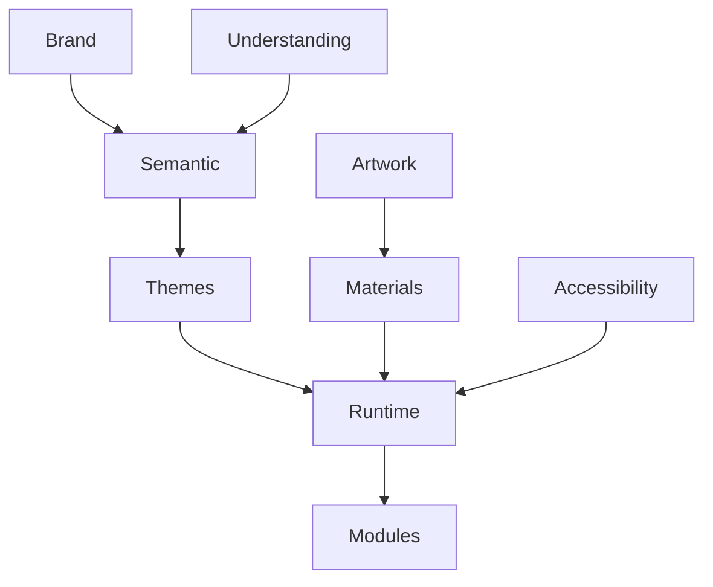

<!--
File: docs/design/system/mds-002-colour-system/12-adrs.md
Document: MDS-002
Chapter: 12
Title: Architectural Decision Records
Status: Draft
Version: 0.2
-->

# Architectural Decision Records

---

# Purpose

The Architectural Decision Records (ADRs) contained within MDS-002 preserve the reasoning behind the Mosaic Colour System.

Where previous specifications established:

- Vision
- Principles
- Mental Model
- Interaction
- Composition
- Token Architecture

MDS-002 establishes the visual language through which those concepts become emotionally expressive.

These ADRs explain why the Colour System deliberately separates:

- Brand
- Semantic Colour
- Runtime Atmosphere
- Themes
- Accessibility

Future contributors should understand these decisions before proposing changes to the visual identity of Mosaic.

---

# Decision Format

Decision format, lifecycle and review expectations are governed by **MDG-001 — Documentation Authority Guide**.

This chapter records decisions specific to this specification and avoids redefining the shared ADR process.

# ADR-097

## Title

Separate Brand From Atmosphere

### Status

Accepted

### Context

Many media applications allow artwork to dominate their visual identity.

Founder workshops consistently identified the need for a recognisable Mosaic identity that remained independent from currently playing media.

### Decision

Brand Colours remain stable.

Runtime Atmosphere adapts.

The two systems remain architecturally independent.

### Consequences

Users continue recognising Mosaic regardless of current entertainment.

---

# ADR-098

## Title

Artwork Influences Environment Rather Than Interface

### Status

Accepted

### Context

Direct artwork recolouring creates visually unstable interfaces.

### Decision

Artwork contributes Runtime Atmosphere rather than direct component colours.

Atmosphere influences Materials.

Materials influence Presentation.

### Consequences

Entertainment emotionally influences the interface without replacing the Design System.

---

# ADR-099

## Title

Semantic Colours Are Stable

### Status

Accepted

### Context

Colour values are expected to evolve significantly over time.

Semantic meaning should not.

### Decision

Applications consume Semantic Colours rather than Primitive Colours.

Primitive values remain implementation details.

### Consequences

Future redesigns become dramatically less disruptive.

---

# ADR-100

## Title

Accessibility Has Higher Authority Than Atmosphere

### Status

Accepted

### Context

Artwork frequently produces colour combinations unsuitable for accessible interfaces.

### Decision

Accessibility validation occurs before Runtime Atmosphere reaches Presentation.

### Consequences

Immersion never compromises readability.

---

# ADR-101

## Title

Themes Interpret Rather Than Redefine

### Status

Accepted

### Context

Maintaining separate Light and Dark design systems fragments conceptual consistency.

### Decision

Themes become visual interpretations of identical semantic architecture.

### Consequences

Users experience one Design Language regardless of active theme.

---

# ADR-102

## Title

Runtime Colour Is Deterministic

### Status

Accepted

### Context

Adaptive colour systems frequently become visually unpredictable.

### Decision

Given identical runtime inputs, the Runtime Resolver must always produce identical colour outputs.

### Consequences

Caching, testing and cross-platform consistency become significantly easier.

---

# ADR-103

## Title

Atmosphere Is Material-Led

### Status

Accepted

### Context

Early exploration applied artwork colours directly to interface surfaces.

This weakened hierarchy and obscured brand identity.

### Decision

Atmosphere should primarily influence Materials rather than component colours.

### Consequences

Future acrylic and refraction systems become the primary visual expression of atmosphere.

---

# ADR-104

## Title

Modules Consume Rather Than Define Colour

### Status

Accepted

### Context

Allowing modules to introduce independent colour systems fragments visual identity.

### Decision

Modules consume:

- Semantic Colours
- Runtime Atmosphere

The platform remains solely responsible for colour generation.

### Consequences

Community modules inherit future visual improvements automatically.

---

# ADR-105

## Title

Colour Exists To Support Understanding

### Status

Accepted

### Context

Many modern interfaces use colour primarily as decoration.

Founder workshops consistently reinforced that hierarchy and understanding should exist independently from colour.

### Decision

Colour reinforces meaning.

It never becomes the only mechanism communicating meaning.

### Consequences

Accessibility improves.

The interface remains understandable even with greatly reduced colour information.

---

# ADR Relationships

Together these decisions establish the architectural separation between:

- identity
- meaning
- emotion
- implementation

which defines the Mosaic Colour System.

---

# Future ADRs

Future Colour System ADRs are expected to formalise:

- HDR Colour Pipeline
- Wide Gamut Displays
- Dynamic Contrast Balancing
- Multi-Monitor Colour Synchronisation
- Refraction Colour Transport
- Ambient Lighting Integration
- AI-assisted Artwork Analysis
- Material Spectral Rendering

These intentionally remain outside the scope of MDS-002 Version 0.1.

---

# ADR Governance

Colour ADRs should change only when:

- accessibility research identifies deficiencies,
- semantic ambiguity exists,
- runtime architecture evolves,
- the Design Language itself changes.

Presentation trends should never justify architectural colour changes.

---

# Summary

The ADRs contained within MDS-002 define the architectural identity of the Mosaic Colour System.

Rather than treating colour as decoration, Mosaic treats colour as:

- identity,
- meaning,
- atmosphere.

Each responsibility remains independent.

Together they create a colour system capable of evolving for many years while remaining recognisably Mosaic.

---

# Review Status

**Status**

Draft

**Next File**

`13-contributor-guidance.md`
