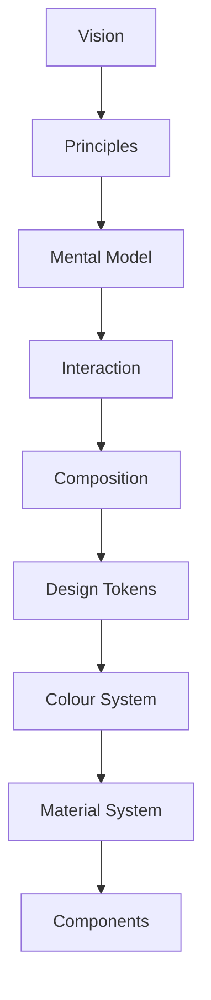
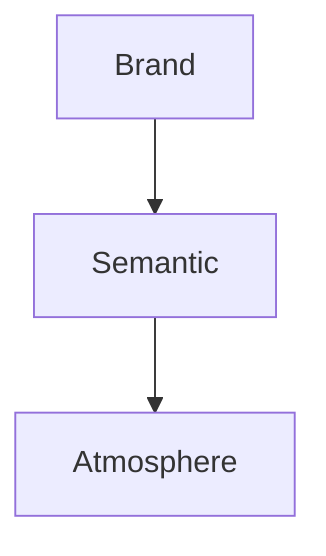

<!--
File: docs/design/system/mds-002-colour-system/index.md
Document: MDS-002
Status: Draft
Version: 0.4
-->

# MDS-002 — Colour System

> *Colour should communicate understanding before identity, and identity before decoration.*

---

# Purpose

[MDS-001](../mds-001-design-token-architecture/index.md) established how design intent becomes machine-readable through the Design Token Architecture.

MDS-002 defines how colour expresses that intent.

Unlike conventional colour systems, the Mosaic Colour System is not centred around a brand palette.

Instead, it balances three independent responsibilities:

- Brand Identity
- Semantic Communication
- Runtime Atmosphere

These responsibilities intentionally remain separate.

The result is a colour system that is:

- recognisable
- adaptive
- accessible
- artwork-aware
- implementation independent

---

# Relationship to Previous Specifications



The Colour System implements the semantic architecture established by [MDS-001](../mds-001-design-token-architecture/index.md).

It never replaces it.

---

# Scope

This specification defines:

- Brand Colours
- Static Mosaic And Resolved Co-Brand Illumination
- Semantic Colours
- Neutral Acrylic Tint Intent
- Runtime Atmosphere
- Artwork Colour Extraction
- Adaptive Colour
- Theme Architecture
- Light Mode
- Dark Mode
- Accessibility
- Colour Resolution
- Adaptive Neutral Foregrounds
- Functional Colour Isolation

This specification intentionally does **not** define:

- Materials
- Components
- Typography
- Motion
- Layout

Those specifications consume colour.

They do not define it.

---

# Guiding Question

MDS-002 exists to answer one question.

> **How should colour communicate meaning?**

Not:

> Which colours should we use?

---

# Colour Statement

Within Mosaic:

> **Colour communicates understanding first.**

Brand second.

Decoration last.

If colour ever becomes the primary source of understanding, accessibility has already failed.

---

# Colour Responsibilities

The Mosaic Colour System separates colour into three independent systems.



Each system exists for one purpose.

They intentionally do not overlap.

---

# Expected Outcome

After reading MDS-002 contributors should understand:

- how Mosaic uses colour
- how artwork influences the interface
- how runtime atmosphere works
- how accessibility is preserved
- how themes evolve
- how clients resolve colour consistently
- how neutral Acrylic tint intent resolves without changing Material physics
- how co-brand colours become a governed Indigo-and-partner illumination pair
- how foreground and functional colours remain stable under environmental light

without discussing implementation.

---

# Repository Structure

```

design/

└── mds/

    └── MDS-002 Colour System/

        README.md

        00-document-control.md

        01-colour-philosophy.md

        02-brand-colours.md

        03-semantic-colours.md

        04-runtime-atmosphere.md

        05-artwork-colour-extraction.md

        06-theme-architecture.md

        07-light-and-dark.md

        08-accessibility.md

        09-colour-resolution.md

        10-runtime-synthesis.md

        11-governance.md

        12-adrs.md

        13-contributor-guidance.md

        references.md

        glossary.md
```

---

# Dependencies

Required reading:

- [MDL-001](../../language/mdl-001-vision/index.md) → [MDL-005](../../language/mdl-005-composition-model/index.md)
- [MDS-001 — Design Token Architecture](../mds-001-design-token-architecture/index.md)

Downstream specifications:

- [MDS-003 — Material System](../mds-003-material-system/index.md)
- [MDS-005 — Motion System](../mds-005-motion-system/index.md)
- [MDP-001 — Adaptive Composition Runtime](../../../engineering/architecture/mdp-001-adaptive-composition-runtime/index.md)
- [MDS-008 — Component Library](../mds-008-component-library/index.md)
