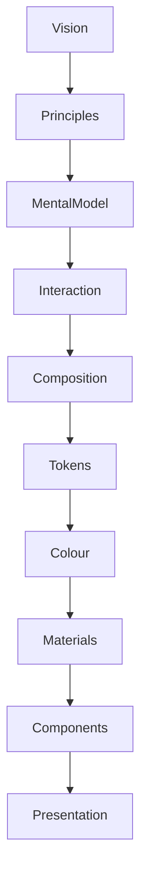

<!--
File: docs/design/system/mds-003-material-system/00-document-control.md
Document: MDS-003
Title: Material System
Status: Draft
Version: 0.2
-->

# Document Control

---

# Document Information

| Property | Value |
|----------|-------|
| Document ID | MDS-003 |
| Title | Mosaic Design System — Material System |
| Classification | Internal |
| Status | Draft |
| Version | 0.1 |
| Owner | Lead Design Systems Architect |
| Parent Specifications | MDL-001 → MDL-005, MDS-001, MDS-002 |
| Repository | `/design/mds/MDS-003 Material System/` |

---

# Purpose

MDS-003 defines the Material System used throughout Mosaic.

The Material System transforms abstract design concepts into physical surfaces that users perceive as existing within the same environment as their entertainment.

Unlike conventional interface frameworks where materials are decorative styling, Mosaic materials are considered part of the platform's behavioural language.

Materials communicate:

- hierarchy
- physicality
- environmental lighting
- depth
- atmosphere
- continuity

The Material System therefore becomes one of the defining characteristics of the Mosaic experience.

---

# Authority

MDS-003 governs:

- Material hierarchy
- Surface behaviour
- Acrylic
- Canvas
- Hero materials
- Overlay materials
- Runtime material adaptation
- Refraction
- Light transport
- Material resolution

This specification intentionally does **not** govern:

- Typography
- Components
- Motion timing
- Layout
- Interaction behaviour

Those specifications consume materials.

They do not define them.

---

# Relationship To MDS

The Material System extends the Design Token Architecture and Colour System.

The Material System consumes:

- Semantic Tokens
- Runtime Atmosphere
- Composition

It produces:

- physical surfaces
- environmental depth
- acrylic behaviour
- refraction

---

# Design Intent

Most design systems describe surfaces.

Mosaic intentionally describes materials.

A surface answers:

> "What colour is this?"

A material answers:

> "How does this exist?"

Materials should behave as though they occupy physical space.

They should react to:

- light
- atmosphere
- movement
- surrounding content

The result should feel less like software and more like an environment.

---

# Reader Expectations

Before reading this specification contributors should already understand:

- MDL-001 Vision
- MDL-002 Principles
- MDL-003 Mental Model
- MDL-004 Interaction Model
- MDL-005 Composition Model
- MDS-001 Design Token Architecture
- MDS-002 Colour System

MDS-003 assumes those concepts already exist.

Its responsibility is to define their physical expression.

---

# Architectural Scope

The Material System defines:

- Material Identity
- Surface Hierarchy
- Acrylic Behaviour
- Refraction
- Light Response
- Runtime Adaptation

It intentionally avoids implementation technologies such as:

- CSS
- Flutter
- Metal
- Vulkan
- WebGL
- Canvas
- Skia

These are implementation concerns.

The Material System defines only the architectural model.

---

# Stability

Expected lifetime.

| Artefact | Expected Lifetime |
|----------|-------------------|
| Shader Implementation | Months |
| Rendering Backend | Months |
| Material Algorithms | Years |
| Material Hierarchy | Years |
| Material Philosophy | Decades |

Rendering technologies are expected to evolve.

Material behaviour should remain recognisably Mosaic.

---

# Success Criteria

MDS-003 succeeds when:

- materials feel physically believable
- runtime atmosphere subtly influences surfaces
- refraction strengthens immersion without distraction
- hierarchy remains immediately understandable
- artwork appears to illuminate the interface
- components feel like objects within one coherent environment

Users should not consciously admire the materials.

They should simply feel that the interface belongs naturally beside the entertainment it presents.

---

# Review Status

**Status**

Draft

**Dependencies**

- MDL-001 → MDL-005
- MDS-001
- MDS-002

**Supersedes**

None.

**Next File**

`01-material-philosophy.md`
