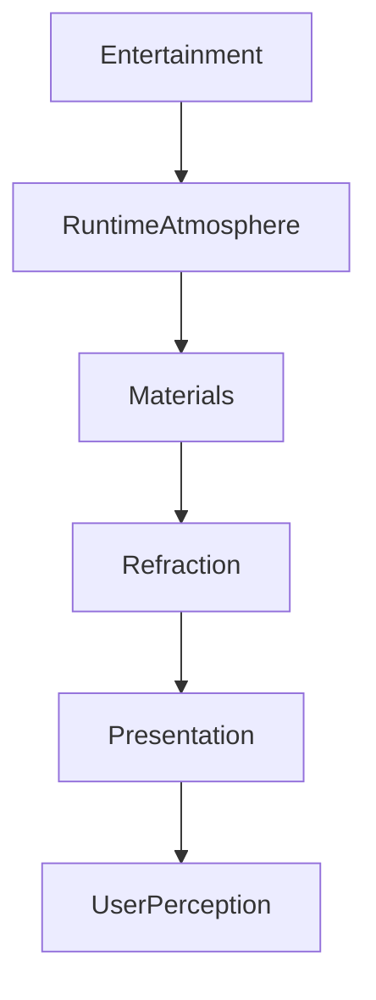

<!--
File: docs/design/system/mds-003-material-system/01-material-philosophy.md
Document: MDS-003
Chapter: 01
Title: Material Philosophy
Status: Draft
Version: 0.2
-->

# Material Philosophy

---

# Purpose

Before defining Acrylic, Refraction or Material Hierarchy, contributors must first understand what a **Material** represents within Mosaic.

Many interface frameworks treat materials as visual effects.

Glass.

Blur.

Opacity.

Shadow.

These are rendering techniques.

They are **not** materials.

Within Mosaic, a Material is a behavioural concept.

It defines how part of the interface physically exists inside the user's entertainment World.

---

# Philosophy Statement

> **Materials should behave as though they are physical objects illuminated by the user's entertainment rather than software panels layered on top of it.**

Everything within the Material System derives from this statement.

---

# Why Materials Exist

Entertainment already possesses:

- colour
- lighting
- atmosphere
- texture
- emotion

Traditional interfaces frequently cover these qualities with opaque panels.

Mosaic intentionally avoids this.

Instead, the interface should feel like it occupies the same environment as the content.

Not a different one.

The Material System exists to make software feel less like software.

---

# Material Is Behaviour

One of the defining architectural ideas of Mosaic is:

> **Materials are behaviours.**

Not appearances.

Acrylic is not simply:

- blur
- transparency
- opacity

Acrylic behaves like a material.

It:

- receives light
- diffuses light
- refracts colour
- preserves hierarchy
- supports interaction

Rendering merely communicates these behaviours.

---

# Materials Exist Between

Materials intentionally exist between:

```
Entertainment

↓

Atmosphere

↓

Interface
```

They form the physical medium through which entertainment influences the interface.

Without materials:

```
Artwork

↓

Interface
```

With materials:

```
Artwork

↓

Atmosphere

↓

Material

↓

Interface
```

This additional layer creates a far more natural experience.

---

# Materials Are Environmental

Materials belong to the environment.

Not to components.

Poor.

```
Button

↓

Blur
```

Preferred.

```
Environment

↓

Material

↓

Button Exists Inside Material
```

Components inherit the behaviour of their surrounding material.

They should not define materials independently.

---

# Materials Respond To Light

The defining property of every Mosaic material is:

Light interaction.

Materials should respond to:

- Runtime Atmosphere
- Hero artwork
- environmental luminance
- surrounding hierarchy

They should not simply display static colours.

Static materials quickly become lifeless.

---

# Materials Preserve Hierarchy

Materials should reinforce hierarchy.

Not replace it.

Example.

```
Canvas

↓

Acrylic

↓

Hero
```

Each material communicates increasing:

- importance
- physical presence
- environmental influence

without requiring additional decoration.

---

# Materials Are Restrained

One of the greatest dangers of advanced material systems is excess.

Too much blur.

Too much glow.

Too much translucency.

Too much reflection.

Mosaic intentionally adopts restraint.

Materials should be noticed emotionally.

Not intellectually.

Users should rarely think:

> "That acrylic looks impressive."

Instead they should feel:

> "This interface belongs here."

---

# Materials Support Entertainment

Materials exist to support entertainment.

Not compete with it.

Artwork should remain:

- sharper
- richer
- emotionally dominant

Materials should quietly reinforce:

- atmosphere
- hierarchy
- continuity

The interface should recede naturally behind content.

---

# Materials And Runtime Atmosphere

Runtime Atmosphere provides environmental light.

Materials determine how that light behaves.

Example.

```
Artwork

↓

Runtime Atmosphere

↓

Acrylic

↓

Refraction

↓

Presentation
```

Atmosphere supplies energy.

Materials determine physical response.

This separation allows both systems to evolve independently.

---

# Materials And Movement

Movement should affect materials naturally.

Examples.

Moving Hero.

↓

Refraction subtly shifts.

Changing Focus.

↓

Atmosphere gradually redistributes.

Changing Domain.

↓

Environmental lighting evolves.

Materials should reinforce behavioural continuity.

Not introduce independent visual effects.

---

# Materials Across Themes

Light and Dark themes should alter material behaviour.

Not material identity.

Light Theme.

- softer diffusion
- brighter scattering
- lighter acrylic

Dark Theme.

- deeper diffusion
- richer reflections
- stronger perceived depth

Users should recognise the same materials in every theme.

Only the environmental lighting changes.

---

# Materials Are Device Independent

Material philosophy should remain identical across:

- Web
- Desktop
- Mobile
- Television
- Future clients

Different rendering engines may implement:

- shaders
- filters
- translucency

differently.

The perceived material should remain recognisably Mosaic.

---

# Good Examples

## Hero

Artwork softly illuminates surrounding acrylic.

The Hero remains dominant.

The material quietly supports it.

---

## Navigation

Navigation remains largely neutral.

Very subtle environmental influence.

Orientation remains stronger than atmosphere.

---

## Playback

Controls inherit gentle reflected light.

Video remains visually dominant.

Nothing distracts from entertainment.

---

# Anti-patterns

## Frosted Glass Everywhere

Every surface becomes heavily blurred.

Hierarchy disappears.

---

## Decorative Glow

Glow exists because it looks impressive.

No additional understanding is created.

---

## Flat Panels

Materials become static coloured rectangles.

Atmosphere disappears.

---

## Heavy Transparency

Background content overwhelms foreground readability.

Accessibility weakens.

---

# Material Philosophy Model



Materials are the physical medium through which entertainment influences perception.

---

# Relationship To Future Chapters

The remaining chapters define the individual materials within Mosaic.

These include:

- Canvas
- Acrylic
- Hero Material
- Overlay Material
- Refraction
- UV-indexed Refraction
- Light Transport
- Runtime Material Resolution

Every implementation should reinforce the philosophy established here.

---

# Summary

Materials are not decorative styling.

They are the physical expression of the Mosaic Design Language.

Their responsibility is to create the feeling that:

- the interface occupies the same world as the entertainment,
- light naturally flows through the experience,
- hierarchy remains physically believable,
- and software quietly fades into the background.

When successful, users should remember the atmosphere...

...not the material that created it.

---

# Review Status

**Status**

Draft

**Next File**

`02-material-hierarchy.md`
