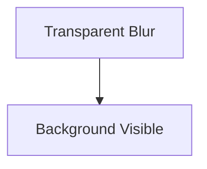
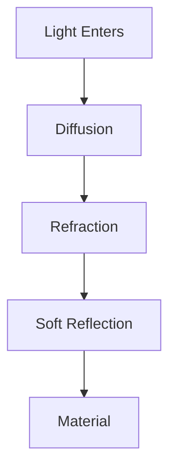
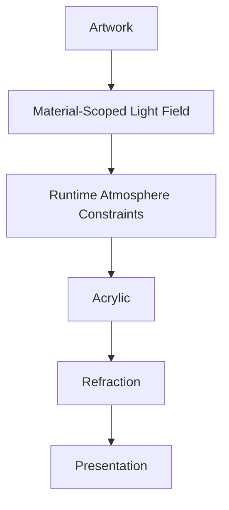
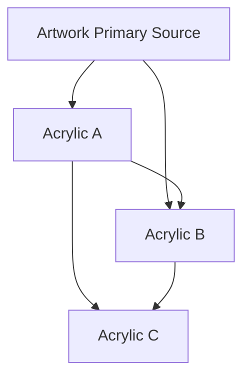
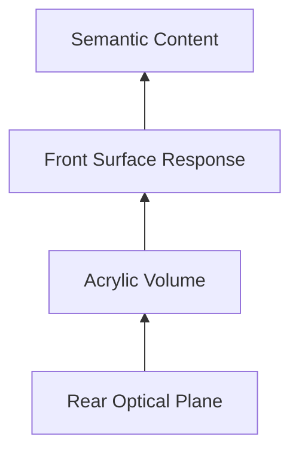
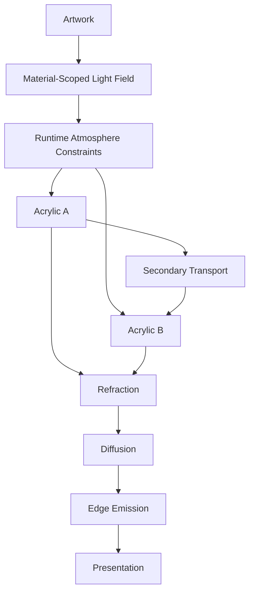

<!--
File: docs/design/system/mds-003-material-system/04-acrylic.md
Document: MDS-003
Chapter: 04
Title: Acrylic
Status: Draft
Version: 0.4
-->

# Acrylic

---

# Purpose

Acrylic is the defining material of the Mosaic Design System.

It is the physical medium through which the user's entertainment influences the interface.

Unlike glass, Acrylic should not disappear.

Unlike opaque panels, Acrylic should not isolate itself from its surroundings.

Instead, Acrylic should behave like a premium physical material that:

- possesses depth,
- receives light,
- refracts colour,
- softly diffuses atmosphere,
- remains structurally present.

It is one of the most recognisable characteristics of the Mosaic visual language.

---

# Definition

Within MDS, **Acrylic** is defined as:

> **A semi-translucent material that receives artwork-derived, material-scoped light and transforms it through refraction, absorption and diffusion while preserving hierarchy, readability and physical presence.**

Acrylic is not:

- glass,
- blur,
- transparency,
- opacity,
- frosted panels.

Those are implementation techniques.

Acrylic is a material.

---

# Philosophy

The industry often treats acrylic as:

```

Blur

+

Transparency
```

Mosaic intentionally rejects this.

Instead Acrylic behaves more like a solid object.

Imagine a thick polished acrylic tile placed onto a table.

It possesses:

- edges,
- thickness,
- internal diffusion,
- light transport,
- subtle reflections.

The interface should communicate that same feeling.

The reference Mosaic Acrylic profile behaves conceptually like a polished sheet approximately one centimetre thick.

This thickness is an optical reference for Material behaviour rather than three-dimensional geometry.

Acrylic remains a two-dimensional surface or layered two-dimensional composite positioned within Composition Space.

Implementations must preserve one fixed apparent-thickness profile across every Acrylic surface.

Renderer scaling maps that profile into Presentation safely; it does not make small Acrylic thinner or Hero Acrylic thicker.

---

# Acrylic Is Present

Glass attempts to disappear.

Acrylic should remain visible.

Not because it is visually loud...

but because it physically exists.

Users should perceive:

- depth,
- volume,
- softness,

rather than simply:

- blur.

This distinction creates a much more premium material language.

---

# Acrylic Responsibilities

Acrylic performs five primary responsibilities.

---

## 1. Receive Artwork Light

Acrylic receives a material-scoped light field derived from the current artwork.

The artwork remains visually ordinary within Presentation.

The artwork field is global within the Acrylic transport environment.

Only Acrylic consumes it, but Acrylic may pass transformed light onward to other Acrylic.

---

## 2. Transport Light

Light should appear to travel through Acrylic.

This behaviour is formalised later through the Refraction System.

---

## 3. Preserve Hierarchy

Despite receiving atmospheric colour, Acrylic must remain structurally readable.

Hierarchy always takes precedence over visual richness.

---

## 4. Create Depth

Acrylic communicates physical layering.

It should feel thicker than ordinary interface panels.

---

## 5. Support Continuity

Atmosphere should move naturally through Acrylic during interaction.

Nothing should appear to flash or abruptly recolour.

---

# Acrylic Is Not Transparent

Transparency implies seeing through a material.

Acrylic implies seeing **within** a material.

This distinction is important.

Poor.



Preferred.



The material becomes believable rather than decorative.

Acrylic may distort and diffuse visible Presentation behind its bounds while independently receiving hidden artwork-derived light.

Backdrop participation communicates local translucency.

Artwork-derived light communicates shared pigmentation, glare and edge response.

---

# Runtime Atmosphere

Artwork provides the spatially distributed light source.

Runtime Atmosphere constrains how strongly that source may influence Acrylic within the current World.

Acrylic determines how the constrained light behaves.

Conceptually.



Acrylic should therefore be considered both a receiver and a secondary transport contributor.

It may redirect existing artwork-derived energy toward other Acrylic, but it must never create additional light energy.

---

# Acrylic-To-Acrylic Transport

Acrylic objects should influence one another when their relative position, orientation, surface bounds, mask and z-order within the three-dimensional Composition permit light transport between them.



Each interaction may refract, absorb, diffuse or redirect the remaining energy.

Successive responses should become weaker and softer rather than accumulating without limit.

---

# Diffusion

Incoming atmosphere should diffuse naturally.

Examples.

Strong artwork colours.

↓

Soft internal glow.

↓

Neutral readable surface.

The material should smooth environmental changes.

Not amplify them.

---

# Refraction

Unlike ordinary translucent materials...

Acrylic should refract light.

Refraction should create:

- gentle colour movement,
- perceived depth,
- environmental richness.

It should never distort:

- typography,
- interaction,
- hierarchy.

Understanding remains more important than spectacle.

---

# Internal Depth

Acrylic should possess perceived thickness.

Future implementations may communicate this through:

- layered diffusion,
- internal highlights,
- edge lighting,
- soft gradients.

Thickness should be perceived consistently with the reference Acrylic profile rather than exposed as a component-level styling value.

Acrylic does not require an extruded shape, mesh or volumetric scene representation to communicate this depth.

---

# Three-Layer Optical Model

Mosaic Acrylic is resolved as three conceptual two-dimensional optical layers sharing one surface mask.



| Layer | Responsibility |
|-------|----------------|
| Rear Optical Plane | Samples visible Presentation behind the Acrylic using fixed, bounded optical displacement and safe overscan. It should remain relatively sharp rather than becoming uniform frost. |
| Acrylic Volume | Filters incident artwork light through tint, absorption and scattering; carries directional edge ingress inward as surface pigmentation; and supplies restrained internal optical parallax. |
| Front Surface Response | Adds the polished Fresnel response, restrained reflection, specular highlight and thin contour definition. |

Semantic content renders above these layers and is not part of the Material composite.

The layers describe observable responsibilities rather than mandatory renderer passes.

A shader may consolidate them, while CSS, Flutter or another native renderer may use clipped stacked layers.

Lower-fidelity renderers may pre-compose or cache compatible layers while preserving the same resolved Material meaning.

The one-centimetre reference is expressed through fixed relationships between the planes rather than a thick visible rim or bezel.

---

# Tint Authority

Tint is the only authored Acrylic Material parameter.

Tint represents the transmission filter through which incident light passes.

It is not a flat final surface colour, opacity control or permission to change the Acrylic profile.

The visible result combines:

```text
visiblePigmentation =
    incidentArtworkLight
    × governedTintTransmission(tint)
    × fixedAcrylicVolumeResponse
```

Authors, Modules and components must not control:

- apparent thickness
- refraction strength
- backdrop displacement
- diffusion or scattering
- edge intensity or spread
- Fresnel or reflection response
- optical parallax
- layer opacity

Artwork or a Static Brand Emitter supplies environmental light.

[MDS-002 — Colour System](../mds-002-colour-system/index.md) owns semantic Tint Intent and the Clear, Mist, Smoke and Deep Smoke neutral transmission recipes.

This specification owns how the fixed Acrylic Volume applies the selected recipe.

Accessibility, capability and performance may reduce refinement without redefining the Material.

---

# Acrylic Parallax

Acrylic should preserve the feeling that its internal response occupies a different optical depth from its outer surface.

It communicates this through two related behaviours.

| Behaviour | Responsibility |
|-----------|----------------|
| Composition parallax | Moves the complete two-dimensional Acrylic surface according to its Composition depth as the projected viewpoint or Focus relationship changes. |
| Internal optical parallax | Shifts sampled artwork, backdrop, diffusion and glare layers within the fixed Acrylic mask by a smaller bounded amount. |

The apparent-thickness profile constrains internal optical displacement.

The one-centimetre reference establishes the intended perceptual character rather than a universal runtime coefficient.

The governed Acrylic Material profile should define the numerical relationship between apparent thickness, diffusion, displacement and safe sampling margins when that profile is standardised.

Renderers should consume that profile rather than independently hard-code thickness or refractive-index values.

The outer surface, interaction bounds and semantic layout remain stable while internal composite layers move relative to them.

Edge glare may move at a different or opposing rate to strengthen the impression of a polished physical surface.

Parallax must remain restrained, must not distort readable content and must respect accessibility constraints on motion.

It responds to Composition movement, scrolling and Focus transitions rather than pointer, gyroscope or device-tilt input.

---

# Edge Behaviour

Edges define Acrylic.

They communicate:

- structure,
- precision,
- craftsmanship.

Edges facing incident artwork light should receive stronger, source-coloured energy than edges facing away.

This creates the feeling that light is travelling through the material rather than simply colouring it.

The response should follow the actual Acrylic contour and continue naturally around curved corners.

It must not appear as:

- a uniform glowing outline
- a detached slash or highlight stroke
- a thick physical bezel

Most incident edge energy belongs to the Acrylic Volume and should spread inward as pigmentation.

The Front Surface adds only a thin polished contour response.

The artwork itself must not acquire a visible glow, bloom or emission effect.

Visible edge light belongs to Acrylic because Acrylic redirected the hidden incident light.

---

# Derived Edge Profile

Acrylic is a rigid material applied to geometry resolved by Adaptive Layout.

SDUI, Modules and ordinary components do not select corner radii or edge thickness.

The provisional alpha profile derives corner curvature from the shortest resolved Tile side `s`:

```text
cornerRadius = clamp(s × 0.045, 8, 32)
```

Corner curvature scales continuously rather than selecting small, medium or large shape tokens.

The lower and upper bounds prevent small Tiles becoming circular and large surfaces becoming excessively soft.

The optical edge response is not a derived bezel width.

Its contour spread belongs to the fixed Acrylic profile and remains an alpha calibration variable.

The corner-radius values remain provisional until the alpha Design System validates them across Hero, portrait poster, utility, administration and accessibility compositions.

---

# Acrylic Assemblies

An **Acrylic Assembly** is a group of rigid Acrylic Tiles that may share layout, rendering work and transported light while remaining visibly distinct material pieces.

Composition determines whether content regions belong to one Tile or an Assembly.

One Tile has one continuous material boundary.

Separate Tiles do not fuse because they touch or move near one another.

The provisional precision seam between Assembly members is:

```text
seam = clamp(s × 0.006, 2, 4)
```

Internal seams retain approximately half-strength edge refraction so the join remains physical without creating a doubled bright line.

The exposed Assembly perimeter receives the full contour and glare response.

Assembly members may exchange bounded light through the shared `UVLightField` and Acrylic-to-Acrylic transport.

They move and resize as rigid panels and must not melt, stretch, form blobs or fuse in response to proximity.

Compositing several Assembly members into one renderer pass is an implementation optimisation and does not change their material identity.

---

# Hero Acrylic

Hero Materials use the same fixed Acrylic profile as every other Acrylic surface.

Their prominence comes from Composition, scale, content hierarchy and their environmental relationship to the active light field rather than stronger refraction or greater thickness.

Importantly...

The Hero should still remain secondary to the entertainment artwork itself.

Artwork remains the emotional centre.

---

# Supporting Acrylic

Supporting materials use the same fixed Acrylic profile.

Timeline, progress, shelf and navigation surfaces may receive less incident energy because of their position, bounds, masks and environmental relationship.

They must not implement a weaker custom Acrylic material.

---

# Overlay Acrylic

Overlay Acrylic uses the same fixed Acrylic profile while prioritising readability.

Foreground separation, local occlusion and accessibility constraints may reduce visible environmental influence.

Interaction takes precedence over immersion.

Dialogs.

Menus.

Playback controls.

All require stronger separation from the environment.

---

# Movement

Acrylic should respond naturally during interaction.

Changing Focus.

↓

Atmosphere gradually redistributes.

Moving Hero.

↓

Refraction subtly shifts.

Playback begins.

↓

Acrylic influence reduces.

Materials should appear physically consistent throughout every interaction.

---

# Themes

Light Theme.

Acrylic appears:

- brighter,
- softer,
- more diffused.

Dark Theme.

Acrylic appears:

- deeper,
- richer,
- more luminous.

Both remain recognisably the same material.

Only environmental lighting changes.

---

# Alpha Calibration Requirements

The three-layer model, fixed apparent thickness, tint authority and directional contour behaviour are stable Material decisions.

The following numerical relationships remain provisional and require alpha calibration against representative artwork, layouts and renderer backends:

| Calibration area | Evidence required |
|------------------|-------------------|
| Optical reference mapping | Refractive-index approximation and renderer mapping that reproduce the intended one-centimetre polished Acrylic character without treating CSS or native pixels as physical units. |
| Rear optical displacement | Minimum visible displacement, maximum safe offset and behaviour near rounded boundaries. |
| Backdrop transmission | Balance between local spatial continuity and Acrylic remaining materially present rather than glass-like. |
| Volume absorption and scattering | Pigmentation strength, inward falloff, colour retention and avoidance of uniform frosted haze. |
| Tint transmission | Luminance and chroma constraints across light, dark, neutral and saturated tints. |
| Contour ingress | Source-facing intensity, contour length, curved-corner wrapping and far-edge attenuation. |
| Front-surface response | Fresnel width, specular strength, reflection softness and avoidance of mirror-like glass. |
| Cross-layer parallax | Relative movement of Rear Optical Plane, Acrylic Volume and Front Surface during Composition movement. |
| Overscan | Sampling margin required to prevent empty or unrelated pixels during maximum displacement and diffusion. |
| Peak-energy handling | Tone mapping and bloom thresholds for concentrated `UVLightField` energy without neon outlines. |
| Fidelity equivalence | Enhanced, Balanced and Essential implementations remaining recognisably the same fixed Material. |

Calibration values remain private Material Profile data.

They must not become public styling controls or SDUI fields.

---

# Accessibility

Accessibility should always constrain Acrylic.

If diffusion or refraction would reduce:

- readability,
- contrast,
- orientation,

their intensity should reduce automatically.

Acrylic exists to enrich understanding.

Not complicate it.

---

# Performance

Future implementations should optimise Acrylic aggressively.

Preferred techniques include:

- cached artwork fields,
- GPU acceleration,
- incremental updates,
- shared material layers.

The client renderer should adapt Acrylic fidelity to measured capability and available presentation budget.

During video playback, Acrylic updates must yield before they delay video presentation.

Users should experience premium materials without perceiving computational cost.

---

# Modules

Modules never define Acrylic.

Modules contribute:

- Information,
- Artwork,
- Relationships.

The Material System determines how Acrylic behaves.

This guarantees every module inherits the same physical language.

---

# Good Examples

## Hero

Poster softly illuminates Acrylic.

Edges gently glow.

Typography remains perfectly readable.

The material feels physically present.

---

## Continue Watching

Timeline receives subtle atmospheric diffusion.

Hero remains dominant.

Nothing feels disconnected.

---

## Playback

Controls float using restrained Acrylic.

Video remains visually dominant.

Interaction feels calm.

---

# Anti-patterns

## Frosted Glass

Heavy blur becomes the defining characteristic.

Material identity disappears.

---

## Fully Transparent Panels

Background dominates foreground.

Depth weakens.

---

## Plastic Shine

Strong specular highlights unrelated to Runtime Atmosphere.

The material feels artificial.

---

## Decorative Refraction

Colour movement exists purely because it looks impressive.

No additional understanding is communicated.

---

# Acrylic Model



Acrylic transforms hidden artwork-derived light into believable physical presence.

---

# Relationship To Future Chapters

The following chapters expand Acrylic into increasingly sophisticated physical behaviour.

Including:

- Hero Material
- Overlay Material
- Refraction
- UV-Indexed Refraction
- Light Transport
- Runtime Material Resolution

These systems all build upon the Acrylic behaviour established here.

---

# Summary

Acrylic is the defining material of Mosaic.

It should feel:

- substantial,
- refined,
- illuminated,
- calm.

It is not glass.

It is not blur.

It is the physical medium through which entertainment quietly reaches into the interface.

When successful, Acrylic should make the interface feel handcrafted rather than rendered.
