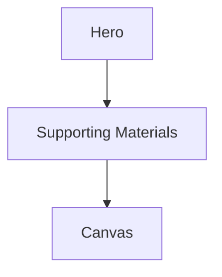
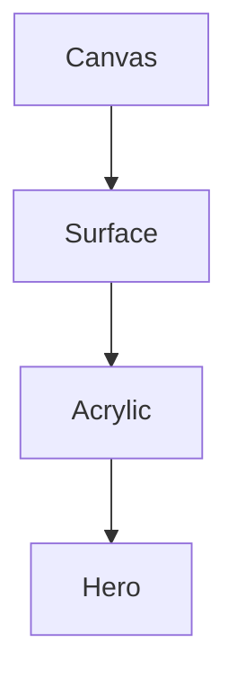
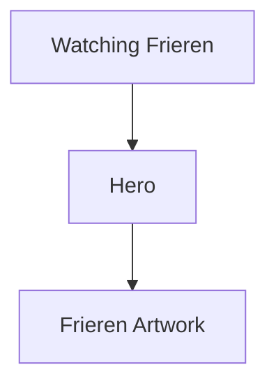
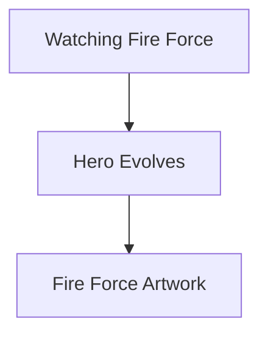
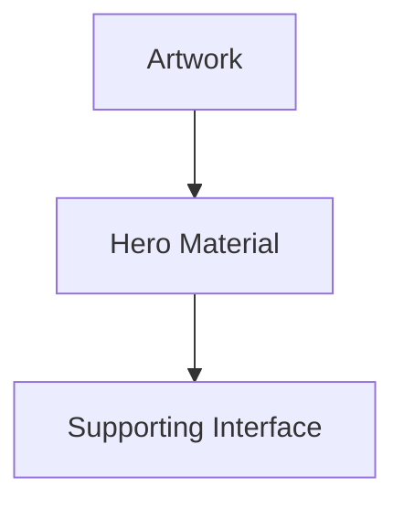
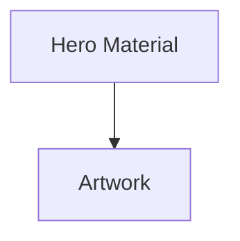
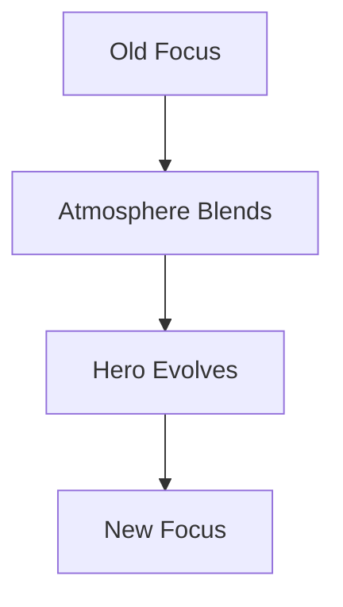
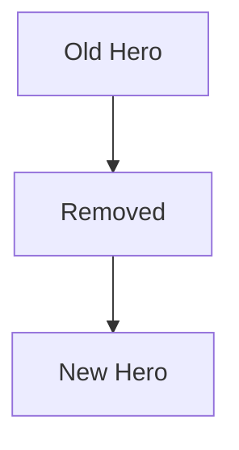
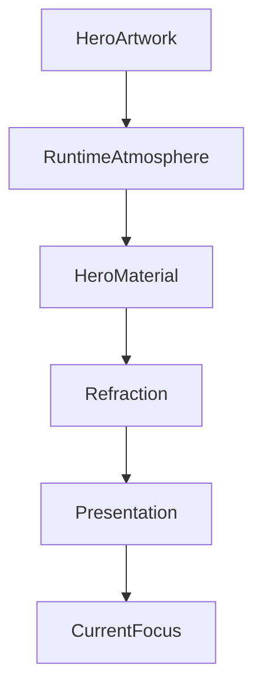

<!--
File: docs/design/system/mds-003-material-system/05-hero-material.md
Document: MDS-003
Chapter: 05
Title: Hero Material
Status: Draft
Version: 0.4
-->

# Hero Material

---

# Purpose

The Hero Material is the most expressive material within the Mosaic Design System.

It represents the physical centre of the user's current World.

Unlike decorative hero banners found in traditional applications, the Hero Material exists to communicate:

- current Focus,
- current Context,
- current emotional atmosphere,
- compositional importance.

The Hero Material should feel as though it has been quietly illuminated by the entertainment itself.

It should never overshadow that entertainment.

---

# Definition

Within MDS, **Hero Material** is defined as:

> **The highest-presence material within the current Composition, receiving the strongest interaction with Runtime Atmosphere while preserving readability, hierarchy and restraint.**

Hero Material exists because something currently matters.

Not because every screen needs a visually impressive header.

---

# Philosophy

The Hero Material should behave like a carefully machined sheet of premium acrylic positioned beneath the current entertainment.

Imagine placing a translucent acrylic panel beneath a beautifully printed film poster.

The acrylic receives:

- reflected colour,
- edge illumination,
- internal diffusion,

while the artwork remains sharp and emotionally dominant.

That relationship defines the Hero Material.

---

# One Hero

Every Composition should normally contain exactly one Hero Material.

Poor.

```

Hero

Hero

Hero

Hero
```

Nothing leads.

Everything competes.

Preferred.



The user's attention immediately knows where to begin.

---

# Hero Owns Atmospheric Priority

The Hero Material receives the highest scheduling and compositional priority for resolving atmospheric influence.

It does not receive a thicker, stronger or independently tuned Acrylic profile.

Conceptually.



Atmosphere weighting increases gradually.

The Hero should appear gently illuminated by the current artwork.

Never recoloured by it.

---

# Hero Is Contextual

Hero Material should change with Focus.

Example.



Changing Focus.



The Hero Material evolves naturally.

The rest of the interface remains largely stable.

---

# Hero Does Not Own Colour

The Hero Material receives colour.

It does not define colour.

Inputs include:

- Semantic Colours
- Runtime Atmosphere
- Theme
- Accessibility

The Hero Material is therefore an interpreter.

Not a source.

---

# Hero Owns Presence

The Hero should possess the greatest compositional presence while using the same fixed Acrylic profile as every Acrylic surface.

Its scale, placement, content hierarchy and relationship to the active light field may make the Material response easier to perceive.

Hero status must not change thickness, diffusion, displacement, contour response or other Acrylic mechanics.

---

# Hero And Refraction

Hero Material is the primary consumer of the Refraction System.

Examples include:

- artwork-derived colour transport,
- UV-indexed material light,
- spatially related edge emission,
- atmospheric diffusion.

Future rendering systems should prioritise Hero Material quality before secondary materials.

If performance budgets become constrained:

Supporting materials should simplify first.

Hero quality should remain as high as practical.

Video presentation deadlines and stable frame pacing still possess higher authority than Hero material fidelity.

---

# Hero And Artwork

Artwork always possesses higher authority than Hero Material.

Correct relationship.



Incorrect.



The Hero should frame artwork.

Never compete with it.

---

# Hero And Typography

Typography positioned upon Hero Material should always remain readable.

If Runtime Atmosphere reduces readability:

Atmosphere should reduce.

Typography should never compensate for material behaviour.

Understanding remains the highest priority.

---

# Hero And Movement

Hero Material should evolve continuously.

Preferred.



Avoid.



The Hero should preserve identity wherever practical.

Users should feel continuity.

Not replacement.

---

# Hero Across Themes

Light Theme.

Hero Material behaves like:

- the fixed Acrylic profile under a light appearance environment.

Dark Theme.

Hero Material behaves like:

- the same fixed Acrylic profile under a dark appearance environment.

The material remains recognisably the same.

Only lighting interpretation changes.

---

# Hero Across Devices

Desktop.

Large atmospheric acrylic.

Television.

Greater perceived depth.

Phone.

Reduced complexity.

Equivalent physical behaviour.

The Hero should remain conceptually identical across every supported device.

---

# Hero And Playback

Playback intentionally reduces Hero prominence.

Before playback.

Hero supports exploration.

During playback.

Video becomes the Hero.

Overlay Materials replace Hero interaction.

After playback.

Hero gradually re-establishes itself around the next experience.

This transition should feel inevitable rather than mechanical.

---

# Hero And Reading

Books behave differently.

Reading remains relatively static.

The Hero should therefore evolve more slowly.

Subtle atmospheric changes over long reading sessions reinforce calmness rather than cinematic energy.

Different domains may therefore produce different Hero rhythms while preserving identical material behaviour.

---

# Hero And Accessibility

Accessibility should always constrain Hero Material.

Examples include:

- reduced glow,
- increased contrast,
- lower translucency,
- simplified refraction.

Hero identity should survive these adaptations.

The material should never become decorative at the expense of readability.

---

# Performance

Hero Material should receive the highest rendering budget.

Future implementations should prioritise:

- shader quality,
- refraction quality,
- atmosphere precision,
- edge rendering.

Supporting materials may degrade gracefully under constrained hardware.

Hero quality should remain the primary visual investment.

---

# Modules

Modules never create Hero Materials.

Modules contribute:

- artwork,
- information,
- relationships.

The Composition Engine determines whether a Hero exists.

The Material System determines how that Hero behaves.

This guarantees one coherent visual identity throughout the ecosystem.

---

# Good Examples

## Film

Poster softly illuminates Hero Acrylic.

Edge lighting subtly follows artwork temperature.

Typography remains perfectly readable.

Users perceive atmosphere rather than effects.

---

## Book

Illustrated cover casts warm reflected light into Hero Material.

Canvas remains calm.

Reading remains the primary activity.

---

## Music

Album artwork generates subtle magenta environmental lighting.

Playback controls remain semantically coloured.

Artwork remains dominant.

---

# Anti-patterns

## Hero Wallpaper

Artwork becomes the interface background.

Hierarchy weakens.

---

## Neon Hero

Atmosphere overwhelms typography.

The interface begins competing with entertainment.

---

## Decorative Glow

Glow exists independently from Runtime Atmosphere.

Material behaviour becomes arbitrary.

---

## Static Hero

Hero never changes despite Focus changing.

The interface becomes emotionally disconnected from the user's World.

---

# Hero Material Model



Hero Material exists to strengthen the user's relationship with their current Focus.

It should never become the focus itself.

---

# Relationship To Future Chapters

The following chapters build upon Hero Material by defining:

- Overlay Material
- Refraction
- UV-Indexed Refraction
- Light Transport
- Runtime Material Resolution

Hero Material represents the highest-presence physical object within the Material hierarchy.

The remaining materials derive much of their behaviour from it.

---

# Summary

Hero Material is the emotional centre of the Mosaic interface.

It should feel:

- substantial,
- illuminated,
- refined,
- alive.

Not because it is visually extravagant...

but because it quietly reflects the user's current entertainment.

The Hero Material should create the feeling that the interface belongs inside the same world as the content without ever asking users to admire the interface itself.
