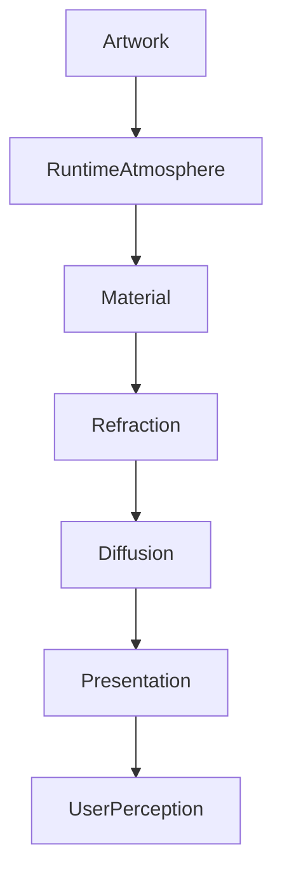

<!--
File: docs/design/system/mds-003-material-system/07-refraction.md
Document: MDS-003
Chapter: 07
Title: Refraction
Status: Draft
Version: 0.2
-->

# Refraction

---

# Purpose

Refraction is the defining physical behaviour of the Mosaic Material System.

It is the mechanism through which entertainment subtly influences the interface.

Without Refraction, Acrylic becomes translucent decoration.

With Refraction, Acrylic becomes a believable physical material.

Refraction transforms Runtime Atmosphere into the feeling that light is travelling through the interface itself.

It is one of the primary visual signatures of Mosaic.

---

# Definition

Within MDS, **Refraction** is defined as:

> **The controlled transport and diffusion of environmental light through Mosaic materials in order to reinforce immersion, hierarchy and physical presence.**

Refraction is not:

- blur
- bloom
- colour overlays
- gradients
- transparency

Those are rendering techniques.

Refraction is a physical behaviour.

---

# Philosophy

Imagine a polished sheet of premium acrylic placed beside a colourful book cover.

The acrylic does not become the same colour as the artwork.

Instead...

Light enters the acrylic.

Travels through it.

Softly bends.

Diffuses internally.

Then exits again.

This behaviour creates the impression of physical depth.

That is the behaviour Mosaic seeks to reproduce.

---

# Why Refraction Exists

Entertainment already contains:

- colour
- light
- atmosphere
- emotional tone

Traditional interfaces isolate themselves from these qualities.

Mosaic instead allows those qualities to gently influence surrounding materials.

Refraction creates the feeling that:

> **The interface exists inside the same environment as the entertainment.**

---

# Light Transport

Refraction should always be thought of as light transport.

Not colour replacement.

Poor.

```text
Artwork

↓

Copy Colours

↓

Interface
```

Preferred.

```text
Artwork

↓

Light

↓

Material

↓

Refraction

↓

Interface
```

The distinction is critical.

Materials remain physically believable.

Brand identity remains intact.

---

# Refraction Inputs

Refraction receives several conceptual inputs.

```text
Runtime Atmosphere

↓

Material Type

↓

Material Thickness

↓

Surface Orientation

↓

Composition Importance
```

Refraction should never depend directly upon component implementation.

It is a material behaviour.

---

# Refraction Outputs

Refraction influences:

- edge lighting
- internal diffusion
- subtle colour transport
- environmental glow
- perceived depth

It should never directly influence:

- typography
- icons
- interaction affordances

Understanding remains independent from refraction.

---

# Refraction Strength

Different materials receive different refraction intensity.

| Material | Refraction |
|----------|-----------:|
| Canvas | None |
| Surface | Very Low |
| Acrylic | Medium |
| Hero | High |
| Overlay | Low |

This hierarchy mirrors the Material Hierarchy.

Refraction reinforces physical importance.

It does not define it.

---

# Directionality

Refraction should possess direction.

Light should appear to originate from:

```
Hero Artwork
```

rather than uniformly illuminating every surface.

Conceptually.

```text
Artwork

↓

Light Direction

↓

Nearby Materials

↓

Environmental Falloff
```

This creates a much stronger sense of physical coherence.

---

# Diffusion

Light should soften as it travels through materials.

Strong artwork colours should gradually become:

- calmer
- broader
- less saturated

Diffusion prevents the interface from becoming visually noisy.

Users should perceive atmosphere rather than individual colours.

---

# Edge Refraction

Edges should refract more strongly than flat surfaces.

Reasons include:

- perceived thickness
- physical realism
- hierarchy

Edge lighting should remain subtle.

Users should feel depth.

Not notice glowing borders.

---

# Hero Refraction

Hero Material receives the highest quality refraction.

Examples include:

- richer colour transport
- deeper diffusion
- stronger perceived volume
- smoother temporal blending

Hero Refraction should remain emotionally expressive without becoming visually dominant.

The artwork always remains sharper and more detailed than the surrounding material.

---

# Supporting Refraction

Supporting Acrylic receives restrained refraction.

Examples include:

- shelves
- timelines
- continuation panels

These materials should visually relate to the Hero without competing for attention.

---

# Overlay Refraction

Overlay Material intentionally reduces refraction.

Interaction possesses higher priority than environmental realism.

Menus.

Playback controls.

Dialogs.

Search.

All should preserve clarity before atmosphere.

---

# Temporal Behaviour

Refraction should evolve continuously.

Preferred.

```text
Artwork Changes

↓

Light Shifts

↓

Refraction Evolves

↓

Materials Settle
```

Avoid.

```text
Artwork Changes

↓

Immediate Recolour
```

The interface should appear physically illuminated rather than digitally updated.

---

# Composition Awareness

Refraction should respect Composition.

Primary materials.

↓

Stronger environmental response.

Peripheral materials.

↓

Minimal environmental response.

Composition therefore influences physical behaviour without components becoming aware of it.

---

# Accessibility

Refraction should never reduce:

- readability
- contrast
- orientation

If environmental light conflicts with semantic clarity:

Refraction should reduce automatically.

Accessibility always overrides visual richness.

---

# Performance

Future implementations should optimise refraction aggressively.

Recommended conceptual strategies include:

- cached atmosphere
- simplified edge calculations
- temporal interpolation
- GPU acceleration
- shared material buffers

Users should experience premium materials without perceiving rendering cost.

---

# Modules

Modules never participate in refraction.

Modules contribute:

- artwork
- information

The Material System determines:

- light transport
- diffusion
- edge behaviour

Every module therefore inherits identical material quality automatically.

---

# Good Examples

## Science Fiction

Cool artwork softly illuminates Hero Acrylic.

Nearby materials receive subtle blue reflections.

Typography remains perfectly readable.

---

## Fantasy Novel

Warm golden artwork creates soft amber edge lighting.

Canvas remains neutral.

Atmosphere feels warm rather than colourful.

---

## Music

Album artwork introduces subtle magenta highlights into nearby Acrylic.

Playback controls remain restrained.

Attention stays with the album cover.

---

# Anti-patterns

## Colour Overlay

Artwork colours directly tint components.

Materials lose physical credibility.

---

## Neon Refraction

Highly saturated glowing edges.

Atmosphere becomes visual spectacle.

---

## Uniform Lighting

Every material receives identical illumination.

Hierarchy disappears.

---

## Animated Refraction

Refraction continually shifts without behavioural cause.

Users become distracted.

---

# Refraction Model



Refraction transforms environmental light into believable physical materials.

---

# Relationship To Future Chapters

The following chapter expands this concept through the **UV-Indexed Refraction System**.

Rather than treating materials as uniformly illuminated, Mosaic introduces spatial light transport based upon UV coordinates.

This allows atmosphere to:

- move naturally,
- preserve hierarchy,
- remain computationally efficient,
- closely follow the user's current Hero.

It is expected to become one of the defining technical innovations of the Mosaic Material System.

---

# Summary

Refraction is the mechanism through which the user's entertainment quietly reaches into the interface.

It should feel:

- physical,
- restrained,
- believable,
- continuous.

Users should never think:

> "That shader looks impressive."

Instead they should simply feel that the interface belongs beside the entertainment.

That subtle shift in perception is the ultimate purpose of Refraction.

---

# Review Status

**Status**

Draft

**Next File**

`08-uv-indexed-refraction.md`
