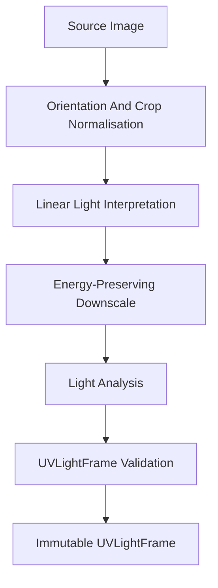
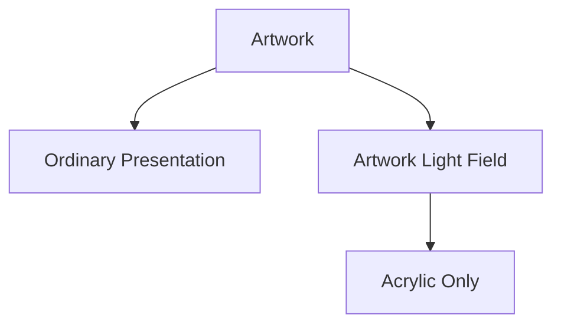
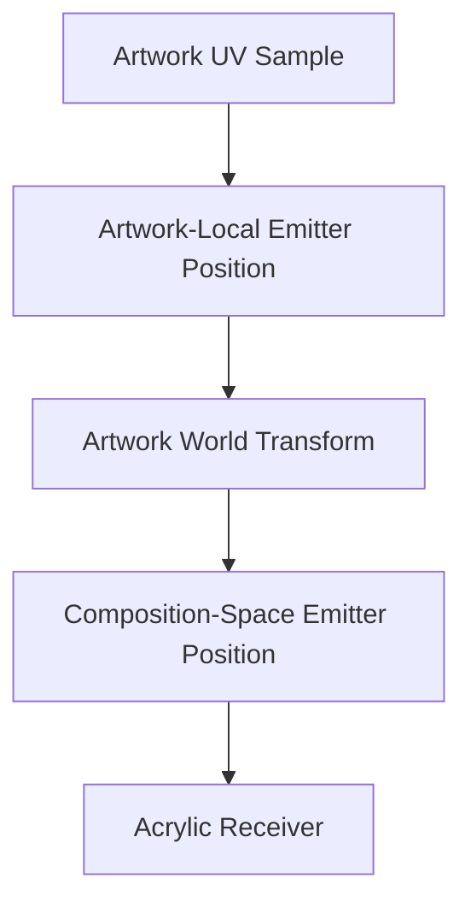
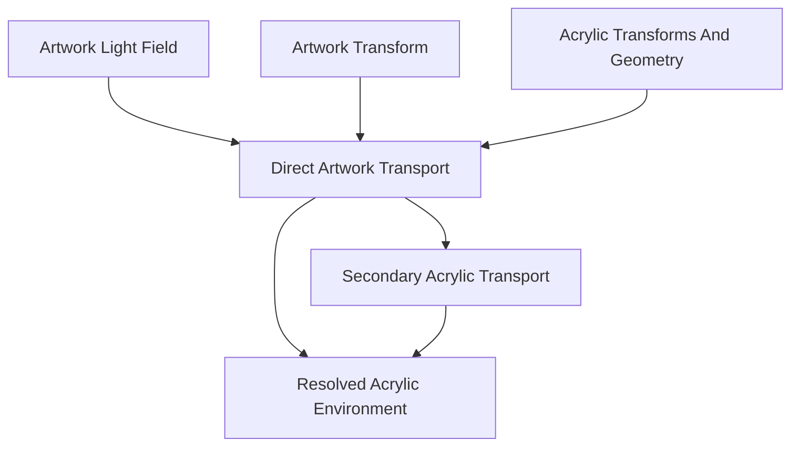
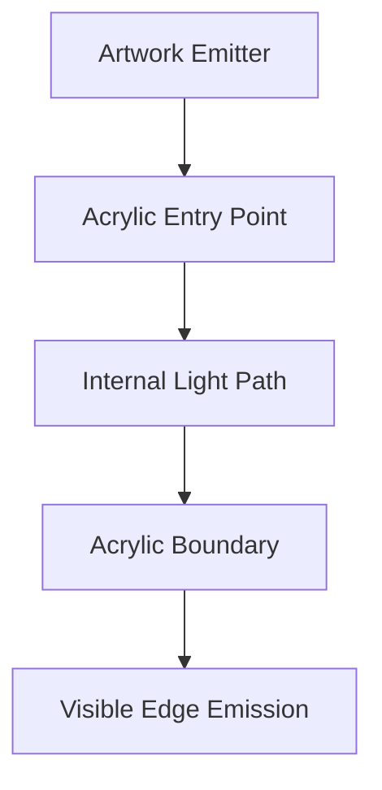
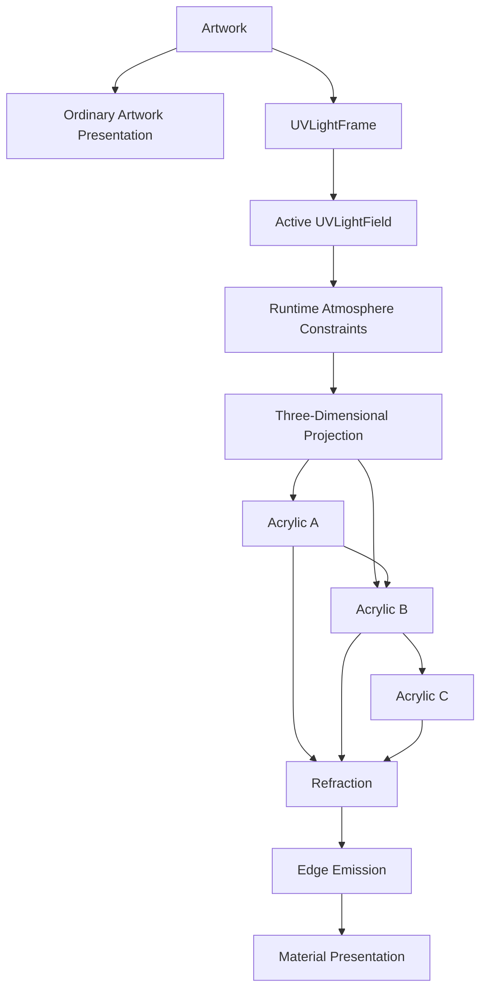

<!--
File: docs/design/system/mds-003-material-system/08-uv-indexed-refraction.md
Document: MDS-003
Chapter: 08
Title: UV-Indexed Refraction
Status: Draft
Version: 0.4
-->

# UV-Indexed Refraction

---

# Purpose

The previous chapter established that artwork acts as a hidden, material-scoped light source for Acrylic.

This chapter defines the reusable representation of that source.

**UV-Indexed Refraction** maps artwork-derived light into a normalised field attached to the artwork surface.

The field remains two-dimensional as stored data while participating in the three-dimensional Composition through the artwork's world transform.

It allows every Acrylic material to participate in one coherent global transport environment without making the artwork appear visibly emissive.

---

# Definition

Within MDS, **UV-Indexed Refraction** is defined as:

> **A material-scoped lighting model in which artwork-derived relative radiance is represented in normalised artwork coordinates, projected into the three-dimensional Composition and propagated through a shared network of spatially related Acrylic.**

The model describes:

- where light originates across the artwork,
- the colour and intensity of that light,
- how it is directed into the Composition,
- how Acrylic discovers and consumes it.

It remains independent from any particular rendering technology or binary encoding.

---

# Standard Light-Field Units

The artwork-analysis and Refraction systems should exchange three related units.

| Unit | Responsibility |
|------|----------------|
| `UVLightFrame` | One immutable, normalised snapshot of primary artwork light. |
| `UVLightStream` | An ordered sequence of timestamped `UVLightFrame` values. |
| `UVLightField` | The active, temporally reconstructed source consumed by Acrylic transport. |


Static artwork normally produces one `UVLightFrame`.

Video produces a periodically sampled `UVLightStream`.

Both resolve into the same active `UVLightField` contract.

---

# UVLightFrame

A `UVLightFrame` is an immutable, downscaled representation of the primary artwork source at one source state or timestamp.

Every frame should preserve stable logical information for:

| Information | Responsibility |
|-------------|----------------|
| Format version | Compatibility of the standard frame contract. |
| Source identity | Traceability to the artwork or video source. |
| Sequence and timestamp | Ordering and temporal relationship where the source moves. |
| Frame extent | Resolution of the downscaled representation. |
| Coordinate convention | Interpretation of normalised artwork UV space. |
| Colour and intensity metadata | Interpretation of colour and relative-radiance values. |
| Light-field payload | Spatial primary-source information. |
| Generator version | Reproducibility and cache invalidation. |

The standard should define semantic compatibility independently from storage, compression or GPU representation.

[MIP-003 — UVLightFrame Protocol](../../../engineering/protocols/mip-003-uv-light-frame-protocol/index.md) defines the machine-readable channels and encoding.

---

# Frame Normalisation

Still and moving sources should use the same normalisation pipeline.



Downscaling should preserve the environmental influence of significant bright regions rather than flattening every source into a simple average.

The normalisation pipeline should preserve mean linear-light energy across each downscaled region.

It may also preserve a local peak-luminance measure so a small, concentrated highlight is not erased by averaging.

Normalisation must retain brightness differences within the artwork.

It must not give every sample equal intensity or stretch each video sample independently to fill the available range.

Moving sources should use a stable exposure relationship across successive frames so unchanged source regions do not cause artificial pulses in Acrylic response.

Stored frame resolution may vary by implementation while its coordinates remain normalised artwork UV coordinates.

---

# Artwork Is The Source

The visible artwork and the material-scoped emitter share the same source image but remain separate Presentation responsibilities.



The artwork must not acquire:

- bloom,
- a halo,
- visible emission,
- direct scene illumination.

Only direct and secondary Acrylic responses reveal that the artwork acted as the global primary light source.

---

# Artwork UV Space

Every artwork source defines a normalised coordinate space.

```text
0,0 -------------------- 1,0

 |                        |

 |                        |

 |                        |

0,1 -------------------- 1,1
```

This coordinate space identifies positions on the artwork rather than positions on the screen.

The same field can therefore survive:

- different screen resolutions,
- device-specific layouts,
- artwork scaling and cropping,
- movement within the Composition.

Presentation adapts.

The source field remains reusable.

---

# Three-Dimensional Projection

The Mosaic Composition is three-dimensional.

The UV field is therefore a parameterisation of an emitter surface rather than a two-dimensional lighting environment.



Artwork and Acrylic each remain two-dimensional surfaces with position, orientation, bounds and masks within the Composition.

Their spatial relationship determines the incident light path.

Screen space becomes relevant only after Acrylic transport resolves into Presentation.

---

# Light-Field Payload

The field should preserve the conceptual information required to reconstruct artwork emission.

| Information | Responsibility |
|-------------|----------------|
| Mean linear colour | Colour whose magnitude preserves relative emitted brightness. |
| Peak luminance | Optional local highlight information that may survive downscaling. |
| Position | Origin of the sample within artwork UV space. |
| Emission direction | Optional artwork-local orientation of emitted influence where it varies across the artwork. |
| Spread | The angular breadth of emitted influence. |
| Confidence | The reliability of derived directional information. |

Mean linear colour carries both chromaticity and relative intensity.

Peak luminance supplements rather than replaces mean linear colour and must not cause the downscaled field to create more energy than the source model permits.

When no per-sample emission direction is available, emission should default to the artwork surface normal and a frame-level emission profile.

Emission direction does not describe the position of a receiver relative to the artwork.

The Refraction Engine derives the source-to-Acrylic vector from artwork and Acrylic transforms in the three-dimensional Composition.

The field should not invent physical certainty that cannot be derived from the source.

---

# Relative Radiance

The field represents spatially varying relative radiance rather than asserting that the source artwork is high dynamic range.

This allows bright and dark artwork regions to produce meaningfully different Acrylic responses without turning the artwork itself into a visible lamp.

The field should preserve:

- linear colour and its relative magnitude,
- stable source-level intensity scaling,
- source colour-space interpretation,
- optional local peak luminance.

Relative radiance is independent from the artwork's display encoding.

An SDR source may therefore produce a spatially varying field without being promoted to HDR or assigned invented absolute luminance.

Renderers may use floating-point or another sufficiently precise representation without changing that semantic model.

Static and moving artwork should use the same logical light-field model.

The exact required channels and encoding are defined by [MIP-003 — UVLightFrame Protocol](../../../engineering/protocols/mip-003-uv-light-frame-protocol/index.md).

---

# Runtime Atmosphere Constraints

Artwork provides the spatial light source.

Runtime Atmosphere governs how strongly that source may influence Acrylic in the current World.

It may constrain:

- intensity,
- saturation,
- contrast,
- temporal response,
- accessibility.

Runtime Atmosphere must not replace the spatial structure of the source field or apply artwork colour directly to components.

---

# Acrylic Transport Environment

Every Acrylic object participates in the same active transport environment through its three-dimensional relationship with the artwork and with other Acrylic.



Different Acrylic objects may receive different results because they occupy different positions and orientations and may redirect light toward one another.

They do not construct independent artwork lighting systems.

The artwork field remains the only primary source.

Acrylic contributes only transformed energy received from that source or from earlier Acrylic interactions.

---

# Edge Emission

The light field does not contain a universal screen-edge lighting strip.

Edge emission depends upon the shape, mask and world transform of a particular Acrylic object.



Renderers may derive and cache edge-emission and Acrylic-to-Acrylic transport responses for a resolved Composition.

Those responses remain disposable runtime data rather than authoritative artwork data.

---

# Static Artwork

Static artwork should normally produce one `UVLightFrame` for each meaningful source or generation change.

The resulting field is:

- derived,
- reproducible,
- reusable,
- disposable.

It therefore belongs within the cache responsibilities defined by [MEG-007 — Storage Architecture](../../../engineering/guides/meg-007-storage-architecture/07-mos-cache.md).

The derived `UVLightFrame` may be serialised as a MOS Cache entry for rapid reuse.

The cached artwork field must remain independent from a particular device, Composition or Acrylic object.

Composition-specific caches may store derived direct and secondary transport relationships, but they must remain reproducible from the source field and current Composition.

---

# Moving Artwork And Live Video

Moving artwork and live video should generate a `UVLightStream` through a sidecar analysis pipeline associated with the video player.

Successive frames should preserve source timestamps and ordering so the renderer can reconstruct temporal continuity.

Light-field generation does not need to occur for every presented video frame.

The analysis pipeline should poll suitable video frames periodically and publish a `UVLightFrame` when sufficient playback headroom exists.

The polling cadence remains independent from the video presentation cadence.

The Refraction Engine may reconstruct continuous material behaviour between sampled frames.

The runtime may reduce update frequency, resolution or precision according to the Renderer Capability Profile and available playback budget, provided it preserves:

- the spatial relationship to the artwork,
- relative-radiance relationships,
- three-dimensional directionality,
- continuity across meaningful visual change.

Persisting streamed frames is optional because they remain derived runtime data.

Video presentation must never wait for:

- light-field generation,
- MOS Cache access,
- transport-graph updates,
- secondary transport,
- edge-response generation.

When an updated field is unavailable within the playback budget, the renderer should reuse the last stable field and continue presenting video.

Skipped polls are acceptable.

The analysis pipeline should favour current source information rather than accumulating a backlog of stale work.

---

# Shared Global Transport

One active Material-light field should act as the global primary source for every Acrylic receiver in the environment.

The active source should come from focused artwork, Hero artwork, an approved Brand Illumination Pair or the default Mosaic pair in that order.

Artwork sources use the standardised `UVLightFrame` path.

Static Brand Illumination Pairs may generate an equivalent stable runtime field locally without entering the interchange protocol.

For artwork-free Authored Layout, a Static Brand Emitter positions that procedural field in the Composition Space parent.

The field may be generated once in memory or pre-baked with the client and reused while scrolling or Focus changes move Acrylic sampling windows across it.

No `.mos` cache file is required.

Acrylic may then redistribute remaining light to other spatially related Acrylic.

This creates:

- one source of Material light,
- consistent spatial behaviour,
- reusable computation,
- coherent direct and secondary Acrylic response.

Canvas, typography, icons and non-Acrylic surfaces must not sample the field.

They may respond to Runtime Atmosphere through their own governed behaviours, but they do not participate in artwork-derived refraction.

Opaque Composition surfaces may occlude the hidden light according to bounds, masks and z-order.

Acrylic may transmit and transform it.

Actual Presentation behind Acrylic may also participate as a separate local backdrop sample.

Backdrop pixels do not become part of `UVLightFrame` or an additional global primary source.

---

# Accessibility

Accessibility should constrain the resolved Acrylic response rather than destroy the source field.

If refraction would reduce:

- contrast,
- readability,
- focus,
- orientation,

the Runtime Material Resolver should reduce or simplify Acrylic participation.

The source field remains coherent and reusable.

---

# Modules

Modules contribute artwork.

They never:

- construct light fields,
- position hidden lights,
- resolve Acrylic transport,
- implement edge emission.

The Platform derives and governs the material-scoped field so every module inherits one physical language.

---

# Anti-Patterns

## Visible Artwork Emission

Artwork receives bloom, a halo or global scene illumination.

The hidden material relationship becomes a visible effect.

---

## Screen-Space Source Data

The stored field depends upon pixels or a particular layout.

It cannot survive projection into another Composition.

---

## Per-Material Light Maps

Every Acrylic object generates an independent interpretation of the artwork.

The physical environment fragments and computation is duplicated.

---

## Unbounded Secondary Transport

Acrylic interactions amplify or recirculate light without energy loss or a termination condition.

The material environment becomes unstable and physically incoherent.

---

## Universal Edge Strip

Edge-emission positions are baked into artwork data without considering Acrylic shape, mask or transform.

The response cannot remain physically related to the three-dimensional Composition.

---

# UV Refraction Model



One artwork.

One hidden global primary light field.

Many spatially coupled Acrylic responses.

---

# Standardisation Boundary

MDS-003 owns the visual meaning and lifecycle of:

- `UVLightFrame`,
- `UVLightStream`,
- `UVLightField`.

[MIP-003 — UVLightFrame Protocol](../../../engineering/protocols/mip-003-uv-light-frame-protocol/index.md) defines:

- exact schema,
- required and optional channels,
- timestamp and sequence encoding,
- serialisation,
- compression,
- compatibility and validation rules.

[MIP-003](../../../engineering/protocols/mip-003-uv-light-frame-protocol/index.md) defines the canonical serialised texture profile while platform-specific runtime layouts and upload strategies remain renderer implementation concerns.

---

# Relationship To Future Chapters

The next chapter defines **Light Transport**.

UV-Indexed Refraction explains:

> **How artwork light is represented and located.**

Light Transport explains:

> **How that light moves through Acrylic.**

Together they establish the conceptual physical model without prescribing a rendering implementation.

---

# Summary

UV-Indexed Refraction converts artwork into standardised `UVLightFrame` data and an active, reusable relative-radiance `UVLightField`.

The field remains attached to artwork coordinates, enters the three-dimensional Composition through the artwork transform and propagates through a bounded network of Acrylic interactions.

The artwork never appears visibly emissive.

Users see only the restrained physical response of Acrylic around it.
