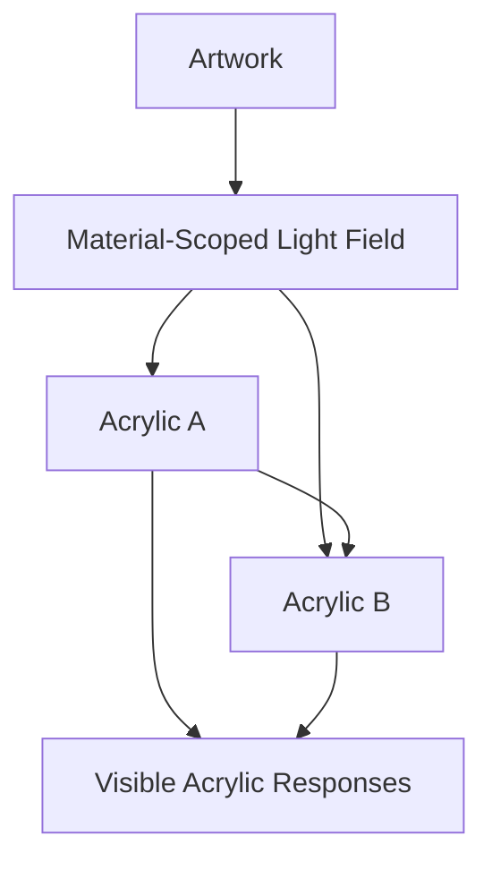
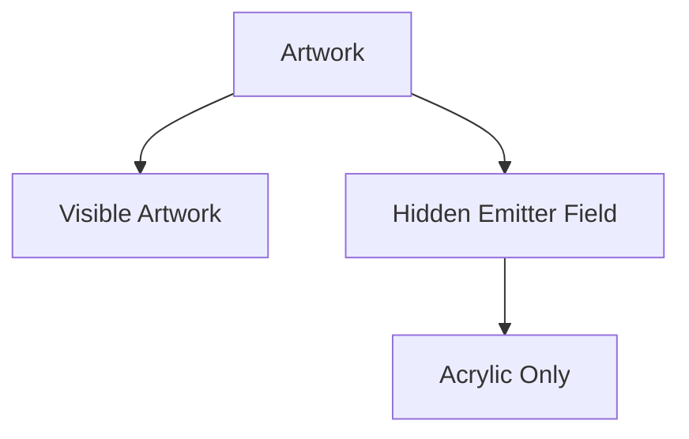
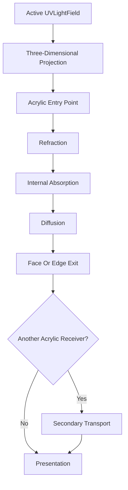
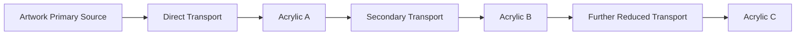
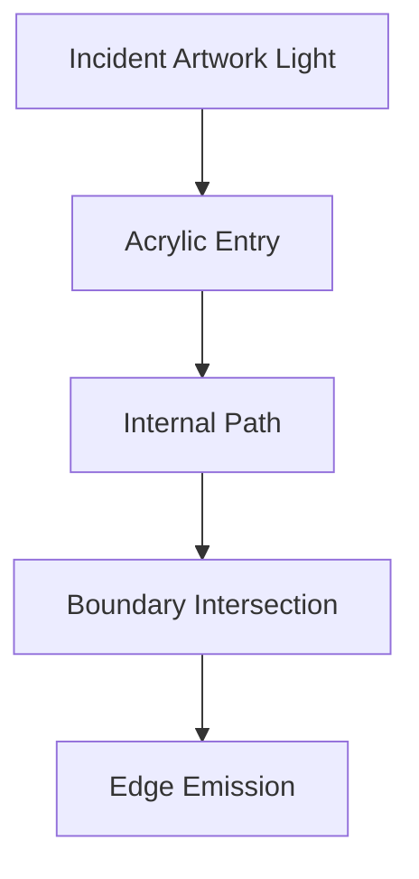
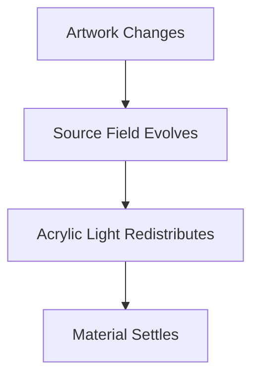
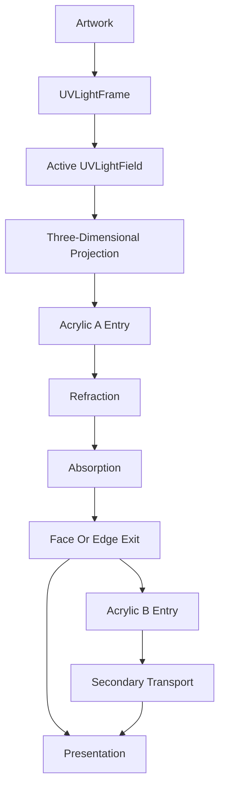

<!--
File: docs/design/system/mds-003-material-system/09-light-transport.md
Document: MDS-003
Chapter: 09
Title: Light Transport
Status: Draft
Version: 0.4
-->

# Light Transport

---

# Purpose

The previous chapters established:

- Acrylic,
- material-scoped artwork emission,
- UV-Indexed Refraction,
- three-dimensional Composition projection.

This chapter defines how artwork-derived light moves through Acrylic.

The objective is not complete optical simulation.

The objective is a consistent physical model that produces restrained, believable Acrylic.

---

# Definition

Within MDS, **Light Transport** is defined as:

> **The conceptual movement of material-scoped artwork light from one global primary source, through a bounded network of spatially related Acrylic composites and out through their surfaces or edges.**

Light Transport is an architectural model.

It is not a rendering algorithm.

---

# Material-Scoped Transport

Artwork emission exists only for Acrylic transport.

Within that transport layer, the artwork is the global primary source.

The field must not directly illuminate:

- Canvas,
- Surface,
- typography,
- icons,
- components,
- the wider Composition.

Those systems may respond to Runtime Atmosphere through separate behaviours.

They do not consume artwork-derived transport.

---

# Artwork Presentation

The artwork has an ordinary visible Presentation path and an independent material-emitter path.

The visible artwork must remain free from:

- bloom,
- halo effects,
- visible self-emission,
- global lighting behaviour.

Users should infer the source only from the Acrylic response.

The response may include light received directly from the artwork or indirectly through other Acrylic.

---

# Reference Acrylic Volume

The reference Mosaic Acrylic behaves conceptually like a polished sheet approximately one centimetre thick.

This is an optical Material reference applied to a two-dimensional surface or composite rather than a geometric volume.

This establishes a stable physical character for:

- internal path length,
- colour absorption,
- diffusion,
- face transmission,
- edge emission.

Runtime Material Resolution preserves one fixed apparent-thickness profile across devices, Composition scales and semantic roles.

Renderers may adapt technique and sampling resolution, but they must not reinterpret the Material as thinner or thicker.

---

# Transport Stages

Conceptually, light moves through several distinct stages.

Each stage has one responsibility.

Refraction bends the light path.

Absorption changes the energy and colour retained over that path.

Diffusion spreads the transported light within the material.

Exit behaviour determines where that transformed light becomes visible.

It also determines whether remaining energy may continue toward another Acrylic receiver.

---

# Three-Dimensional Direction

The direction of incident light follows the spatial relationship between the emitting artwork sample and the receiving Acrylic point.

It depends upon:

- the artwork position and orientation,
- the Acrylic position and orientation,
- the emitter position within artwork UV space,
- the Acrylic entry point,
- the source emission profile.

The same light field can therefore produce a different response when either object moves within the Composition.

This relationship must resolve before projection into screen space.

---

# Acrylic-To-Acrylic Transport

Acrylic should have a knock-on effect upon other Acrylic when their relative three-dimensional relationship permits transport.

Each Acrylic interaction may alter:

- direction,
- colour,
- intensity,
- spread,
- the next reachable boundary.

Secondary transport should remain visibly subordinate to direct artwork transport.

---

# Occlusion

Opaque Composition surfaces should block material-scoped transport according to bounds, masks and z-order.

Acrylic may transmit and transform it.

Visibility between the artwork, Acrylic entry points and subsequent Acrylic receivers should therefore influence the resolved environment.

This makes depth and ordering physically meaningful without exposing the hidden source to ordinary Presentation.

---

# Energy Conservation

The artwork is the only primary source of energy.

Acrylic may redistribute that energy but must not create more.

Every interaction should preserve or reduce the remaining transport contribution after accounting for:

- reflection,
- refraction,
- absorption,
- diffusion,
- distance and occlusion.

Further transport should stop when its contribution becomes negligible.

Implementations may enforce this through a bounded interaction depth, an energy threshold or an equivalent approximation.

---

# Refraction

Light bends as it crosses into and out of Acrylic.

The refracted path determines:

- how far light travels through the material,
- which internal regions it crosses,
- whether it exits through a face or edge,
- where its visible response appears.

Refraction must not distort typography, icons or interaction affordances.

Material expression remains subordinate to understanding.

---

# Absorption And Pigmentation

Acrylic becomes visually pigmented by the light transported through it.

The appearance should follow:

- the colour and intensity of incident artwork light,
- the distance travelled through Acrylic,
- the material absorption profile,
- Runtime Atmosphere constraints.

Longer internal paths may create a richer colour response than shorter paths.

This colour belongs within Acrylic rather than being painted onto its surface.

---

# Diffusion

Transported light should soften as it travels through Acrylic.

Strong local colour should gradually become:

- broader,
- calmer,
- less visually noisy.

Diffusion should preserve the spatial origin of the light without reproducing artwork detail inside the material.

---

# Edge Transport

When an internal light path reaches an Acrylic boundary, part of the response may become visible as edge emission.

The visible position of edge emission should move consistently with:

- artwork content,
- artwork transform,
- Acrylic transform,
- Acrylic shape, mask and transform.

Edge emission is not an independently animated border.

---

# Shared Global Environment

Every Acrylic receiver associated with the current artwork should participate in the same active transport environment.

Receivers interpret the global artwork source and any incoming secondary Acrylic transport through their own shape, mask, transform and Material role.

This provides one coherent energy origin without requiring independent or identical visible results.

Hero Acrylic may receive higher scheduling priority and preserve optional transport refinement longer under pressure.

Supporting and Overlay Acrylic use the same fixed transport profile.

Their different visible results arise from source relationship, geometry, occlusion, foreground separation and accessibility rather than semantic Material strength.

---

# Runtime Atmosphere

Runtime Atmosphere constrains artwork-derived transport according to the current World.

It may reduce:

- intensity,
- saturation,
- contrast,
- temporal change.

It must not convert the material-scoped source into direct component colouring or global illumination.

---

# Temporal Transport

Static artwork should normally reuse a cached `UVLightFrame` as its source.

Moving artwork and live video should publish a sampled `UVLightStream` from which the renderer reconstructs the same active `UVLightField` while preserving continuity.

Users should perceive one evolving material environment rather than repeated recolouring.

---

# Accessibility

Accessibility constrains the resolved Acrylic response.

Examples include:

High Contrast.

↓

Reduced transmission and diffusion.

Reduced Motion.

↓

Simplified temporal blending.

Low Vision.

↓

Reduced atmospheric variation.

The source field should remain coherent while material participation adapts.

---

# Performance

Future implementations should optimise Light Transport through:

- reusable cached artwork fields,
- reduced-resolution source data,
- incremental live updates,
- derived Composition transport and edge-response caches,
- temporal interpolation,
- shared material buffers.

These are conceptual optimisation directions rather than required implementation techniques.

The runtime should evaluate only transport relationships capable of producing a meaningful visible contribution.

Visibility, distance, orientation, remaining energy and Composition importance may all reduce the active transport graph.

Direct artwork transport possesses higher fidelity priority than secondary Acrylic transport.

Secondary transport should reduce in depth, precision, frequency or active relationships before direct transport loses spatial coherence.

The authoritative source remains the artwork and its reproducible derived field.

During video playback, Light Transport must operate within measured presentation headroom.

If no safe headroom remains, transport should hold its last stable result rather than compete with video presentation.

---

# Modules

Modules contribute:

- artwork,
- metadata,
- information.

Modules never define:

- material emitters,
- light-field generation,
- Acrylic transport,
- edge emission.

The Platform owns one material model for every module.

---

# Anti-Patterns

## Visible Artwork Lamp

Artwork glows or illuminates the wider Composition directly.

The material-scoped relationship becomes a visible lighting effect.

---

## Surface Tint

Artwork colour is applied directly to an Acrylic face without a transport relationship.

The material loses internal depth.

---

## Independent Acrylic Sources

Each Acrylic object constructs a different source from the same artwork.

The physical environment fragments.

---

## Missing Knock-On Transport

Spatially related Acrylic objects ignore light exiting neighbouring Acrylic.

The Composition loses physical continuity.

---

## Energy Amplification

Each Acrylic interaction increases available light or propagates indefinitely.

The hidden transport environment becomes unstable and visually dominant.

---

## Decorative Edge Glow

An edge highlight moves without a corresponding source, transform or internal light path.

The material behaves like an animated border.

---

# Light Transport Model

One hidden source.

One bounded three-dimensional transport environment.

Many spatially coupled Acrylic responses.

---

# Relationship To Future Chapter

The next chapter defines **Runtime Material Resolution**.

Light Transport explains:

> **How artwork-derived light moves through Acrylic.**

Runtime Material Resolution explains:

> **How that behaviour becomes a device-appropriate material response.**

---

# Summary

Light Transport connects artwork and a spatial network of Acrylic without making artwork visibly emissive.

Artwork supplies a hidden, spatially distributed source.

The three-dimensional Composition determines where that light meets Acrylic.

Acrylic bends, absorbs, diffuses and emits the result through its faces and edges, where remaining energy may influence other Acrylic.

Users see a believable material response rather than a lighting effect.
