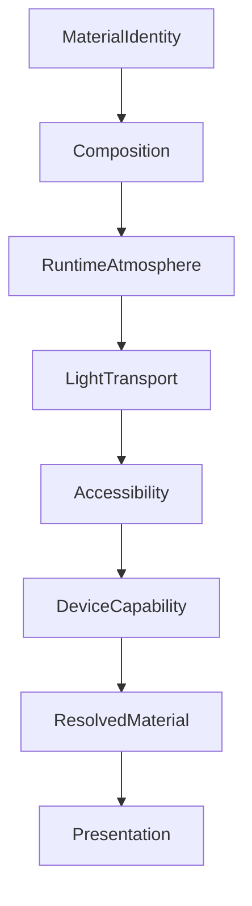

<!--
File: docs/design/system/mds-003-material-system/10-runtime-material-resolution.md
Document: MDS-003
Chapter: 10
Title: Runtime Material Resolution
Status: Draft
Version: 0.2
-->

# Runtime Material Resolution

---

# Purpose

The previous chapters established the conceptual behaviour of the Material System.

They defined:

- Material Hierarchy
- Acrylic
- Hero Material
- Overlay Material
- Refraction
- UV-Indexed Refraction
- Light Transport

This chapter defines how those independent systems become a resolved material at runtime.

Runtime Material Resolution is the bridge between architectural intent and rendered surfaces.

It ensures that every Mosaic client presents identical material behaviour regardless of rendering technology.

---

# Definition

Within MDS, **Runtime Material Resolution** is defined as:

> **The deterministic process through which conceptual material behaviour is transformed into concrete runtime material properties suitable for rendering.**

Runtime Material Resolution never changes material identity.

It only determines how that identity is expressed in the current environment.

---

# Why Resolution Exists

A Hero Tile should never decide:

- blur strength
- acrylic depth
- edge lighting
- atmosphere intensity
- translucency
- refraction strength

Instead it simply requests:

```text
Material.Hero
```

The Runtime Material Resolver determines everything else.

This dramatically reduces component complexity.

---

# Resolution Pipeline

Every material follows the same conceptual pipeline.

```text
Material Identity

↓

Semantic Tokens

↓

Runtime Atmosphere

↓

UV Field

↓

Light Transport

↓

Accessibility

↓

Device Capability

↓

Resolved Material
```

Each stage contributes exactly one responsibility.

---

# Resolution Inputs

The Runtime Material Resolver evaluates:

```text
Current World

↓

Current Focus

↓

Current Context

↓

Composition

↓

Material Identity

↓

Runtime Atmosphere

↓

Accessibility

↓

Theme

↓

Device
```

No single input should dominate.

The resolver balances all inputs according to architectural priority.

---

# Resolution Priority

Material Resolution follows a strict evaluation order.

```text
1.

Material Identity

↓

2.

Composition

↓

3.

Runtime Atmosphere

↓

4.

Accessibility

↓

5.

Device Capability

↓

6.

Rendering Backend
```

Meaning always precedes implementation.

Accessibility always precedes aesthetics.

---

# Material Identity Never Changes

One of the strongest guarantees within Mosaic is:

```text
Hero Material

↓

Always Hero Material
```

Regardless of:

- device
- theme
- accessibility
- artwork

Only its physical implementation changes.

The conceptual identity remains constant.

---

# Runtime Adaptation

Runtime Material Resolution adapts implementation.

Examples include:

Hero.

↓

Greater perceived thickness.

Playback.

↓

Reduced atmosphere.

Reading.

↓

Softer diffusion.

Administration.

↓

Calmer materials.

The same Material Identity behaves differently because the user's World changed.

Not because components changed.

---

# Accessibility Resolution

Accessibility possesses higher authority than physical realism.

Examples.

High Contrast.

↓

Reduced translucency.

Reduced Motion.

↓

Simplified atmosphere interpolation.

Low Vision.

↓

Reduced refraction.

Every adaptation should preserve:

- hierarchy
- readability
- interaction

before preserving material richness.

---

# Device Resolution

Different devices possess different rendering capabilities.

Desktop.

↓

Full Acrylic.

Television.

↓

Enhanced depth.

Phone.

↓

Reduced shader complexity.

Low Power Device.

↓

Simplified diffusion.

Despite implementation differences...

Users should continue perceiving the same Material System.

---

# Material Profiles

Future implementations may internally generate Material Profiles.

Conceptually.

```text
Material.Hero

↓

Runtime Profile

↓

Blur

↓

Refraction

↓

Thickness

↓

Edge Behaviour

↓

Lighting

↓

Resolved Material
```

Components consume only the completed profile.

---

# Runtime Caching

Resolved Materials should be aggressively cached.

Typical cache invalidation events include:

- Hero changes
- Focus changes
- artwork changes
- theme changes
- accessibility changes

Ordinary scrolling should not invalidate material resolution.

The environment should remain visually stable.

---

# Incremental Updates

Material Resolution should favour incremental refinement.

Preferred.

```text
Atmosphere Changes

↓

Update Hero

↓

Update Nearby Acrylic

↓

Canvas Stable
```

Avoid.

```text
Atmosphere Changes

↓

Rebuild Entire Material Tree
```

Incremental updates preserve continuity while reducing computational cost.

---

# Composition Awareness

Material Resolution should remain Composition-aware.

Example.

Primary Composition.

↓

High-quality Acrylic.

Peripheral Composition.

↓

Simplified Acrylic.

Material fidelity should follow compositional importance.

Rendering effort should therefore support user understanding.

---

# Module Behaviour

Modules never resolve materials.

Modules contribute:

- artwork
- information
- relationships

The platform resolves:

- Material Identity
- Atmosphere
- Refraction
- Lighting

This guarantees every module inherits identical physical behaviour.

---

# Good Examples

## Hero

Current artwork.

↓

Atmosphere.

↓

Hero Profile.

↓

Premium Acrylic.

↓

Rendered Surface.

---

## Timeline

Supporting Composition.

↓

Supporting Acrylic.

↓

Reduced refraction.

↓

Consistent hierarchy.

---

## Playback Overlay

Overlay Material.

↓

Reduced atmosphere.

↓

Maximum readability.

↓

Interaction remains effortless.

---

# Anti-patterns

## Component Materials

Components constructing materials independently.

The Material System fragments.

---

## Device Materials

Every client inventing its own material hierarchy.

Consistency disappears.

---

## Runtime Identity

Runtime changing Hero into Surface.

Meaning has leaked into implementation.

---

## Complete Rebuild

Every runtime update regenerates every material.

Continuity weakens.

Performance decreases.

---

# Runtime Material Model



Material behaviour is resolved once.

Components simply consume the result.

---

# Relationship To Future Specifications

Future specifications are expected to formalise:

- Material Resolver
- GPU Material Pipeline
- Shader Profiles
- Material Cache
- Acrylic Renderer
- Refraction Engine
- Cross-platform Material Backends

These systems implement the architecture defined by this chapter.

---

# Summary

Runtime Material Resolution transforms conceptual materials into physical experience.

It preserves:

- hierarchy
- atmosphere
- accessibility
- continuity
- performance

while hiding implementation complexity from the rest of the platform.

Components should never know:

- how Acrylic is rendered,
- how light was transported,
- how atmosphere was generated.

They should simply receive:

> **Material.Hero**

The Material System does everything else.

---

# Review Status

**Status**

Draft

**Next File**

`11-governance.md`
