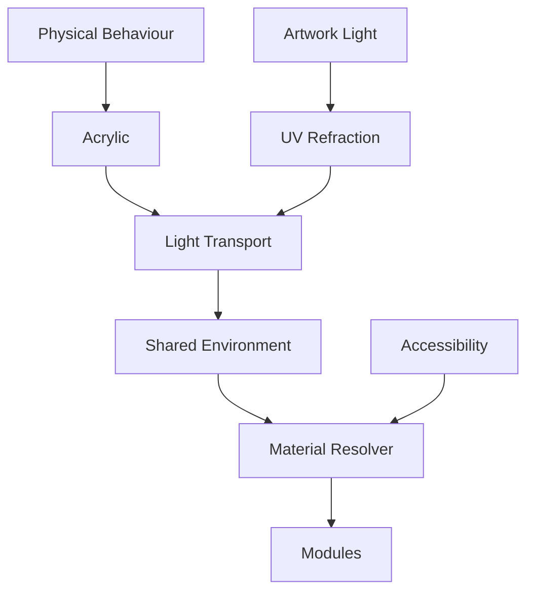

<!--
File: docs/design/system/mds-003-material-system/12-adrs.md
Document: MDS-003
Chapter: 12
Title: Architectural Decision Records
Status: Draft
Version: 0.2
-->

# Architectural Decision Records

---

# Purpose

The Architectural Decision Records (ADRs) contained within MDS-003 preserve the reasoning behind the Mosaic Material System.

Where previous specifications established:

- Design Tokens
- Colour
- Runtime Atmosphere

this specification establishes the physical language through which those systems become a believable environment.

These ADRs explain why Mosaic deliberately models materials as physical behaviours rather than decorative effects.

Future contributors should consult these records before proposing changes to the Material System.

---

# Decision Format

Decision format, lifecycle and review expectations are governed by **MDG-001 — Documentation Authority Guide**.

This chapter records decisions specific to this specification and avoids redefining the shared ADR process.

# ADR-111

## Title

Treat Materials As Physical Behaviours

### Status

Accepted

### Context

Most UI frameworks model materials as visual styles.

Founder workshops consistently described the desired experience as physical rather than decorative.

### Decision

Materials become behavioural objects.

Rendering becomes their implementation.

### Consequences

Future rendering technologies may evolve without changing the perceived physical language of Mosaic.

---

# ADR-112

## Title

Adopt Acrylic As The Primary Interactive Material

### Status

Accepted

### Context

Glass interfaces frequently disappear into the background while opaque panels isolate themselves from surrounding content.

Neither behaviour aligned with the desired Mosaic experience.

### Decision

Premium Acrylic becomes the primary interactive material.

### Consequences

The interface gains:

- presence
- depth
- environmental lighting
- restrained translucency

without competing with entertainment.

---

# ADR-113

## Title

Treat Artwork As Environmental Light

### Status

Accepted

### Context

Direct artwork recolouring weakens hierarchy and brand identity.

### Decision

Artwork becomes a conceptual light source rather than a colour palette.

### Consequences

Runtime Atmosphere influences Materials rather than directly colouring components.

This creates significantly stronger physical coherence.

---

# ADR-114

## Title

Introduce UV-Indexed Refraction

### Status

Accepted

### Context

Screen-space atmospheric effects become inconsistent across devices and layouts.

### Decision

Atmospheric lighting is projected into a normalised UV coordinate space sampled by materials.

### Consequences

Atmosphere becomes:

- device independent
- composition aware
- runtime efficient

while preserving one coherent lighting model.

---

# ADR-115

## Title

Separate Refraction From Colour

### Status

Accepted

### Context

Many rendering systems treat refraction as colour overlays or decorative bloom.

### Decision

Refraction becomes light transport rather than colour replacement.

### Consequences

Materials appear physically illuminated rather than digitally tinted.

---

# ADR-116

## Title

Material Resolution Owns Rendering Decisions

### Status

Accepted

### Context

Allowing components to construct their own material behaviour fragments the Material System.

### Decision

Components request Material Identity.

The Runtime Material Resolver determines implementation.

### Consequences

Applications remain simple while rendering technology evolves independently.

---

# ADR-117

## Title

Accessibility Overrides Material Fidelity

### Status

Accepted

### Context

Highly expressive material systems frequently reduce readability.

### Decision

Accessibility possesses higher authority than physical realism.

### Consequences

Material richness automatically adapts whenever readability would otherwise decrease.

---

# ADR-118

## Title

Maintain One Shared Environmental Lighting Model

### Status

Accepted

### Context

Per-component lighting creates inconsistent physical behaviour.

### Decision

Every material samples one shared Runtime Atmosphere field.

### Consequences

The interface feels like one coherent physical environment rather than unrelated visual effects.

---

# ADR-119

## Title

Modules Inherit The Material System

### Status

Accepted

### Context

Allowing modules to implement independent materials fragments product identity.

### Decision

Modules contribute:

- artwork
- information
- relationships

The platform owns every material behaviour.

### Consequences

Community modules automatically inherit future material improvements.

---

# ADR Relationships

Together these decisions establish one coherent physical model for the entire Mosaic interface.

---

# Future ADRs

Future Material ADRs are expected to formalise:

- Spectral Refraction
- HDR Material Response
- Dynamic Edge Illumination
- Adaptive Thickness
- Volumetric Acrylic
- Ray-Marched Atmosphere
- Material Level-of-Detail
- Hardware Capability Profiles

These intentionally remain outside the scope of MDS-003 Version 0.1.

---

# ADR Governance

Material ADRs should change only when:

- architectural inconsistencies emerge,
- runtime evolution requires refinement,
- accessibility research identifies deficiencies,
- the Design Language itself evolves.

Implementation techniques should never drive architectural changes.

Rendering engines evolve.

Material behaviour should remain recognisably Mosaic.

---

# Summary

The ADRs contained within MDS-003 define the physical identity of Mosaic.

Rather than treating materials as visual styling, Mosaic treats them as environmental behaviours.

Light moves.

Materials respond.

Entertainment quietly illuminates the interface.

Together these decisions create a material language that feels:

- premium,
- restrained,
- believable,
- unmistakably Mosaic.

---

# Review Status

**Status**

Draft

**Next File**

`13-contributor-guidance.md`
