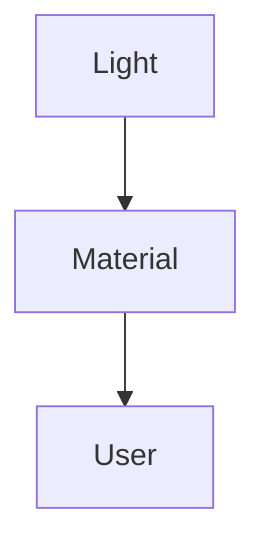
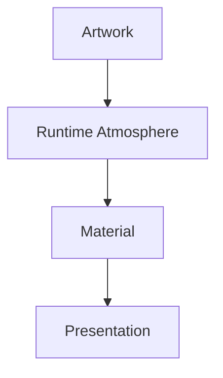
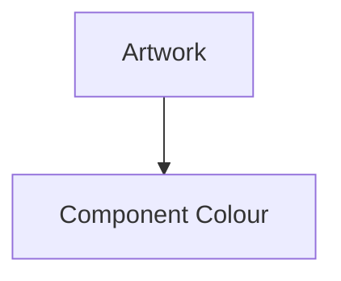
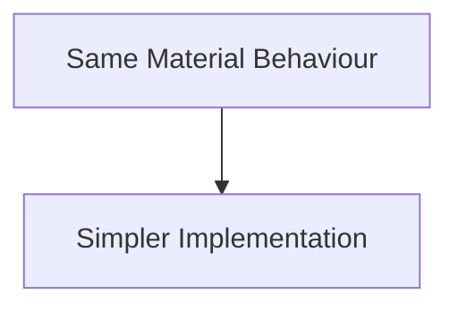
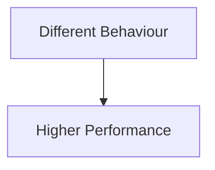

<!--
File: docs/design/system/mds-003-material-system/13-contributor-guidance.md
Document: MDS-003
Chapter: 13
Title: Contributor Guidance
Status: Draft
Version: 0.4
-->

# Contributor Guidance

---

# Purpose

The Material System is one of the most distinctive parts of Mosaic.

It defines how the interface feels rather than simply how it looks.

Every contributor working on:

- rendering,
- frontend,
- design,
- shaders,
- components,
- runtime systems,

will eventually interact with this specification.

The purpose of this chapter is to ensure that every implementation strengthens one coherent physical language rather than introducing isolated visual effects.

---

# Think In Materials

Never begin with:

> How should this shader work?

Instead ask:

> **What physical behaviour am I trying to communicate?**

Rendering should always emerge from material behaviour.

Not the reverse.

---

# Think In Light

One useful mental model is to stop thinking about colour entirely.

Instead imagine:



Ask:

- Where is the light coming from?
- How should this material respond?
- Should the user notice the light...
  or simply feel it?

This mindset naturally produces calmer interfaces.

---

# Materials Before Effects

Avoid implementing:

- blur
- glow
- bloom
- gradients
- transparency

as independent effects.

Instead ask:

> Which material should produce this behaviour?

Every visual effect should belong to a Material.

Not to a component.

---

# Preserve Material Identity

Every Material possesses one responsibility.

Canvas.

Environment.

Surface.

Grouping.

Acrylic.

Physical presence.

Hero.

Current importance.

Overlay.

Temporary interaction.

Avoid blending these responsibilities together.

The Material vocabulary should remain intentionally small.

---

# Let Atmosphere Travel

Applications should never manually tint materials.

Preferred.



Avoid.



Atmosphere belongs to the Material System.

Components should remain unaware of its implementation.

---

# Respect The Hero

The Hero Material should receive the highest compositional and rendering priority while retaining the same fixed Acrylic behaviour.

However...

It should never become more visually interesting than the entertainment itself.

When implementing Hero Materials ask:

> Does this strengthen the artwork...

or compete with it?

If the answer is competition...

Reduce the effect.

---

# Protect The Canvas

The Canvas should remain calm.

Avoid introducing:

- strong gradients
- heavy atmosphere
- animated backgrounds
- decorative textures

The Canvas exists to support.

Never to perform.

---

# Acrylic Should Feel Solid

When implementing Acrylic, imagine a physical object.

Not a CSS filter.

Acrylic should communicate:

- thickness
- diffusion
- restrained translucency
- subtle edge lighting

If the material begins feeling like glass...

Reduce transparency.

Increase perceived substance.

---

# Refraction Exists For Understanding

Refraction should always explain physical presence.

It should never exist because shaders are available.

One selected Material-light source should remain the only global primary source for the Acrylic transport environment.

Use focused or Hero artwork when available and the governed Brand Illumination Pair fallback otherwise.

Spatially related Acrylic should preserve coherent knock-on transport without creating or indefinitely recirculating energy.

Ask:

> Does this strengthen perceived depth?

If not...

Remove it.

The best refraction is often the one users never consciously notice.

---

# Runtime Owns Materials

Applications should never construct Material behaviour.

Components request:

```text
Material.Hero
```

The Runtime Material Resolver determines:

- atmosphere
- refraction
- diffusion
- edge behaviour
- lighting

This separation dramatically simplifies application code.

---

# Accessibility Is Architectural

Accessibility is not an optional rendering mode.

Every Material implementation should begin by asking:

> Will this remain readable?

Only afterwards ask:

> Will this feel immersive?

Physical realism always remains subordinate to understanding.

---

# Modules

Modules should never define:

- Acrylic
- Blur
- Refraction
- Lighting
- Materials

Instead they contribute:

- artwork
- information
- relationships

The Material System automatically integrates those contributions into one coherent physical environment.

---

# Device Independence

Do not optimise Materials for one platform.

Instead ask:

> Would this still feel like Acrylic on:

- Desktop?
- Mobile?
- Television?
- Future devices?

Implementation may differ.

Perception should remain constant.

---

# Performance

Performance optimisation should preserve behaviour.

Material quality should follow measured client capability and available frame budget rather than device labels.

Preferred.



Avoid.



If simplification becomes necessary:

Reduce implementation complexity.

Preserve conceptual behaviour.

Reduce secondary transport and negligible detail before weakening direct artwork-to-Acrylic coherence.

During video playback:

Preserve the video presentation deadline.

Skip or defer Material work when necessary.

Reuse the last stable Material state rather than blocking playback.

Generate `UVLightFrame` updates independently from video presentation cadence.

Do not require analysis of every presented video frame.

---

# Common Mistakes

Avoid the following.

### Frosted Glass

Blur replacing material behaviour.

---

### Decorative Glow

Glow existing independently from Runtime Atmosphere.

---

### Transparent Panels

Interfaces becoming visually fragile.

---

### Material Per Component

Every component inventing independent physical behaviour.

---

### Heavy Atmosphere

Materials becoming more expressive than entertainment.

---

### Platform-Specific Behaviour

Desktop Acrylic behaving fundamentally differently from Television Acrylic.

---

# Material Review Questions

Before implementing any Material ask:

- What physical object does this represent?
- Where does its light originate?
- Does this preserve hierarchy?
- Does this strengthen immersion?
- Would removing this effect reduce understanding?
- Does this still feel like Mosaic?

If the final answer is uncertain...

Return to the Material hierarchy before writing code.

---

# Material Checklist

Every Material implementation should satisfy the following.

- [ ] Material identity is clear.
- [ ] Runtime Atmosphere is respected.
- [ ] Refraction remains subtle.
- [ ] Spatially related Acrylic resolves as one coupled transport environment.
- [ ] Secondary transport remains energy bounded.
- [ ] Opaque Composition surfaces occlude hidden artwork light through bounds, masks and z-order.
- [ ] Quality follows measured renderer capability rather than device category.
- [ ] Stable frame pacing overrides Refraction fidelity.
- [ ] Refraction work cannot cause a video presentation deadline miss.
- [ ] Static and moving sources use the same UVLightFrame semantics.
- [ ] Video sampling may skip work without invalidating the active UVLightField.
- [ ] Accessibility remains uncompromised.
- [ ] Components remain unaware of implementation.
- [ ] Device independence is preserved.
- [ ] Performance optimisations preserve behaviour.
- [ ] Entertainment remains visually dominant.

---

# Final Guidance

The Material System exists to make software feel less like software.

When contributors find themselves discussing:

- shaders,
- blur,
- transparency,
- rendering,

they should pause and instead ask:

> **What should this material feel like?**

If that question becomes habitual, the implementation will naturally begin aligning with the Mosaic Design Language.

The strongest Material System is not the most technically impressive.

It is the one users stop noticing because it feels completely natural.
