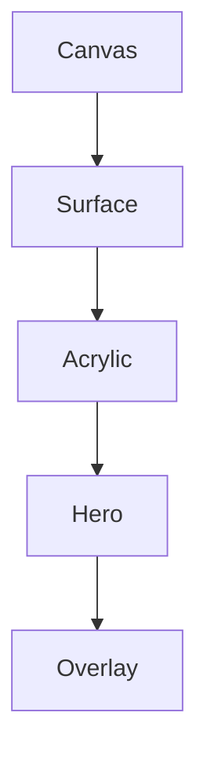

<!--
File: docs/design/system/mds-003-material-system/glossary.md
Document: MDS-003
Title: Glossary
Status: Draft
Version: 0.4
-->

# Glossary

---

# Purpose

This glossary defines the architectural terminology introduced by **MDS-003 — Material System**.

Unlike previous glossaries, this document focuses on the physical behaviour of the Mosaic interface rather than conceptual behaviour or colour.

These definitions should remain stable regardless of rendering technology.

Future specifications should reuse these terms consistently.

---

# A

## Adaptive Material Quality

The client-owned adjustment of independent Refraction quality dimensions according to measured rendering capability and available presentation budget.

Adaptation preserves Material invariants while reducing optional fidelity under pressure.

---

## Acrylic

The primary interactive material within the Mosaic Material System.

Acrylic is a semi-translucent material that receives:

- Runtime Atmosphere
- artwork-derived material light
- Refraction

while preserving:

- hierarchy
- readability
- physical presence

Acrylic is intentionally distinct from glass.

It possesses substance.

---

## Acrylic Assembly

A group of rigid Acrylic Tiles that may share layout, rendering work and transported light while preserving distinct material boundaries and precision seams.

An Acrylic Assembly is not a fused or liquid surface.

---

## Acrylic-To-Acrylic Transport

The bounded redistribution of artwork-derived light from one Acrylic object to another according to their relative relationship within the three-dimensional Composition.

Acrylic redirects existing energy rather than creating a new primary source.

---

## Acrylic Volume

The middle layer of the three-layer Acrylic optical model.

It filters incident artwork light through governed tint transmission, absorption and scattering; carries directional contour ingress inward as pigmentation; and supplies restrained internal optical parallax.

---

## Atmosphere

The environmental lighting generated from the user's current entertainment.

Atmosphere is received by Materials.

It is not applied directly to components.

---

# B

## Backdrop Participation

The receiver-local distortion and diffusion of actual Presentation rendered behind an Acrylic surface.

Backdrop Participation remains separate from the hidden artwork-derived `UVLightField` and does not create another global primary source.

---

## Brand Illumination Pair

The default Mosaic Indigo and Cyan pair, or a resolved co-brand pair containing Mosaic Indigo and one normalised registered partner accent, resolved into a stable synthetic Material-light field when no focused or Hero artwork is available.

The pair supplies Acrylic illumination without recolouring components or replacing Mosaic Material behaviour.

---

# C

## Canvas

The foundational environmental material beneath every Mosaic Composition.

Canvas communicates:

- calmness
- stability
- continuity

It receives minimal atmospheric influence.

Canvas is a Material identity and should not be confused with the three-dimensional Composition Space in which artwork and Acrylic are positioned.

---

## Composition Space

The spatial coordinate system in which two-dimensional artwork and Acrylic surfaces possess `x`, `y`, `z`, orientation, bounds and masks before projection into Presentation.

Composition Space does not require mesh geometry.

---

# D

## Diffusion

The soft internal spreading of transported artwork light through Acrylic.

Diffusion reduces:

- saturation
- contrast
- visual noise

while increasing perceived physical realism.

---

## Dynamic Material Budget

The measured portion of presentation headroom currently available to Material Resolution after core presentation, interaction reserve and safety margin are considered.

The budget changes with renderer performance and runtime conditions rather than device category.

---

# E

## Energy Conservation

The requirement that Acrylic transport preserve or reduce the energy supplied by the artwork primary source.

Successive interactions must not amplify or recirculate light without a termination condition.

---

## Edge Lighting

The subtle illumination visible along the edges of Acrylic materials.

Edge Lighting communicates:

- thickness
- craftsmanship
- physical presence

It should remain understated.

When caused by artwork-derived light exiting an Acrylic boundary, this behaviour is described more precisely as **Edge Emission**.

---

## Edge Emission

The restrained visible response created when artwork-derived light exits through an Acrylic boundary.

Its position follows the relationship between:

- artwork content,
- artwork transform,
- Acrylic transform,
- Acrylic shape, mask and transform.

Edge Emission belongs to Acrylic rather than the visible artwork.

---

# F

## Fidelity Maximum

The highest Refraction fidelity permitted by user preference: Automatic, Balanced or Essential.

Accessibility, capability, current budget and Presentation deadlines may resolve to a lower level.

---

## Focused Artwork Source

The artwork associated with current Focus and therefore selected as the active global primary source for Acrylic.

Hero artwork becomes the source when Focus is not associated with artwork.

---

## Front Surface Response

The polished outer layer of the three-layer Acrylic optical model.

It supplies thin contour definition, restrained Fresnel response, reflection and specular behaviour without becoming a thick bezel or uniform glowing outline.

---

# H

## Hero Material

The material representing the highest-priority concept within the current Composition.

Hero Material receives the highest compositional and rendering priority while preserving the same fixed Acrylic profile and the dominance of entertainment artwork.

---

# L

## Light Transport

The conceptual movement of material-scoped artwork light from one global primary source through a bounded network of Acrylic within the three-dimensional Composition.

Light Transport describes behaviour rather than implementation.

It should feel physically believable rather than visually dramatic.

---

# M

## Material

A physical behavioural object within the Mosaic Design System.

Materials communicate:

- hierarchy
- environmental response
- physical presence

They are not equivalent to rendering effects.

---

## Material-Scoped Artwork Emitter

The hidden, spatially distributed role through which the current artwork acts as the global primary source exposed exclusively to Acrylic.

The visible artwork remains ordinarily presented and does not glow or illuminate the wider Composition.

---

## Material Hierarchy

The ordered relationship between all Mosaic materials.

Each level communicates increasing physical presence.

---

## Material Resolution

The runtime process that transforms Material Identity into concrete rendering behaviour.

Material Resolution evaluates:

- Runtime Atmosphere
- Accessibility
- Renderer Capability Profile
- Dynamic Material Budget
- Theme

before producing renderable material properties.

---

# O

## Occlusion

The blocking of material-scoped artwork light by opaque Composition surfaces according to their bounds, masks and z-order.

Acrylic may transmit and transform the field, while opaque surfaces prevent transport through their covered Composition region.

---

## Optical Parallax

The bounded relative movement of sampled artwork, backdrop, diffusion and glare layers inside a stable Acrylic mask.

Optical Parallax uses apparent thickness and Composition relationships to communicate physical depth without mesh geometry.

---

## Overlay Material

A temporary material prioritising interaction and readability.

Overlay Material participates in the Material System while reducing atmospheric influence.

It exists only while interaction requires it.

---

# P

## Physical Presence

The perceived solidity of a material.

Physical Presence is communicated through:

- diffusion
- edge lighting
- depth
- refraction

rather than shadows or opacity alone.

---

## Playback Protection

The Refraction Engine behaviour that preserves video presentation deadlines by skipping, deferring or simplifying Material work and reusing the last stable Material state when necessary.

---

## Presentation Deadline

The latest safe completion point for work required to present the next frame without an attributable delay or drop.

Video Presentation Deadlines possess higher authority than Refraction fidelity.

---

## Primary Artwork Source

The current artwork acting as the single global origin of energy for its Acrylic transport environment.

Global applies within the Acrylic transport layer and does not make the artwork visibly emissive in ordinary Presentation.

When no focused or Hero artwork exists, a Brand Illumination Pair becomes the Primary Material-Light Source instead.

---

## Primary Material-Light Source

The single global origin of energy for one Acrylic transport environment.

It is selected from focused artwork, Hero artwork, an approved Brand Illumination Pair or the default Mosaic pair in that order.

---

# R

## Rear Optical Plane

The rear layer of the three-layer Acrylic optical model.

It samples visible Presentation behind Acrylic using fixed bounded displacement and safe overscan while remaining relatively sharp rather than uniformly frosted.

---

## Relative Radiance

The spatial relationship between artwork colour and emitted light intensity without asserting an absolute physical luminance or requiring HDR source artwork.

Within a `UVLightFrame`, the magnitude of linear colour preserves relative brightness between artwork regions and across temporally related source frames.

---

## Refraction

The controlled bending and transport of artwork-derived light through Mosaic Acrylic.

Refraction communicates:

- depth
- atmosphere
- environmental continuity

It should never become decorative.

---

## Runtime Atmosphere Constraints

The contextual, accessibility and visual-restraint limits applied to artwork-derived light before Acrylic transport resolves.

Runtime Atmosphere governs the strength of the material response without replacing the spatial source field.

---

## Renderer Capability Profile

The client-local understanding of available rendering features, their measured cost and current runtime headroom.

It is discovered and maintained by the client renderer rather than inferred from a device category or prescribed by Runtime SDUI.

---

## Runtime Material Resolver

The platform subsystem responsible for producing resolved Material Profiles.

Applications consume resolved materials rather than constructing them.

---

# S

## Secondary Acrylic Transport

The reduced and transformed light passed from one Acrylic object to another after an earlier direct or secondary interaction.

Secondary transport depends upon relative position, distance, orientation, surface bounds, masks, visibility and remaining energy.

---

## Static Brand Emitter

A page-level artwork-free source definition that positions a governed Brand Illumination Pair in the Composition Space parent using normalised `x`, `y` and bounded logical `z` coordinates.

The client generates a stable procedural `UVLightField` without requiring artwork analysis or `.mos` serialisation.

---

## Static Material-Light Source

A stable synthetic light field derived from a Brand Illumination Pair and used where meaningful artwork is absent.

---

## Surface

A grouping material sitting between Canvas and Acrylic.

Surfaces organise information while remaining visually restrained.

They receive limited atmospheric influence.

---

# T

## Thickness

The perceived depth of a material.

Thickness is communicated through:

- edge behaviour
- diffusion
- refraction
- lighting

The reference Mosaic Acrylic behaves conceptually like a polished sheet approximately one centimetre thick.

Thickness is an optical Material parameter rather than geometric extrusion.

Runtime implementations preserve one fixed apparent-thickness profile while adapting renderer technique, sampling resolution and optional refinement.

---

# U

## UVLightField

The active, temporally reconstructed relative-radiance primary source consumed by Acrylic transport.

Acrylic receivers use one shared `UVLightField` through their three-dimensional relationship with the artwork and may redistribute its remaining energy to other Acrylic.

The `UVLightField` is independent of:

- screen resolution
- layout
- a particular Acrylic object
- rendering technology

---

## UVLightFrame

One immutable, normalised and downscaled snapshot of primary artwork light at a source state or timestamp.

Static artwork normally produces one cached `UVLightFrame`.

The frame preserves spatially varying mean linear colour and relative brightness, may preserve local peak luminance, and does not imply that its source artwork is HDR.

Artwork-to-Acrylic direction is derived from the three-dimensional Composition rather than stored as receiver-relative frame data.

The exact serialised schema is defined by [MIP-003 — UVLightFrame Protocol](../../../engineering/protocols/mip-003-uv-light-frame-protocol/index.md).

---

## UVLightStream

An ordered sequence of timestamped `UVLightFrame` values generated from moving artwork or periodically sampled video.

The renderer reconstructs an active `UVLightField` from the stream without requiring analysis of every presented video frame.

---

## UV-Indexed Refraction

The conceptual lighting model through which artwork-derived light is represented in normalised artwork UV space, projected into the three-dimensional Composition and propagated through a bounded network of Acrylic.

This system provides one coherent material light source across every client.

---

# Cross References

| Specification | Primary Concepts |
|---------------|------------------|
| [MDL-001 — Mosaic Design Language Vision](../../language/mdl-001-vision/index.md) | Companion, Immersion |
| [MDL-002 — Principles](../../language/mdl-002-principles/index.md) | Calmness, Restraint |
| [MDL-003 — Mental Model](../../language/mdl-003-mental-model/index.md) | World, Focus |
| [MDL-004 — Interaction Model](../../language/mdl-004-interaction-model/index.md) | Continuity |
| [MDL-005 — Composition Model](../../language/mdl-005-composition-model/index.md) | Hero, Hierarchy |
| [MDS-001 — Design Token Architecture](../mds-001-design-token-architecture/index.md) | Semantic Tokens, Resolved Tokens |
| [MDS-002 — Colour System](../mds-002-colour-system/index.md) | Runtime Atmosphere |

---

# Terminology Rules

Future contributors should:

- describe materials as behaviours rather than effects
- describe light before colour
- distinguish Acrylic from glass
- distinguish Atmosphere from Brand
- distinguish Refraction from blur
- distinguish artwork Presentation from material-scoped artwork emission
- describe Composition Space as three-dimensional

Material terminology should remain independent from rendering implementation.
