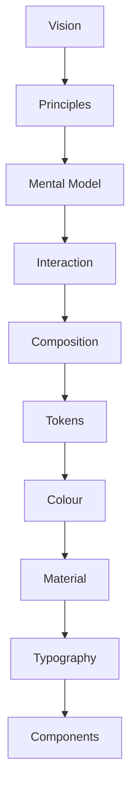
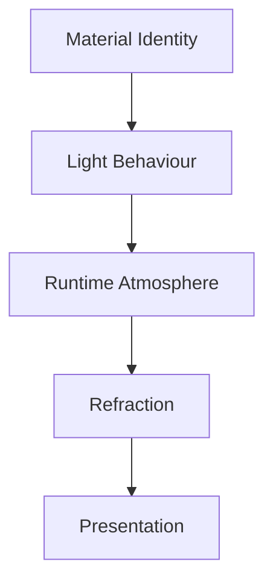

<!--
File: docs/design/system/mds-003-material-system/index.md
Document: MDS-003
Status: Draft
Version: 0.4
-->

# MDS-003 — Material System

> *Materials are not textures. They are physical behaviours through which the user's entertainment becomes part of the interface.*

---

# Purpose

The Mosaic Design Language established:

- Why Mosaic exists.
- How it thinks.
- How it behaves.
- How understanding is organised.

The Design System has established:

- Design Tokens
- Colour Architecture

MDS-003 defines how those concepts become **physical interface materials**.

Unlike traditional design systems, Mosaic does not treat materials as decorative surfaces.

Materials are considered physical participants within the user's entertainment World.

They receive:

- Runtime Atmosphere
- Refraction
- Light
- Hierarchy
- Interaction

and transform those inputs into a coherent visual experience.

---

# Relationship to Previous Specifications



The Material System consumes:

- Design Tokens
- Semantic Colours
- Runtime Atmosphere

It produces:

- Physical Surfaces
- Acrylic Behaviour
- Refraction
- Depth
- Environmental Response

---

# Scope

This specification defines:

- Material Philosophy
- Material Hierarchy
- Canvas
- Acrylic
- Fixed Three-Layer Acrylic Optical Model
- Tint-Only Authored Acrylic Control
- Hero Material
- Overlay Material
- Refraction
- Material-Scoped Artwork Emission
- Focused-Or-Hero Artwork Source Selection
- Local Backdrop Participation
- UV Mapping
- UVLightFrame, UVLightStream And UVLightField
- Acrylic Composition And Optical Parallax
- Light Transport
- Acrylic-to-Acrylic Transport
- Bounded Acrylic Proximity Transport
- Capability-Driven Material Quality
- Video Playback Protection
- Material Resolution
- Runtime Material Behaviour

This specification intentionally does **not** define:

- Typography
- Components
- Motion Curves
- Layout
- Interaction

Those systems consume Materials.

They do not define them.

---

# Guiding Question

MDS-003 exists to answer one question.

> **How should the interface physically exist?**

Not:

> How should it be coloured?

---

# Material Statement

Within Mosaic:

> **Materials communicate physical presence rather than visual decoration.**

Every material should answer:

- What is this?
- How does light interact with it?
- How does it relate to the user's entertainment?

before it answers:

- How does it look?

---

# Material Responsibilities

The Material System separates responsibilities into independent layers.



Each layer contributes one responsibility.

No layer duplicates another.

---

# Expected Outcome

After reading MDS-003 contributors should understand:

- why Mosaic uses Acrylic
- why one fixed Acrylic profile resolves through Rear Optical Plane, Acrylic Volume and Front Surface responsibilities
- why tint is the only authored Acrylic Material control
- how Runtime Atmosphere interacts with materials
- how Refraction works
- how artwork-space UV light fields enter the three-dimensional Composition
- why artwork emission remains visible only through Acrylic response
- how focused artwork, Hero artwork and governed static Brand Illumination Pairs select the active source
- how local backdrop distortion remains separate from hidden artwork light
- how still images and periodically sampled video produce the same standard light-field model
- how two-dimensional Acrylic composites create physical depth through bounded parallax
- how spatially related Acrylic redistributes bounded artwork-derived light
- how client renderers adapt Material fidelity to measured presentation headroom
- why video presentation deadlines override Refraction fidelity
- how surfaces establish hierarchy
- how future rendering systems should implement these ideas

without discussing specific rendering technologies.

---

# Repository Structure

```text
design/

└── mds/

    └── MDS-003 Material System/

        README.md

        00-document-control.md

        01-material-philosophy.md

        02-material-hierarchy.md

        03-canvas.md

        04-acrylic.md

        05-hero-material.md

        06-overlay-material.md

        07-refraction.md

        08-uv-indexed-refraction.md

        09-light-transport.md

        10-runtime-material-resolution.md

        11-governance.md

        12-adrs.md

        13-contributor-guidance.md

        references.md

        glossary.md
```

---

# Dependencies

Required reading:

- [MDL-001](../../language/mdl-001-vision/index.md) → [MDL-005](../../language/mdl-005-composition-model/index.md)
- [MDS-001 — Design Token Architecture](../mds-001-design-token-architecture/index.md)
- [MDS-002 — Colour System](../mds-002-colour-system/index.md)

Downstream specifications:

- [MDS-004 — Typography System](../mds-004-typography-system/index.md)
- [MDS-005 — Motion System](../mds-005-motion-system/index.md)
- [MDP-001 — Adaptive Composition Runtime](../../../engineering/architecture/mdp-001-adaptive-composition-runtime/index.md)
- [MDP-001 — Adaptive Composition Runtime](../../../engineering/architecture/mdp-001-adaptive-composition-runtime/14-adaptive-tile-model.md)
- [MDS-008 — Component Library](../mds-008-component-library/index.md)
