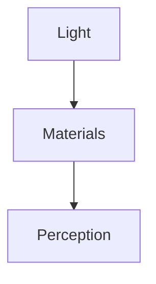
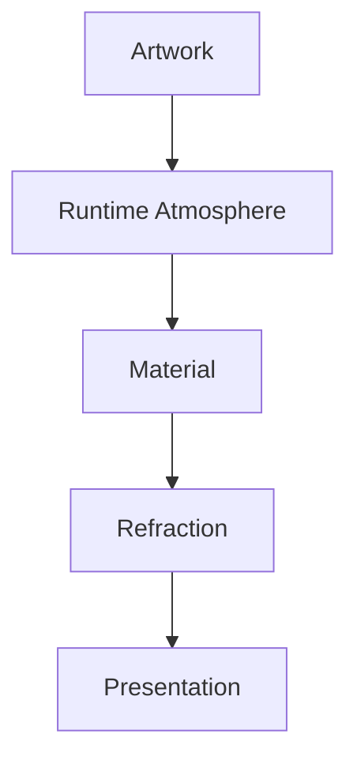

<!--
File: docs/design/system/mds-003-material-system/references.md
Document: MDS-003
Title: References
Status: Draft
Version: 0.4
-->

# References

---

# Purpose

This document records the architectural influences and conceptual foundations that informed **MDS-003 — Material System**.

Unlike implementation documentation, these references explain *why* the Material System behaves as it does rather than prescribing rendering techniques.

The Material System intentionally combines ideas from:

- physical materials,
- environmental lighting,
- industrial design,
- human perception,
- rendering architecture,
- entertainment interfaces,

into one coherent architectural language.

---

# Reading Order

Contributors should approach references in the following order.

1. MDL Specifications
2. Design Token Architecture
3. Colour System
4. Material System
5. Rendering Architecture
6. Platform Implementations

The Mosaic Design Language remains the authoritative source.

External references provide inspiration rather than specification.

---

# Internal References

## [MDL-001 — Mosaic Design Language Vision](../../language/mdl-001-vision/index.md)

Provides:

- Companion philosophy
- Entertainment-first thinking
- Premium product identity

The Material System exists to reinforce immersion without competing with entertainment.

---

## [MDL-002 — Principles](../../language/mdl-002-principles/index.md)

Provides:

- Content Leads
- Every Feature Earns Its Place
- Calm Interfaces
- Context Before Prediction

Materials should quietly support these principles rather than becoming visual features in their own right.

---

## [MDL-003 — Mental Model](../../language/mdl-003-mental-model/index.md)

Provides:

- World
- Focus
- Context
- Information
- Relationships

Materials physically express the World.

They never redefine it.

---

## [MDL-004 — Interaction Model](../../language/mdl-004-interaction-model/index.md)

Provides:

- Continuity
- Behaviour
- Movement
- Temporal evolution

Material behaviour should evolve alongside interaction rather than independently from it.

---

## [MDL-005 — Composition Model](../../language/mdl-005-composition-model/index.md)

Provides:

- Hero
- Hierarchy
- Priority
- Density
- Anchors

Material Hierarchy is intentionally derived from the Composition Model.

Physical presence should reinforce conceptual hierarchy.

---

## [MDS-001 — Design Token Architecture](../mds-001-design-token-architecture/index.md)

Provides:

- Semantic Tokens
- Resolved Tokens
- Resolution Pipeline

Materials consume Resolved Tokens and governed Resolution Context rather than generating their own semantic meaning.

---

## [MDS-002 — Colour System](../mds-002-colour-system/index.md)

Provides:

- Brand
- Semantic Colours
- Runtime Atmosphere
- Theme Architecture

The Material System intentionally treats Runtime Atmosphere as environmental light rather than surface colour.

---

## [MIP-003 — UVLightFrame Protocol](../../../engineering/protocols/mip-003-uv-light-frame-protocol/index.md)

Defines the machine-readable artwork-light frame, relative-radiance channels, serialised texture profile and compatibility rules consumed by Refraction.

MDS-003 remains authoritative for visual meaning and Material behaviour.

---

## [MEG-014 — Refraction Engine](../../../engineering/guides/meg-014-refraction-engine/index.md)

Explains how clients resolve focused-or-Hero artwork light, local backdrop, two-dimensional surface relationships and performance budgets into renderer-ready Acrylic state.

---

# Future Specifications

The following specifications directly depend upon MDS-003.

- [MDS-004 — Typography System](../mds-004-typography-system/index.md)
- [MDS-005 — Motion System](../mds-005-motion-system/index.md)
- [MDP-001 — Adaptive Composition Runtime](../../../engineering/architecture/mdp-001-adaptive-composition-runtime/index.md)
- [MDP-001 — Adaptive Composition Runtime](../../../engineering/architecture/mdp-001-adaptive-composition-runtime/14-adaptive-tile-model.md)
- [MDS-008 — Component Library](../mds-008-component-library/index.md)

These specifications should consume Materials rather than introducing independent physical behaviour.

---

# Industrial Design

The Material System draws significant inspiration from physical industrial materials rather than digital interface trends.

Examples include:

- polished acrylic
- machined aluminium
- architectural glass
- illuminated resin
- museum display systems

The objective is not literal reproduction.

It is perceived physical credibility.

---

# Environmental Lighting

One of the defining conceptual influences is environmental lighting.

Instead of colouring interface objects directly:

This model creates stronger visual coherence than direct colour application.

It is one of the defining architectural ideas behind Mosaic.

---

# Human Perception

Several characteristics of visual perception influenced the Material System.

Examples include:

- depth perception
- edge recognition
- environmental lighting
- peripheral vision
- object permanence

The Material hierarchy is designed to reinforce these perceptual behaviours rather than work against them.

---

# Rendering Architecture

Although MDS intentionally avoids implementation details, the Material System assumes future rendering architectures capable of:

- GPU acceleration
- material composition
- runtime atmosphere
- cached lighting
- adaptive shaders

These technologies remain implementation concerns.

The Material behaviour defined within MDS should remain stable regardless of rendering backend.

---

# Physical Simulation

The Material System is **not** intended to become a physically accurate rendering engine.

Instead it follows a principle of:

> **Perceived realism over physical realism.**

Every rendering decision should improve:

- understanding
- immersion
- calmness

rather than simulation accuracy.

---

# Runtime Behaviour

Materials intentionally evolve with:

- Focus
- Context
- Runtime Atmosphere
- Theme
- Accessibility

The Material System therefore treats rendering as a continuously evolving environmental system rather than a static skin.

---

# Platform Independence

Material behaviour should remain consistent across:

- Web
- Flutter
- SwiftUI
- Jetpack Compose
- Future rendering engines

Implementation quality may differ.

Material identity should not.

---

# Mosaic-Specific Influences

The Material System emerged directly from founder exploration.

Major architectural discoveries included:

- Acrylic should feel substantial rather than transparent.
- Artwork should illuminate the interface rather than recolour it.
- Refraction should communicate physical presence rather than visual effects.
- Runtime Atmosphere should behave like environmental lighting.
- Materials should support entertainment rather than compete with it.
- UV-indexed lighting provides stronger conceptual consistency than screen-space effects.

Together these discoveries define the physical language unique to Mosaic.

---

# Relationship To The Refraction System

The Material System intentionally positions Refraction as a consequence of:

This ordering ensures:

- hierarchy remains stable,
- brand identity remains recognisable,
- materials remain physically believable.

Future rendering implementations should preserve this architectural ordering.

---

# Normative References

Required reading before contributing to MDS-003.

- [MDL-001 — Mosaic Design Language Vision](../../language/mdl-001-vision/index.md)
- [MDL-002 — Principles](../../language/mdl-002-principles/index.md)
- [MDL-003 — Mental Model](../../language/mdl-003-mental-model/index.md)
- [MDL-004 — Interaction Model](../../language/mdl-004-interaction-model/index.md)
- [MDL-005 — Composition Model](../../language/mdl-005-composition-model/index.md)
- [MDS-001 — Design Token Architecture](../mds-001-design-token-architecture/index.md)
- [MDS-002 — Colour System](../mds-002-colour-system/index.md)

Together these documents define the conceptual foundation of the Material System.

---

# Informative References

Future contributors may also wish to review:

- [MDS-005 — Motion System](../mds-005-motion-system/index.md)
- [MDP-001 — Adaptive Composition Runtime](../../../engineering/architecture/mdp-001-adaptive-composition-runtime/index.md)
- [MDP-001 — Adaptive Composition Runtime](../../../engineering/architecture/mdp-001-adaptive-composition-runtime/14-adaptive-tile-model.md)
- [MDS-008 — Component Library](../mds-008-component-library/index.md)

These specifications describe how Material behaviour becomes interaction and presentation.

---

# Living Document

This reference list should remain intentionally concise.

References should only be introduced when they materially influence:

- material behaviour,
- environmental lighting,
- runtime architecture,
- implementation boundaries.

The objective is to preserve architectural reasoning rather than catalogue rendering techniques.

---

# Completion

This concludes **MDS-003 — Material System**.

The next specification in the Mosaic Design System is:

> **[MDS-004 — Typography System](../mds-004-typography-system/index.md)**

Where MDS-003 defines **how the interface physically exists**, [MDS-004](../mds-004-typography-system/index.md) defines **how language exists within that physical world**.

It formalises:

- Typography philosophy
- Reading hierarchy
- Editorial rhythm
- Responsive type scales
- Reading density
- Hero typography
- Motion-aware typography
- Accessibility
- Cross-platform typography

Together with the Material System, Typography completes the primary sensory language of Mosaic.
