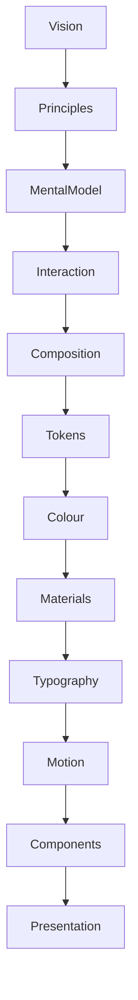

<!--
File: docs/design/system/mds-004-typography-system/00-document-control.md
Document: MDS-004
Title: Typography System
Status: Draft
Version: 0.4
-->

# Document Control

---

# Document Information

| Property | Value |
|----------|-------|
| Document ID | MDS-004 |
| Title | Mosaic Design System — Typography System |
| Classification | Internal |
| Status | Draft |
| Version | 0.4 |
| Owner | AdamNi-7080 |
| Parent Specifications | [MDL-001](../../language/mdl-001-vision/index.md) → [MDL-005](../../language/mdl-005-composition-model/index.md), [MDS-001](../mds-001-design-token-architecture/index.md), [MDS-002](../mds-002-colour-system/index.md), [MDS-003](../mds-003-material-system/index.md) |
| Repository | `/design/mds/MDS-004 Typography System/` |

---

# Purpose

MDS-004 defines the Typography System used throughout Mosaic.

Typography is not treated as visual styling.

It is treated as the primary mechanism through which Mosaic communicates knowledge.

Where the Material System defines:

> How the interface physically exists.

Typography defines:

> How the interface speaks.

Its responsibility is to make information feel:

- calm
- intelligent
- effortless
- trustworthy
- editorial

The Typography System therefore becomes a fundamental part of the Companion.

---

# Authority

MDS-004 governs:

- Type hierarchy
- Editorial rhythm
- Reading behaviour
- Responsive typography
- Variable font behaviour
- Accessibility
- Runtime typography
- Cross-platform typography

This specification intentionally does **not** govern:

- Colour
- Materials
- Motion
- Components
- Layout

Those systems work alongside Typography.

---

# Relationship To MDS

Typography sits between Materials and Motion.

Typography consumes:

- Composition
- Colour
- Materials

It communicates:

- hierarchy
- rhythm
- language
- understanding

---

# Design Intent

Many interface typography systems optimise for:

- density
- efficiency
- information throughput

Mosaic intentionally optimises for:

- comprehension
- calmness
- editorial quality
- companionship

Typography should encourage users to read naturally rather than process interfaces mechanically.

---

# Reader Expectations

Before reading this specification contributors should already understand:

- [MDL-001 — Mosaic Design Language Vision](../../language/mdl-001-vision/index.md)
- [MDL-002 — Principles](../../language/mdl-002-principles/index.md)
- [MDL-003 — Mental Model](../../language/mdl-003-mental-model/index.md)
- [MDL-004 — Interaction Model](../../language/mdl-004-interaction-model/index.md)
- [MDL-005 — Composition Model](../../language/mdl-005-composition-model/index.md)
- [MDS-001 — Design Token Architecture](../mds-001-design-token-architecture/index.md)
- [MDS-002 — Colour System](../mds-002-colour-system/index.md)
- [MDS-003 — Material System](../mds-003-material-system/index.md)

Typography builds upon every one of these systems.

It should never redefine them.

---

# Architectural Scope

The Typography System defines:

- editorial hierarchy
- reading rhythm
- semantic typography
- runtime scaling
- accessibility
- responsive typography

It intentionally avoids implementation-specific concerns such as:

- CSS font declarations
- Flutter TextTheme
- SwiftUI Font
- Compose Typography

Those are implementation artefacts generated from this architecture.

---

# Stability

Expected lifetime.

| Artefact | Expected Lifetime |
|----------|-------------------|
| Font Implementation | Months |
| Variable Font Support | Months |
| Font Family | Years |
| Typography Hierarchy | Years |
| Typography Philosophy | Decades |

Rendering technology may evolve.

Reading behaviour should remain recognisably Mosaic.

---

# Success Criteria

MDS-004 succeeds when:

- users instinctively know what to read first
- reading feels calm rather than mechanical
- typography supports Composition rather than competing with it
- long-form reading remains comfortable
- interfaces feel editorial rather than technical
- typography quietly disappears behind understanding

Users should remember:

- the story,
- the information,
- the entertainment.

They should rarely remember the typography itself.
