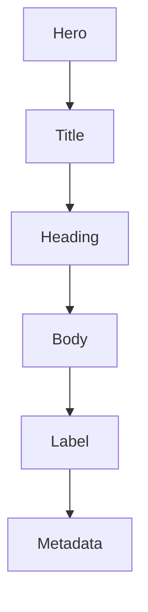

<!--
File: docs/design/system/mds-004-typography-system/02-editorial-hierarchy.md
Document: MDS-004
Chapter: 02
Title: Editorial Hierarchy
Status: Draft
Version: 0.4
-->

# Editorial Hierarchy

---

# Purpose

Editorial Hierarchy determines how Mosaic communicates importance through written language.

Composition establishes conceptual importance.

Typography expresses it without competing with artwork or Material hierarchy.

---

# Definition

Within MDS, **Editorial Hierarchy** is defined as:

> **The ordered relationship between semantic typography roles through which a solved Composition becomes readable.**

Editorial Hierarchy is stable across clients.

Its physical implementation adapts.

---

# Primary Roles

Mosaic defines six semantic typography roles.

| Role | Responsibility | Typical content |
|------|----------------|-----------------|
| Hero | Introduce the current Focus with restrained presence | Hero fallback title, rare major moment |
| Title | Identify the primary page, collection or object | Media title, page title, collection title |
| Heading | Organise a section or conceptual group | Continue Watching, Cast, Chapters |
| Body | Support sustained reading | Synopsis, description, biography |
| Label | Identify actions, navigation and compact controls | Play, Search, Save, field label |
| Metadata | Provide subordinate facts and context | Runtime, year, rating, timestamp |

SDUI and Platform components request these roles by meaning.

They do not request a font size, weight or line height.

---

# Hierarchy Order

The order describes expected emphasis rather than a mandatory document structure.

A Composition may omit any role that is not required.

Hero must remain rare.

---

# Artwork Authority

Artwork carries media emotion and identity.

Typography provides orientation and understanding.

Typography must not become the primary focal point of a media Composition.

The Composition-owned HD ClearLogo and portrait-poster rules are defined in [MDP-001 — Adaptive Composition Runtime](../../../engineering/architecture/mdp-001-adaptive-composition-runtime/06-adaptive-layout.md#artwork-title-treatment).

When Composition selects a ClearLogo, the semantic title remains present for accessibility and non-visual output even though Hero or Title typography is not visibly rendered.

---

# One Typeface Voice

Every role uses the Platform typeface defined by this specification.

Hierarchy is created through:

- size
- weight
- line height
- spacing
- placement

It is not created by switching font families.

---

# Reading Priority

Typography should guide the reader through:

1. current Focus
2. primary identity
3. section structure
4. explanatory content
5. available actions
6. supporting facts

The order may adapt spatially but must remain understandable.

---

# Module Boundary

Modules provide content, domain intent and relationships.

They cannot:

- create typography roles
- choose font families
- select physical font values
- manipulate variable font axes
- override accessibility behaviour

New cross-Platform editorial meaning requires Design System governance.

---

# Summary

Mosaic uses six semantic roles to preserve one editorial voice across media, utility and administrative experiences.

Composition determines importance.

Typography makes that importance readable.
