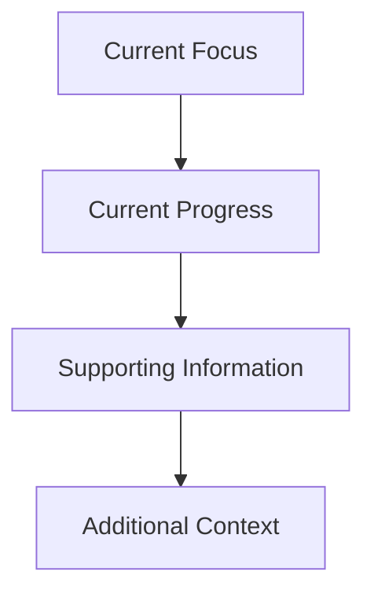
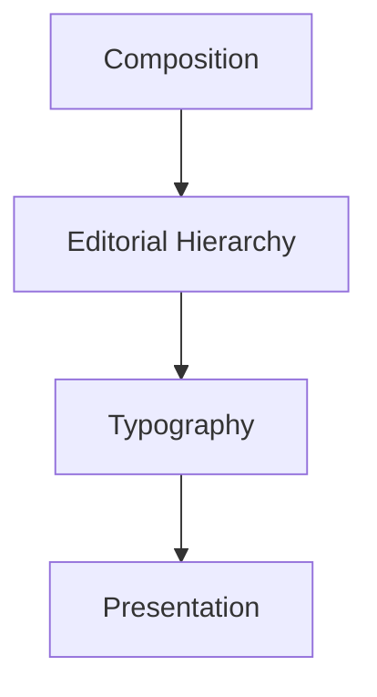
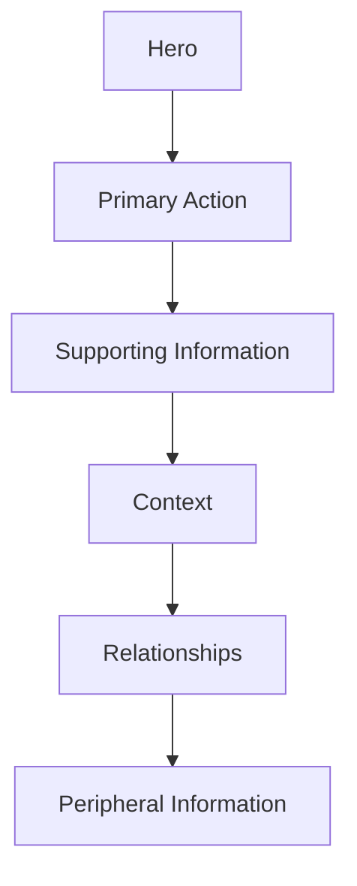
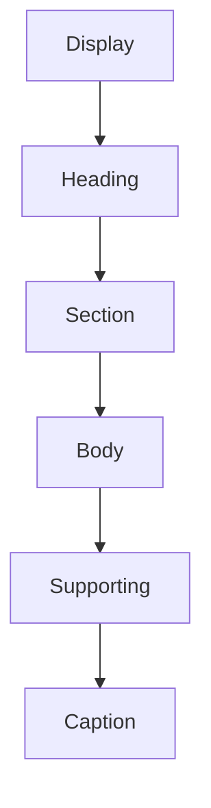
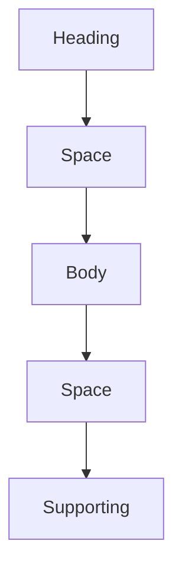
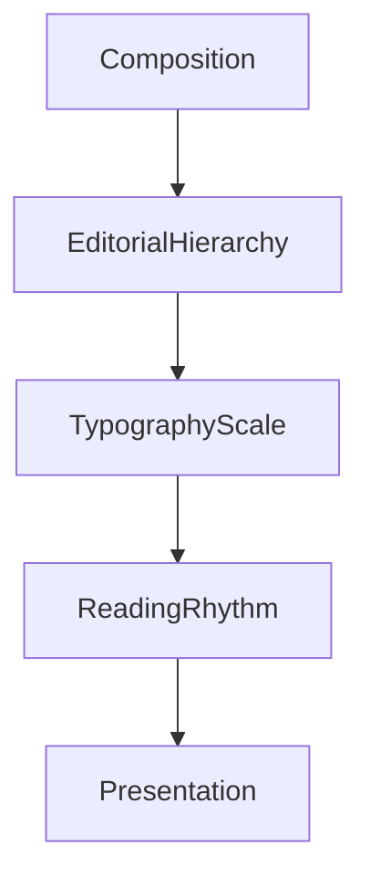

<!--
File: docs/design/system/mds-004-typography-system/02-editorial-hierarchy.md
Document: MDS-004
Chapter: 02
Title: Editorial Hierarchy
Status: Draft
Version: 0.4
-->

# Editorial Hierarchy

---

# Purpose

Typography communicates more than language.

It communicates:

- importance,
- confidence,
- rhythm,
- intent.

Within Mosaic this communication is intentionally modelled after editorial design rather than dashboard software.

Editorial Hierarchy defines how typography guides attention through a Composition.

It answers one question.

> **"What should the reader understand first?"**

---

# Definition

Within MDS, **Editorial Hierarchy** is defined as:

> **The intentional organisation of written language into a reading experience that mirrors the conceptual hierarchy established by the Composition Model.**

Editorial Hierarchy should never create hierarchy independently.

It reinforces hierarchy that already exists.

---

# Why Editorial?

Entertainment is consumed.

Not managed.

People naturally expect:

- stories,
- books,
- magazines,
- albums,
- films

to present information editorially.

Traditional software instead presents information transactionally.

Examples.

```

Runtime

Genre

Rating

Studio

Release
```

Everything receives identical emphasis.

Editorial Hierarchy instead tells a story.



The user reads naturally.

Rather than scanning mechanically.

---

# Composition Leads

Typography should always follow Composition.

Never the reverse.

Conceptually.



The Composition determines:

- what matters.

Typography determines:

- how that importance is communicated.

---

# Reading Order

Every Composition should establish one natural reading path.

Typical order.



Readers should never consciously search for the next piece of information.

Editorial Hierarchy should quietly guide them.

---

# Hierarchy Levels

The Typography System defines six editorial levels.



Each level exists for one purpose.

None should duplicate another.

---

# Display

Purpose.

Communicate the Hero.

Display typography should appear rarely.

Normally only:

- Hero titles,
- onboarding,
- major transitions,
- immersive artwork.

Display typography should never become routine.

Its rarity preserves its impact.

---

# Heading

Purpose.

Introduce major concepts.

Examples.

- Film title
- Book title
- Artist
- Collection

Headings establish orientation.

Not decoration.

---

# Section

Purpose.

Organise understanding.

Examples.

- Continue Watching
- Related Works
- Chapters
- Cast

Section typography should quietly structure the Composition.

---

# Body

Purpose.

Communicate primary reading content.

Examples.

- descriptions
- metadata
- reviews
- summaries

Body typography should prioritise:

- comfort,
- rhythm,
- clarity.

Body text represents the majority of reading within Mosaic.

---

# Supporting

Purpose.

Communicate secondary understanding.

Examples.

- runtime,
- publication date,
- codec,
- subtitle language,
- metadata.

Supporting typography should remain readable without competing with primary information.

---

# Caption

Purpose.

Communicate quiet context.

Examples.

- timestamps,
- file size,
- diagnostics,
- technical metadata.

Caption typography should remain present without drawing unnecessary attention.

---

# Hierarchy Is Relative

Editorial Hierarchy depends upon Context.

Example.

Current Context.

```

Watching
```

Episode title becomes:

Heading.

Runtime becomes:

Supporting.

Later.

```

Browsing Reviews
```

Review title becomes:

Heading.

Episode runtime becomes:

Caption.

Typography adapts because understanding changes.

---

# Hierarchy And Space

Editorial Hierarchy should work together with Breathing Space.

Example.



Whitespace communicates editorial rhythm.

Typography alone should never carry the full burden of hierarchy.

---

# Hero Typography

The Hero should receive the strongest editorial treatment.

However...

It should not become theatrical.

Avoid:

- oversized typography,
- excessive weight,
- unnecessary visual effects.

The Hero should communicate quiet confidence.

Not spectacle.

---

# Editorial Consistency

Every Domain should reuse the same editorial hierarchy.

Television.

↓

Episode title.

Books.

↓

Chapter title.

Music.

↓

Track title.

Different content.

Identical editorial language.

Users should never learn multiple typographic systems.

---

# Runtime Adaptation

Editorial Hierarchy remains conceptually stable.

Runtime may adapt:

- scale,
- spacing,
- weight,
- contrast.

Meaning remains unchanged.

The same Heading should remain a Heading regardless of:

- Light Mode,
- Dark Mode,
- Television,
- Mobile.

---

# Accessibility

Editorial Hierarchy should survive:

- reduced colour,
- reduced motion,
- high contrast,
- enlarged text.

If hierarchy disappears when colour is removed...

Typography has failed.

---

# Materials

Typography should respond to surrounding materials.

Hero Material.

↓

More generous spacing.

Overlay Material.

↓

Higher clarity.

Canvas.

↓

Editorial calmness.

Materials influence typography subtly.

They never redefine hierarchy.

---

# Good Examples

## Film

Display.

↓

Film title.

Heading.

↓

Continue Watching.

Body.

↓

Synopsis.

Supporting.

↓

Runtime.

Caption.

↓

Codec.

The reader instinctively understands where to begin.

---

## Reading

Heading.

↓

Book title.

Section.

↓

Current Chapter.

Body.

↓

Summary.

Supporting.

↓

Progress.

The hierarchy quietly encourages continued reading.

---

## Administration

Heading.

↓

Users.

Section.

↓

Permissions.

Body.

↓

Configuration.

Caption.

↓

Diagnostics.

Editorial rhythm remains recognisably Mosaic despite increased information density.

---

# Anti-patterns

## Equal Typography

Every piece of text appears identical.

Users construct hierarchy themselves.

---

## Decorative Hierarchy

Hierarchy depends upon colour or animation.

Typography should remain understandable independently.

---

## Oversized Headlines

Every heading competes for attention.

The interface begins shouting.

---

## Dense Metadata

Supporting information visually overwhelms primary content.

The Composition weakens.

---

# Editorial Hierarchy Model



Editorial Hierarchy transforms conceptual importance into readable structure.

---

# Relationship To Future Chapters

The next chapter defines the **Type Scale**.

Editorial Hierarchy answers:

> **What should be emphasised?**

The Type Scale answers:

> **How should that emphasis be physically expressed?**

Together they establish the typographic language of Mosaic.

---

# Summary

Editorial Hierarchy is the bridge between Composition and Typography.

It allows users to instinctively understand:

- what matters,
- what supports it,
- what can wait.

Typography should therefore feel less like interface chrome...

...and more like a carefully edited publication.

That editorial quality is one of the defining characteristics of the Mosaic Design System.
