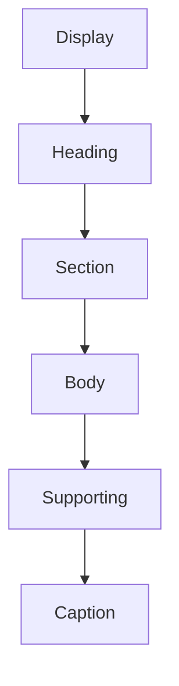
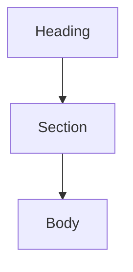
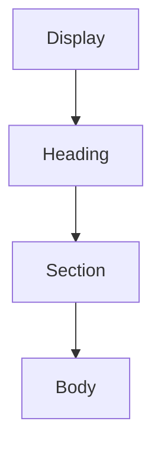
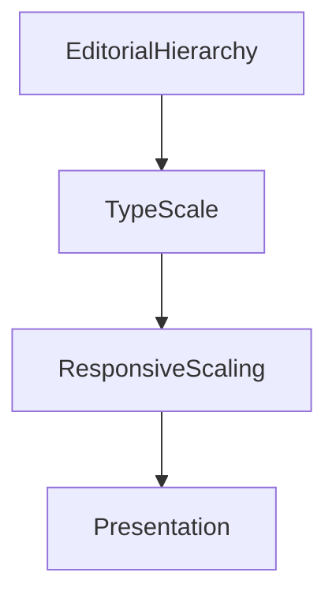

<!--
File: docs/design/system/mds-004-typography-system/03-type-scale.md
Document: MDS-004
Chapter: 03
Title: Type Scale
Status: Draft
Version: 0.4
-->

# Type Scale

---

# Purpose

Editorial Hierarchy defines **what deserves emphasis**.

The Type Scale defines **how that emphasis is physically communicated**.

Unlike many design systems, the Mosaic Type Scale is **not** a mathematical ladder of font sizes.

It is a reading system.

Every step exists to support:

- understanding,
- rhythm,
- hierarchy,
- companionship.

Typography should encourage reading.

Not simply display information.

---

# Definition

Within MDS, the **Type Scale** is defined as:

> **The ordered system of typographic roles through which editorial hierarchy becomes physically readable.**

The Type Scale expresses hierarchy.

It does not create it.

Hierarchy already exists within the Composition.

---

# Philosophy

Many interfaces define typography like this.

```text
12

14

16

18

20

24

32

48
```

These are numbers.

They communicate almost nothing.

Mosaic instead thinks in reading roles.



Values exist only to support those roles.

---

# Scale Before Size

Typography should always be selected by role.

Not measurement.

Incorrect.

```text
Use 24px
```

Correct.

```text
Use Heading
```

The Design System determines the correct implementation.

Applications should never depend upon physical measurements.

---

# Scale Hierarchy

The Mosaic Type Scale contains six primary levels.


Each level exists because it communicates a different editorial responsibility.

---

# Display

Purpose.

Communicate major emotional moments.

Examples include:

- Hero title
- onboarding
- welcome
- major transitions

Display typography should remain rare.

Overuse weakens emphasis.

---

# Heading

Purpose.

Establish orientation.

Examples.

- film title
- book title
- artist
- collection

Headings should communicate confidence.

Not visual drama.

---

# Section

Purpose.

Organise the Composition.

Examples.

- Continue Watching
- Related Works
- Recently Added
- Chapters

Sections divide understanding into meaningful editorial groups.

---

# Body

Purpose.

Support sustained reading.

Body typography represents the majority of reading throughout Mosaic.

Examples.

- synopsis
- descriptions
- reviews
- biographies

Comfort should always have higher priority than compactness.

---

# Supporting

Purpose.

Communicate secondary understanding.

Examples.

- runtime
- release year
- author
- subtitle language
- resolution

Supporting typography should remain easy to read while remaining visually quieter than Body text.

---

# Caption

Purpose.

Communicate peripheral detail.

Examples.

- timestamps
- codec
- bitrate
- diagnostics
- technical metadata

Caption typography should never become unreadable.

Quiet does not mean small.

It means lower editorial importance.

---

# Scale Relationships

Each level should feel related to the levels around it.

Example.



The transition should feel gradual.

Not abrupt.

Readers should naturally move through the hierarchy without consciously noticing changes in scale.

---

# Optical Rhythm

Typography should create rhythm rather than mathematical progression.

Poor.

```text
16

18

20

22

24
```

Preferred.



Readers perceive rhythm.

Not pixel values.

The scale should therefore optimise perception.

Not arithmetic.

---

# Reading Distance

Different contexts require different perceived scale.

Examples.

Television.

↓

Greater viewing distance.

↓

Larger physical implementation.

Phone.

↓

Closer viewing distance.

↓

Smaller physical implementation.

The editorial role remains identical.

Only implementation changes.

---

# Hero Scale

Hero Typography should possess the greatest physical presence.

However...

It should never dominate through size alone.

Hero emphasis should emerge through:

- hierarchy
- composition
- spacing
- materials
- typography

Working together.

Typography should never carry hierarchy independently.

---

# Long-Form Reading

Books.

Reviews.

Descriptions.

Editorial content.

These experiences should optimise:

- line length
- rhythm
- paragraph spacing
- eye movement

The Body role therefore becomes one of the most carefully tuned parts of the entire Typography System.

Comfort should remain the primary objective.

---

# Runtime Adaptation

The Type Scale may adapt according to:

- accessibility
- viewing distance
- platform
- display density

It should never adapt because:

- artwork changed
- atmosphere changed

Atmosphere influences Materials.

Typography remains comparatively stable.

---

# Variable Fonts

Future implementations may use variable font technology.

The Type Scale should express:

- weight
- width
- optical size

through semantic roles.

Applications should never manipulate these values directly.

The Variable Font System is defined later within this specification.

---

# Accessibility

The Type Scale should remain recognisable regardless of:

- increased text size
- reduced vision
- high contrast
- platform scaling

Increasing text size should preserve hierarchy.

Not flatten it.

Every editorial role should remain identifiable.

---

# Good Examples

## Film

Display.

↓

Film Title.

Heading.

↓

Continue Watching.

Section.

↓

Cast.

Body.

↓

Synopsis.

Supporting.

↓

Runtime.

Caption.

↓

HDR.

Readers instinctively understand importance.

---

## Reading

Heading.

↓

Book Title.

Section.

↓

Current Chapter.

Body.

↓

Content.

Supporting.

↓

Progress.

Caption.

↓

Page Count.

Long-form reading remains comfortable.

---

## Administration

Heading.

↓

Users.

Section.

↓

Permissions.

Body.

↓

Configuration.

Caption.

↓

Diagnostics.

Editorial consistency remains intact despite higher information density.

---

# Anti-patterns

## Pixel Thinking

Selecting typography by measurement.

---

## Decorative Scale

Large text used purely because space exists.

---

## Tiny Metadata

Caption becoming unreadable.

---

## Equal Scale

Every editorial role appearing visually identical.

Hierarchy disappears.

---

# Type Scale Model



Editorial intent determines the role.

The Type Scale determines the physical expression.

---

# Relationship To Future Chapters

The next chapter defines **Reading Rhythm**.

The Type Scale answers:

> **How large should each editorial role feel?**

Reading Rhythm answers:

> **How should those roles work together over time?**

Together they create typography that feels read rather than scanned.

---

# Summary

The Type Scale is not a collection of font sizes.

It is a reading hierarchy.

Every level should encourage effortless movement through the user's current World.

Users should naturally know:

- where to begin,
- what deserves attention,
- what supports understanding,

without consciously analysing typography.

That effortless progression is the defining objective of the Mosaic Type Scale.
