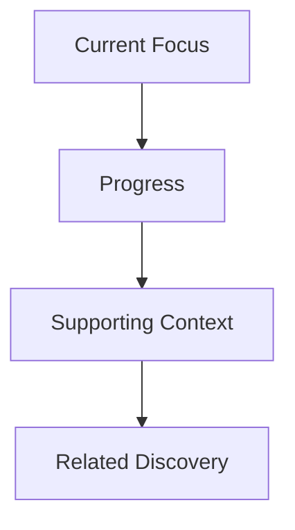
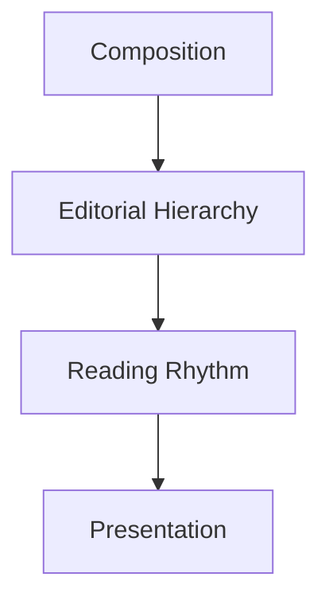
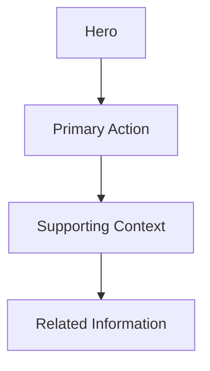
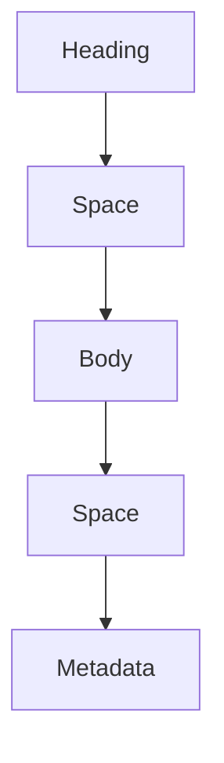
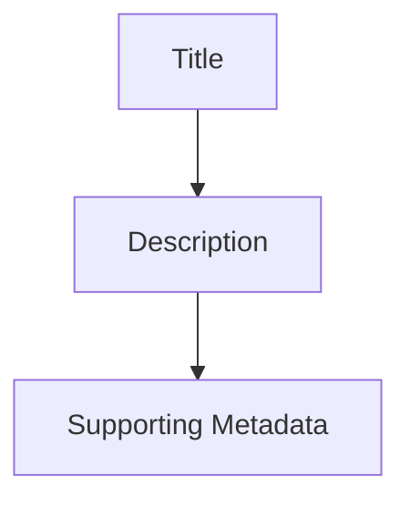
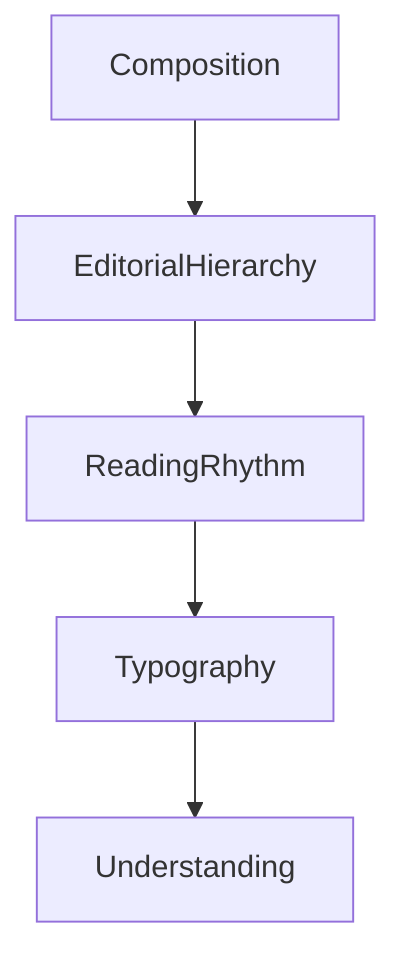

<!--
File: docs/design/system/mds-004-typography-system/04-reading-rhythm.md
Document: MDS-004
Chapter: 04
Title: Reading Rhythm
Status: Draft
Version: 0.4
-->

# Reading Rhythm

---

# Purpose

Typography is more than letters.

It is movement.

Readers do not consume interfaces one word at a time.

They move through ideas.

Reading Rhythm defines how typography guides that movement.

Unlike many interface systems, Mosaic intentionally optimises for continuous reading rather than rapid scanning.

Reading should feel:

- natural,
- calm,
- uninterrupted,
- inevitable.

The Typography System therefore treats rhythm as an architectural concern rather than a visual preference.

---

# Definition

Within MDS, **Reading Rhythm** is defined as:

> **The deliberate pacing of typography, spacing and hierarchy that guides readers naturally through a Composition.**

Reading Rhythm exists between typography and composition.

It transforms information into an effortless reading experience.

---

# Philosophy

A good novel possesses rhythm.

A well-designed magazine possesses rhythm.

A thoughtful article possesses rhythm.

Readers rarely notice it consciously.

They simply continue reading.

The same principle should apply to Mosaic.

Users should rarely stop to determine:

- where to read next,
- whether something is important,
- whether they missed information.

The interface should already have answered those questions.

---

# Reading Before Scanning

Many productivity interfaces optimise for scanning.

Entertainment interfaces should optimise for reading.

Scanning.

```text
Metric

Metric

Metric

Metric
```

Reading.



The second encourages understanding rather than information processing.

---

# Rhythm Emerges From Composition

Reading Rhythm should never exist independently.

It follows:



Composition establishes understanding.

Reading Rhythm determines how that understanding unfolds.

---

# Vertical Flow

Readers naturally move vertically.

The Composition should support this behaviour.

Preferred.



Avoid fragmented reading paths requiring constant visual searching.

The eye should move comfortably through the Composition.

---

# Line Length

Reading Rhythm depends heavily upon comfortable line lengths.

Long-form reading should avoid:

- excessively long lines,
- extremely narrow columns,
- inconsistent wrapping.

Future implementations should optimise line length according to:

- device,
- viewing distance,
- reading context.

Comfort always possesses higher priority than fitting additional information onto the screen.

---

# Paragraph Rhythm

Paragraphs communicate pace.

Large uninterrupted blocks increase cognitive effort.

Very short fragmented sentences weaken narrative flow.

Descriptions.

Reviews.

Editorial content.

All should possess consistent paragraph rhythm.

The interface should feel composed.

Not assembled.

---

# Spacing Rhythm

Whitespace is part of typography.

Conceptually.



Spacing communicates pauses.

These pauses improve understanding.

Removing them increases cognitive load.

---

# Tempo

Different activities require different reading tempo.

Watching.

↓

Very little reading.

Reading.

↓

Sustained reading.

Administration.

↓

Faster information processing.

The Typography System should naturally adapt rhythm without changing its underlying editorial language.

---

# Hero Rhythm

Hero Typography should breathe.

Examples.

Large title.

↓

Generous spacing.

↓

Supporting metadata.

↓

Primary action.

Nothing should feel hurried.

The Hero introduces the experience.

It should feel confident.

---

# Metadata Rhythm

Metadata should never interrupt primary reading.

Poor.

```text
Title

Runtime

Codec

Resolution

Studio

Rating

Description
```

Preferred.



Supporting information should remain available without constantly demanding attention.

---

# Rhythm Across Domains

Television.

↓

Progressive reading.

Books.

↓

Long-form rhythm.

Music.

↓

Compact rhythm.

Administration.

↓

Higher information density.

Although tempo changes...

The editorial language should remain recognisably Mosaic.

---

# Rhythm Across Viewing Contexts

Reading Rhythm adapts from:

- available extent
- viewing distance
- content density
- reading duration
- accessibility

Greater distance may require larger pauses and physical scale.

Constrained extent may require shorter reading paths and progressive disclosure.

The physical implementation changes.

The perceived rhythm should remain constant.

---

# Runtime Adaptation

Reading Rhythm should remain remarkably stable.

Runtime may adjust:

- spacing,
- scale,
- line length,

according to:

- accessibility,
- device,
- viewing distance.

Artwork should never directly alter reading rhythm.

Atmosphere belongs to materials.

Rhythm belongs to typography.

---

# Accessibility

Accessibility should strengthen rhythm.

Examples.

Larger text.

↓

Larger spacing.

Higher contrast.

↓

Clearer hierarchy.

Reading should become easier.

Never denser.

---

# Materials

Typography should appear physically related to surrounding materials.

Hero Material.

↓

More breathing space.

Overlay Material.

↓

Greater clarity.

Canvas.

↓

Editorial calmness.

Materials provide environment.

Typography provides cadence.

Together they create one coherent experience.

---

# Good Examples

## Film

Title.

↓

Synopsis.

↓

Continue Watching.

↓

Supporting metadata.

The eye naturally progresses through the experience.

---

## Book

Book title.

↓

Current chapter.

↓

Reading summary.

↓

Bookmarks.

↓

Technical information.

Readers remain immersed.

---

## Administration

Users.

↓

Permissions.

↓

Configuration.

↓

Diagnostics.

Higher density.

Identical editorial rhythm.

---

# Anti-patterns

## Dashboard Rhythm

Everything presented simultaneously.

The eye constantly searches.

---

## Interrupted Reading

Metadata repeatedly interrupts narrative information.

---

## Compressed Typography

Paragraphs and headings visually collapse together.

Rhythm disappears.

---

## Decorative Spacing

Whitespace exists without editorial purpose.

Rhythm should always communicate understanding.

---

# Reading Rhythm Model



Rhythm transforms typography into an effortless reading experience.

---

# Relationship To Future Chapters

The next chapter defines **Hero Typography**.

Reading Rhythm explains:

> **How readers move through information.**

Hero Typography explains:

> **How the first words they encounter establish the emotional tone of the experience.**

Together they establish the voice of Mosaic.

---

# Summary

Reading Rhythm is one of the quietest systems within Mosaic.

Users should rarely notice it consciously.

Instead they should simply continue reading.

The interface should feel less like software...

...and more like a thoughtfully edited publication.

When Reading Rhythm succeeds, understanding becomes almost effortless.
