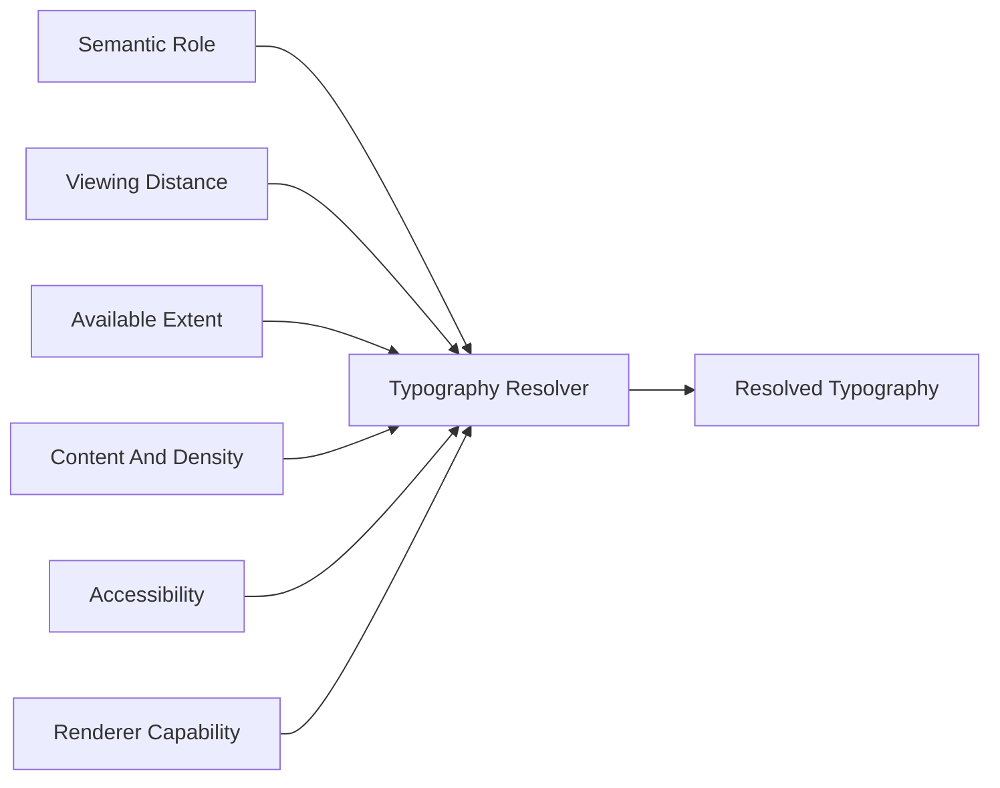

<!--
File: docs/design/system/mds-004-typography-system/06-responsive-typography.md
Document: MDS-004
Chapter: 06
Title: Responsive Typography
Status: Draft
Version: 0.4
-->

# Responsive Typography

---

# Purpose

Responsive Typography preserves editorial hierarchy and reading comfort while the physical viewing environment changes.

It does not begin with a device label or breakpoint.

It begins with the reader, content and available Presentation constraints.

---

# Definition

Within MDS, **Responsive Typography** is defined as:

> **The capability-driven client resolution of semantic typography roles into readable physical values.**

Responsive Typography changes implementation.

It does not change editorial meaning.

---

# Resolution Inputs

Equivalent effective inputs should produce equivalent editorial results regardless of whether the client is described as a browser, phone, desktop or television.

---

# Alignment

Text aligns to the logical reading edge.

Left-to-right languages normally align left.

Right-to-left languages normally align right.

Centred text is reserved for short empty, loading, confirmation or ceremonial states.

Mosaic does not justify interface text.

---

# Wrapping And Line Limits

| Role | Default behaviour |
|------|-------------------|
| Hero | Up to two lines |
| Title | Up to two lines |
| Heading | Prefer one line; permit two |
| Body | Component context determines the reading measure and visible extent |
| Label | One line; adapt layout before truncating a critical action |
| Metadata | Collapse by semantic priority before reducing readability |

Accessibility may relax line limits and reflow the Composition.

---

# Truncation

Ellipsis is permitted only when the complete value remains available through focus, expansion or accessibility output.

Automatic marquees are prohibited.

Text must not shrink continuously to fit a fixed region.

Composition owns the response to overflow.

---

# Reading Measure

The client should resolve line length from reading context rather than available width alone.

Long-form Body text should preserve a comfortable measure even when more horizontal space exists.

Labels and metadata should remain scannable without becoming artificially wide.

---

# Accessibility

Accessibility possesses higher authority than preferred density or line limits.

When text scaling increases, the client may:

- increase region size
- wrap additional lines
- move supporting content
- use progressive disclosure
- simplify the surrounding Composition

It must not preserve a visual arrangement by clipping or reducing legibility.

---

# Continuity

Small environmental changes should create small typographic changes.

Runtime scaling should avoid abrupt jumps, repeated reflow and focus loss.

Motion used during layout transition follows [MDS-005 — Motion System](../mds-005-motion-system/index.md).

---

# Summary

Responsive Typography resolves reading conditions rather than device classes.

It preserves role hierarchy, allows Composition to reflow and gives accessibility final authority over spatial preference.
