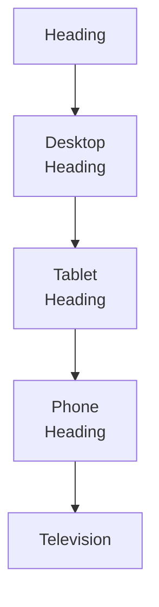
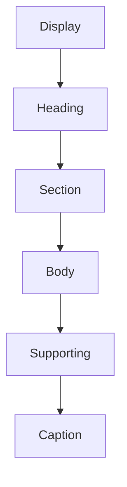
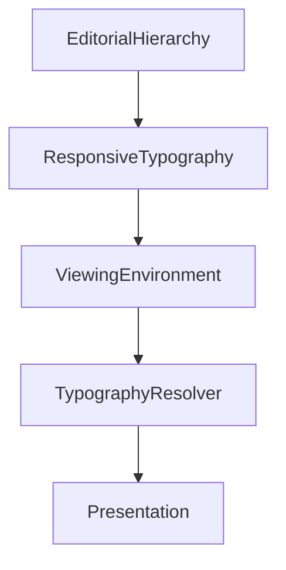

<!--
File: docs/design/system/mds-004-typography-system/06-responsive-typography.md
Document: MDS-004
Chapter: 06
Title: Responsive Typography
Status: Draft
Version: 0.4
-->

# Responsive Typography

---

# Purpose

Typography should remain recognisably Mosaic regardless of:

- device,
- display size,
- viewing distance,
- orientation,
- accessibility settings.

Responsive Typography ensures that editorial understanding remains stable while physical implementation adapts.

Unlike many responsive systems, Mosaic does **not** begin with screen width.

It begins with reading.

The objective is not fitting more text onto a display.

The objective is preserving effortless understanding.

---

# Definition

Within MDS, **Responsive Typography** is defined as:

> **The adaptive implementation of editorial typography across different viewing environments while preserving semantic hierarchy, rhythm and readability.**

Responsive Typography changes implementation.

It never changes editorial meaning.

---

# Philosophy

Responsive typography should answer:

> **How should this feel to read here?**

Not:

> **How many pixels are available?**

The Typography System should adapt to the reader.

Not force the reader to adapt to the device.

---

# Editorial Consistency

The following should remain identical across every device.

- Editorial hierarchy
- Reading rhythm
- Semantic roles
- Hero importance
- Supporting information

Only physical implementation changes.

Conceptually.

One editorial role.

Many implementations.

---

# Reading Distance

Reading distance is more important than screen size.

Approximate examples.

| Device | Reading Distance |
|----------|----------------:|
| Phone | Very Near |
| Tablet | Near |
| Desktop | Medium |
| Television | Far |

Typography should adapt according to perceived distance rather than pixel dimensions.

---

# Device Classes

Responsive Typography currently recognises several conceptual environments.

## Phone

Characteristics.

- one-handed interaction
- short reading bursts
- interruptions
- close viewing

Typography should favour:

- shorter line lengths
- stronger hierarchy
- comfortable touch reading

---

## Tablet

Characteristics.

- immersive reading
- medium distance
- portrait usage
- editorial layouts

Tablet typography should closely resemble printed editorial material.

---

## Desktop

Characteristics.

- multitasking
- larger information density
- longer sessions

Typography should remain calm despite additional available space.

Extra space should improve rhythm.

Not increase clutter.

---

## Television

Characteristics.

- greater viewing distance
- remote interaction
- cinematic presentation

Typography should become physically larger.

It should not become visually louder.

---

# Responsive Scale

Every editorial role should scale proportionally.

Conceptually.

The relationships between roles should remain stable regardless of implementation.

Scaling should preserve hierarchy.

Not flatten it.

---

# Line Length

Comfortable line length is one of the strongest determinants of readability.

Future implementations should optimise line length according to:

- device
- orientation
- reading context

Long-form reading should remain comfortable on every supported platform.

---

# Responsive Rhythm

Responsive Typography should preserve editorial rhythm.

Desktop.

↓

Longer pauses.

Phone.

↓

Shorter pauses.

Television.

↓

Larger physical spacing.

Although measurements differ...

Readers should perceive identical rhythm.

---

# Orientation

Orientation should influence implementation.

Not hierarchy.

Portrait.

↓

Narrower reading measure.

Landscape.

↓

Wider reading measure.

The editorial structure should remain unchanged.

---

# Runtime Adaptation

Responsive Typography may adapt according to:

- accessibility
- display density
- viewing distance
- operating system scaling

It should **not** adapt according to:

- artwork
- runtime atmosphere
- entertainment genre

Typography remains comparatively stable.

Materials carry emotional adaptation.

---

# Variable Fonts

Future implementations should preferentially use variable font technology.

Responsive behaviour may therefore adapt:

- optical size
- width
- weight

while preserving the same editorial role.

Applications should never manipulate these properties directly.

The Typography Resolver owns these decisions.

---

# Accessibility

Accessibility should strengthen Responsive Typography.

Examples.

Large text.

↓

Preserve hierarchy.

Higher contrast.

↓

Improve readability.

Reduced vision.

↓

Increase spacing.

Responsiveness should improve understanding rather than merely enlarging text.

---

# Hero Behaviour

Hero Typography should remain recognisable across every environment.

Desktop.

↓

Large editorial Hero.

Phone.

↓

Compact editorial Hero.

Television.

↓

Large cinematic Hero.

The Hero should always feel like the same voice.

Only its physical expression changes.

---

# Long-Form Reading

Books.

Reviews.

Descriptions.

Long-form editorial content should receive special responsive treatment.

Examples include:

- comfortable measure
- increased line spacing
- generous paragraph rhythm
- stable hierarchy

Reading should remain enjoyable rather than efficient.

---

# Cross-Platform Consistency

Future Mosaic clients should share one typographic language.

Web.

Flutter.

SwiftUI.

Compose.

Desktop.

Television.

Each client may implement typography differently.

Readers should experience one editorial voice.

---

# Modules

Modules should never define responsive typography.

Modules contribute:

- information
- relationships
- editorial content

The Typography System determines:

- hierarchy
- scaling
- rhythm
- implementation

Every module therefore automatically inherits future typographic improvements.

---

# Good Examples

## Phone

Compact hierarchy.

Comfortable reading.

Shorter line lengths.

Editorial rhythm preserved.

---

## Desktop

Greater breathing space.

Longer paragraphs.

Stable editorial pacing.

The interface feels spacious rather than empty.

---

## Television

Large typography.

Long viewing distance.

Strong readability.

Atmosphere remains secondary to comprehension.

---

# Anti-patterns

## Breakpoint Typography

Typography changing purely because viewport width crossed a breakpoint.

---

## Device Hierarchy

Heading becoming Body on smaller devices.

Editorial meaning has been lost.

---

## Dense Desktop

Using extra space to display more text rather than improve rhythm.

---

## Tiny Mobile Text

Shrinking typography to fit more information.

Reading becomes work.

---

# Responsive Typography Model

Responsive Typography preserves understanding while adapting physical implementation.

---

# Relationship To Future Chapters

The next chapter defines **Accessibility**.

Responsive Typography explains:

> **How typography adapts to different environments.**

Accessibility explains:

> **How typography adapts to different people.**

Together they ensure the Companion remains understandable for every reader.

---

# Summary

Responsive Typography ensures that Mosaic speaks with one consistent editorial voice across every supported platform.

Different devices should never produce different typography philosophies.

They should simply produce different physical expressions of the same language.

Readers should always feel that:

> The Companion is speaking to me.

Not:

> This is the mobile version.

That consistency is one of the defining goals of the Mosaic Typography System.
