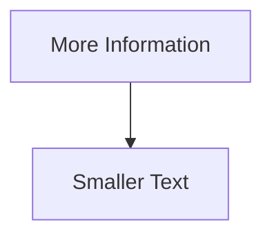
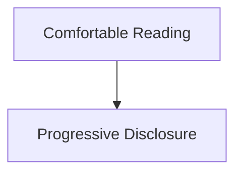
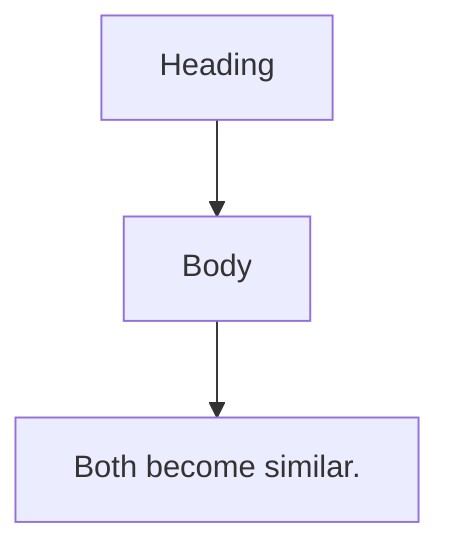
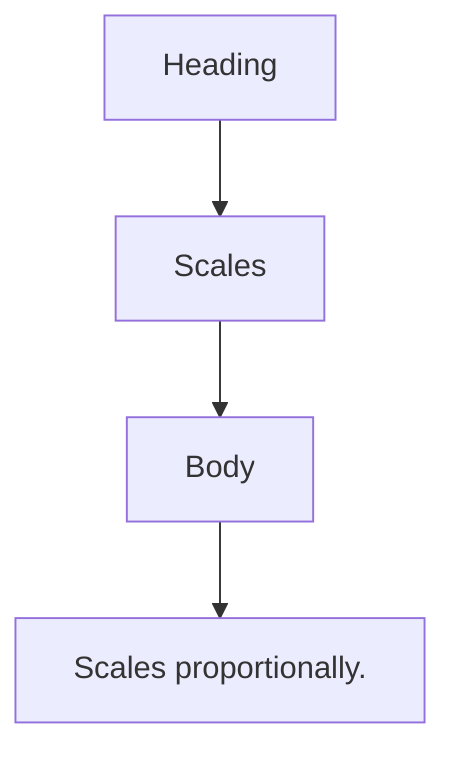
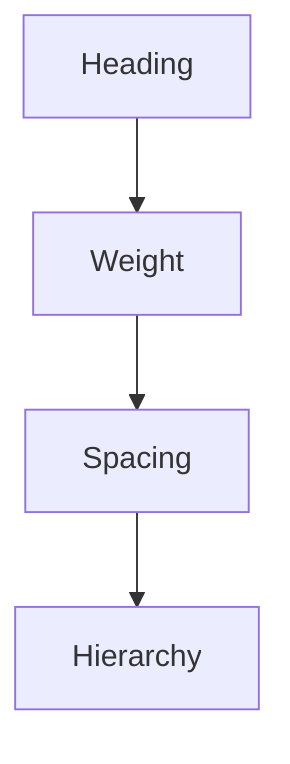
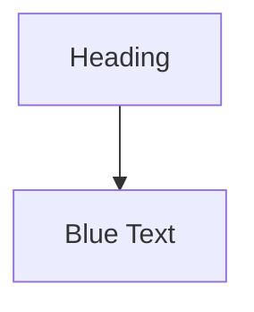
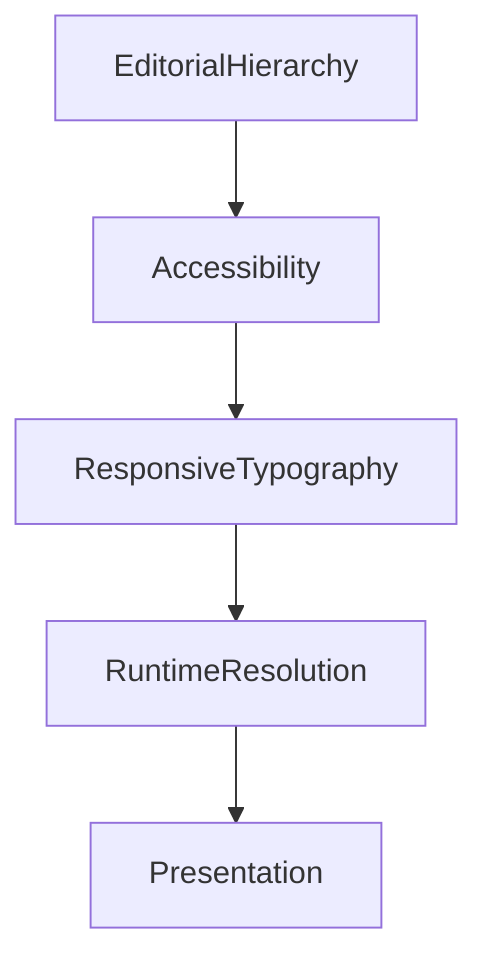

<!--
File: docs/design/system/mds-004-typography-system/07-accessibility.md
Document: MDS-004
Chapter: 07
Title: Accessibility
Status: Draft
Version: 0.4
-->

# Accessibility

---

# Purpose

Typography exists to communicate understanding.

If readers cannot comfortably perceive that understanding, the Typography System has failed regardless of how visually refined it appears.

Accessibility is therefore not an optional enhancement.

It is one of the primary architectural constraints of the Mosaic Typography System.

Typography should adapt to people.

People should never be expected to adapt to typography.

---

# Philosophy

The Typography System follows one fundamental rule.

> **Understanding must never depend upon perfect vision.**

Every typographic decision should preserve:

- hierarchy,
- rhythm,
- comprehension,
- orientation,

regardless of:

- visual ability,
- device,
- environment,
- operating system settings.

Accessibility strengthens typography.

It never compromises it.

---

# Accessibility Before Density

When readability conflicts with information density:

Readability wins.

Always.

Poor.

Preferred.

The Composition Model already provides mechanisms for reducing density.

Typography should never become smaller simply because more information exists.

---

# Hierarchy Preservation

Increasing text size should never flatten hierarchy.

Example.

Incorrect.

Preferred.

Editorial relationships should remain immediately recognisable.

Accessibility should preserve understanding.

Not merely enlarge text.

---

# Line Length

Larger text naturally changes reading measure.

Future implementations should compensate by adapting:

- line length,
- column width,
- paragraph spacing.

Comfortable reading should remain the primary objective.

Typography should never become a wall of enlarged text.

---

# Line Spacing

Line spacing should increase alongside text size.

Reasons include:

- improved scanning,
- reduced visual crowding,
- lower cognitive effort.

The relationship between:

- font size,
- line height,
- paragraph spacing

should remain proportional.

---

# Paragraph Rhythm

Accessibility should preserve editorial rhythm.

Large text.

↓

Larger paragraph separation.

Long-form reading should continue feeling natural.

The interface should never become visually compressed simply because text increased.

---

# Colour Independence

Typography should remain understandable even if colour information is removed.

Examples.

Correct.

Incorrect.

Colour may reinforce hierarchy.

Typography should never depend upon it.

---

# Contrast

Typography should maintain sufficient contrast under:

- Light Theme,
- Dark Theme,
- Runtime Atmosphere,
- High Contrast.

Atmosphere should automatically reduce whenever necessary to preserve readability.

Typography always possesses higher authority than atmosphere.

---

# Runtime Atmosphere

Runtime Atmosphere should never reduce typographic clarity.

Examples.

Warm artwork.

↓

Subtle Material change.

↓

Typography unchanged.

Atmosphere belongs to materials.

Typography remains comparatively stable.

---

# Reduced Motion

Typography should remain readable without motion.

Examples.

Transitions.

↓

Fade.

↓

No animated text movement required.

Understanding should never depend upon animation.

Motion may reinforce editorial rhythm.

It should never create it.

---

# Screen Readers

Typography should preserve semantic structure.

Editorial hierarchy should map cleanly onto:

- headings,
- sections,
- paragraphs,
- captions.

Visual hierarchy and semantic hierarchy should remain aligned.

The interface should communicate the same structure whether read visually or through assistive technologies.

---

# Variable Fonts

Future Variable Font implementations should support accessibility.

Possible runtime adaptations include:

- optical sizing,
- increased x-height,
- wider characters,
- reduced stroke contrast.

These adaptations should preserve the editorial voice of Mosaic while improving readability.

---

# Reading Modes

Different reading contexts may require different accessibility strategies.

Watching.

↓

Minimal reading.

Reading.

↓

Maximum comfort.

Administration.

↓

Higher information density.

Accessibility should adapt according to the user's current activity rather than applying one global typographic profile.

---

# Television

Television typography should account for:

- viewing distance,
- lower visual acuity,
- remote interaction.

Larger text alone is insufficient.

Future implementations should also consider:

- stronger hierarchy,
- simplified layouts,
- generous spacing.

---

# Mobile

Mobile typography should account for:

- small displays,
- interruptions,
- varying lighting conditions.

The system should prioritise:

- short reading paths,
- comfortable tap targets,
- stable rhythm.

Reading should remain effortless despite environmental variability.

---

# User Preferences

Future implementations should respect user preferences such as:

- preferred text size,
- increased contrast,
- bold text,
- operating system accessibility settings.

Platform preferences should integrate into the Typography Resolver rather than requiring application-specific logic.

---

# Modules

Modules automatically inherit accessibility.

Modules should never:

- override typography,
- introduce custom font scales,
- reduce readability.

Modules contribute information.

The Typography System determines how that information becomes readable.

---

# Good Examples

## Reading

Larger text.

↓

Longer line spacing.

↓

Generous paragraphs.

↓

Comfortable rhythm.

The reading experience remains calm.

---

## Playback

Overlay typography.

↓

High contrast.

↓

Clear hierarchy.

↓

Minimal atmospheric influence.

Interaction remains effortless.

---

## Administration

Dense information.

↓

Responsive scaling.

↓

Stable editorial hierarchy.

↓

Clear navigation.

The interface remains functional without becoming overwhelming.

---

# Anti-patterns

## Tiny Metadata

Captions becoming unreadable.

---

## Colour Hierarchy

Removing colour destroys editorial structure.

---

## Flat Scaling

Every typographic role enlarged equally.

Hierarchy weakens.

---

## Decorative Accessibility

Adding visual styling rather than improving comprehension.

Accessibility exists to improve understanding.

---

# Accessibility Model

Accessibility refines typography.

It never replaces editorial structure.

---

# Relationship To Future Chapters

The next chapter defines **Runtime Typography Resolution**.

Accessibility explains:

> **How typography adapts to different readers.**

Runtime Resolution explains:

> **How those adaptations become concrete typography at runtime.**

Together they ensure the Companion remains readable everywhere.

---

# Summary

Accessibility is one of the strongest architectural principles of the Mosaic Typography System.

Every user should experience the same:

- hierarchy,
- rhythm,
- understanding,
- editorial voice,

regardless of:

- ability,
- device,
- environment,
- display.

Typography succeeds when reading feels effortless.

Accessibility ensures that effortless experience belongs to everyone.
