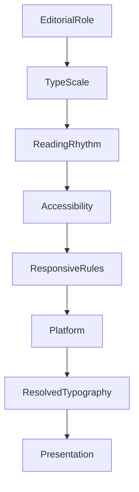

<!--
File: docs/design/system/mds-004-typography-system/08-runtime-resolution.md
Document: MDS-004
Chapter: 08
Title: Runtime Typography Resolution
Status: Draft
Version: 0.2
-->

# Runtime Typography Resolution

---

# Purpose

The previous chapters established:

- Editorial Hierarchy
- Type Scale
- Reading Rhythm
- Hero Typography
- Responsive Typography
- Accessibility

This chapter defines how those concepts become concrete typography at runtime.

Runtime Typography Resolution is the mechanism through which abstract editorial intent becomes readable text on a specific device in a specific environment.

Applications should never determine:

- font size,
- line height,
- optical sizing,
- spacing,
- font variation,

independently.

Instead they request editorial intent.

The Typography System resolves everything else.

---

# Definition

Within MDS, **Runtime Typography Resolution** is defined as:

> **The deterministic process through which editorial typography is transformed into concrete runtime typography while preserving semantic hierarchy and reading comfort.**

Runtime Typography Resolution never changes editorial meaning.

It only determines how that meaning is expressed.

---

# Why Resolution Exists

Without Runtime Resolution, every component would need to understand:

- screen size,
- viewing distance,
- accessibility,
- platform,
- font technology,
- user preferences.

Instead.

```text
Heading

↓

Runtime Resolver

↓

Rendered Typography
```

Components remain simple.

Typography remains consistent.

---

# Resolution Pipeline

Every typographic role follows the same conceptual pipeline.

```text
Editorial Role

↓

Type Scale

↓

Responsive Rules

↓

Accessibility

↓

Runtime Context

↓

Platform Adaptation

↓

Resolved Typography
```

Each stage contributes one responsibility.

No stage duplicates another.

---

# Resolution Inputs

Runtime Typography Resolution evaluates:

```text
Editorial Role

↓

Current Context

↓

Device Class

↓

Viewing Distance

↓

Accessibility

↓

User Preferences

↓

Platform Capability
```

Typography adapts according to these inputs while preserving one editorial language.

---

# Resolution Order

Typography should always resolve using the same conceptual order.

```text
1.

Editorial Role

↓

2.

Type Scale

↓

3.

Reading Rhythm

↓

4.

Accessibility

↓

5.

Responsive Rules

↓

6.

Platform Adaptation

↓

7.

Rendered Typography
```

Meaning always precedes implementation.

---

# Editorial Stability

One of the strongest guarantees within Mosaic is:

```text
Heading

↓

Always Heading
```

The Heading may become:

- larger,
- smaller,
- wider,
- optically adjusted,

but it never stops being:

```
Heading
```

Applications should therefore consume editorial roles rather than implementation values.

---

# Runtime Context

Typography may adapt according to the user's current activity.

Examples.

Watching.

↓

Less reading.

Reading.

↓

Comfort-first typography.

Administration.

↓

Higher density.

The same editorial role may therefore resolve differently while remaining conceptually identical.

---

# Viewing Distance

Viewing distance is considered a runtime input.

Television.

↓

Greater physical size.

Phone.

↓

Smaller physical size.

Desktop.

↓

Balanced implementation.

The user should perceive equivalent readability regardless of hardware.

---

# Accessibility Resolution

Accessibility possesses higher authority than responsive behaviour.

Examples.

Large Text.

↓

Larger scale.

↓

Greater line spacing.

↓

Paragraph rhythm preserved.

Reduced Vision.

↓

Increased optical size.

↓

Higher readability.

Editorial rhythm should remain recognisable after accessibility adaptation.

---

# Variable Font Resolution

Future implementations may resolve:

- weight,
- width,
- optical size,
- grade,

using variable font technology.

Applications should never manipulate these axes directly.

They simply request:

```text
Heading
```

The Typography Resolver determines the appropriate implementation.

---

# Runtime Caching

Resolved typography should be cacheable.

Typical invalidation events include:

- accessibility changes,
- device changes,
- orientation changes,
- platform font changes.

Ordinary interaction should not repeatedly resolve typography.

Reading should remain visually stable.

---

# Incremental Resolution

Typography updates should occur incrementally.

Preferred.

```text
Accessibility Changes

↓

Body

↓

Supporting

↓

Caption
```

Avoid.

```text
Accessibility Changes

↓

Entire Typography System Rebuilt
```

Readers should perceive continuity.

Not replacement.

---

# Platform Adaptation

Different rendering technologies possess different capabilities.

Examples.

Web.

↓

Variable font support.

Flutter.

↓

Engine-specific metrics.

Television.

↓

Distance optimisation.

The Typography Resolver should compensate for implementation differences while preserving editorial consistency.

---

# Material Awareness

Typography should respect surrounding Materials.

Hero Material.

↓

Slightly greater spacing.

Overlay Material.

↓

Higher contrast.

Canvas.

↓

Editorial rhythm.

Materials influence implementation.

They never redefine editorial hierarchy.

---

# Runtime Atmosphere

Typography should participate minimally in Runtime Atmosphere.

Atmosphere may subtly influence:

- luminance,
- contrast,

It should never influence:

- hierarchy,
- weight,
- reading rhythm.

Words remain the most stable visual element within the interface.

---

# Modules

Modules never resolve typography.

Modules contribute:

- information,
- descriptions,
- metadata.

The Typography Resolver determines:

- hierarchy,
- spacing,
- scaling,
- accessibility.

Every module therefore automatically inherits future typographic improvements.

---

# Good Examples

## Hero

Hero Title.

↓

Responsive Scale.

↓

Accessibility.

↓

Resolved Typography.

↓

Presentation.

---

## Reading

Body.

↓

Comfort Profile.

↓

Reading Rhythm.

↓

Rendered Paragraphs.

The experience remains editorial rather than technical.

---

## Administration

Supporting Text.

↓

Higher Density Profile.

↓

Accessible Scaling.

↓

Presentation.

Information remains efficient without abandoning Mosaic's typographic voice.

---

# Anti-patterns

## Component Typography

Components selecting font sizes independently.

---

## Platform Typography

Each client inventing independent typography behaviour.

---

## Runtime Identity

Runtime changing Heading into Body.

Editorial meaning has leaked into implementation.

---

## Atmosphere Typography

Artwork directly influencing font weights or scale.

Atmosphere belongs to materials.

Not language.

---

# Runtime Typography Model



Applications request editorial intent.

The Typography System resolves implementation.

---

# Relationship To Future Chapters

The next chapter defines **Platform Typography**.

Runtime Resolution explains:

> **How typography becomes concrete at runtime.**

Platform Typography explains:

> **How different rendering technologies implement that typography while preserving one editorial language.**

Together they complete the runtime architecture of the Typography System.

---

# Summary

Runtime Typography Resolution transforms editorial intent into readable typography.

It preserves:

- hierarchy,
- rhythm,
- accessibility,
- responsiveness,
- consistency,

while hiding implementation complexity from applications.

Components should never ask:

> **"What font size should I use?"**

They should simply request:

> **Heading**

The Typography System does everything else.

---

# Review Status

**Status**

Draft

**Next File**

`09-platform-typography.md`
