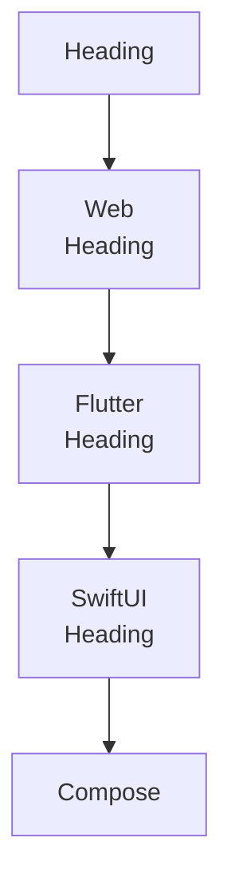
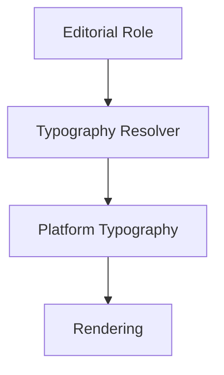
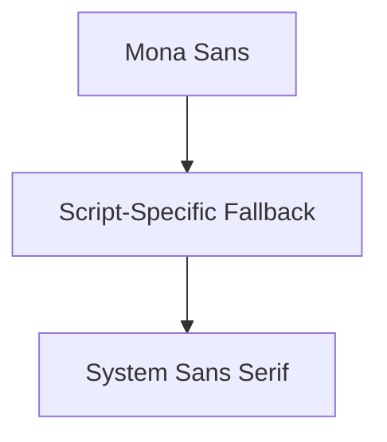
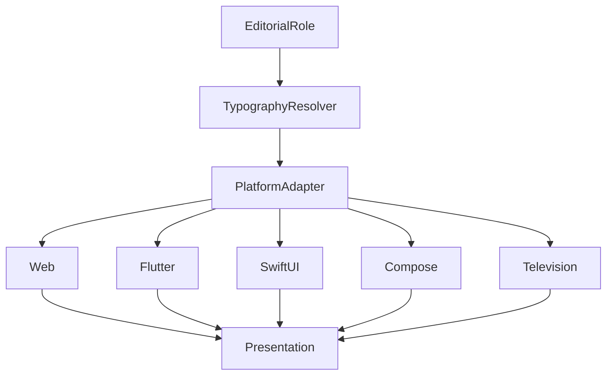

<!--
File: docs/design/system/mds-004-typography-system/09-platform-typography.md
Document: MDS-004
Chapter: 09
Title: Platform Typography
Status: Draft
Version: 0.4
-->

# Platform Typography

---

# Purpose

The Typography System defines one editorial language.

Mosaic clients implement that language across many rendering technologies.

Platform Typography ensures that:

- Web
- Flutter
- SwiftUI
- Jetpack Compose
- Desktop
- Television
- Future clients

all communicate the same editorial experience despite differing implementation capabilities.

Platform implementation should never redefine editorial meaning.

It should simply express it.

---

# Definition

Within MDS, **Platform Typography** is defined as:

> **The platform-specific implementation of the Mosaic Typography System while preserving one consistent editorial language.**

Platform Typography concerns implementation.

It does not concern design philosophy.

---

# Philosophy

Every platform possesses different capabilities.

Examples include:

- font rendering
- anti-aliasing
- shaping engines
- variable font support
- hinting
- sub-pixel rendering

These differences are implementation concerns.

Readers should experience one consistent Companion regardless of platform.

---

# Platform Independence

Editorial meaning should remain platform independent.

Conceptually.

Only rendering changes.

Meaning remains identical.

---

# Platform Responsibilities

Each platform implementation is responsible for:

- font loading
- shaping
- rendering
- fallback fonts
- locale support
- glyph rasterisation

Platforms are **not** responsible for:

- editorial hierarchy
- type scale
- reading rhythm
- semantic typography

Those responsibilities belong to the Typography System.

---

# Typography Resolver

Every platform should consume the output of the Typography Resolver.

Conceptually.

Platforms should never reinterpret editorial roles.

---

# Rendering Quality

Platform implementations should prioritise:

- readability
- consistency
- stability

before:

- rendering tricks
- custom effects
- decorative styling

Typography exists to communicate understanding.

Rendering quality should strengthen that communication.

---

# Primary Typeface

Mona Sans is the Mosaic Platform typeface.

It provides one variable family for Hero, Title, Heading, Body, Label and Metadata roles.

Mosaic uses the default width and creates hierarchy through size, weight, line height, spacing and Composition.

The normal product weight range is `400` to `700`.

Optical sizing resolves automatically where supported.

The typeface remains a provisional alpha dependency until language coverage, font loading, renderer metrics and licensing packaging have been verified.

---

# Font Metrics

Different rendering engines interpret font metrics differently.

Examples include:

- ascender height
- descender height
- x-height
- line height
- baseline

Future platform adapters should compensate for these differences.

Users should perceive one typographic rhythm regardless of implementation.

---

# Font Fallback

Platform Typography should define predictable fallback behaviour.

Conceptually.

Fallbacks should preserve:

- hierarchy
- rhythm
- readability

Editorial identity should remain recognisable even when the preferred font is unavailable.

Script-specific fallbacks are permitted only when Mona Sans lacks required glyph coverage.

They are compatibility resources rather than additional Mosaic brand typefaces.

A monospace family is permitted only for genuinely technical content such as logs or code.

Ordinary administration interfaces continue to use Mona Sans.

---

# Variable Fonts

Platforms supporting variable fonts should use them.

Platforms without variable font support should approximate the same editorial result using discrete font weights.

The editorial role remains identical.

Only implementation differs.

---

# International Typography

Platform implementations should support multilingual typography.

Examples include:

- Latin
- Cyrillic
- Greek
- Arabic
- Hebrew
- Devanagari
- Japanese
- Korean
- Chinese

Editorial hierarchy should remain consistent regardless of writing system.

The Typography System should feel culturally adaptable rather than culturally fixed.

---

# Bidirectional Text

Future implementations should support bidirectional text.

Editorial hierarchy should remain identical for:

- left-to-right
- right-to-left
- mixed-direction documents

The reading model adapts.

The editorial philosophy does not.

---

# Responsive Rendering

Platform typography should adapt to:

- display density
- operating system scaling
- viewing distance
- accessibility

The implementation may differ.

The perceived reading comfort should remain stable.

---

# Viewing Conditions

Platform implementations combine current viewing distance, extent, input context, operating-system scaling and accessibility.

Distant viewing should favour clarity over compactness.

Constrained extent should preserve rhythm through reflow and disclosure rather than arbitrary type reduction.

Additional space should improve reading measure and breathing room rather than increase visual complexity.

---

# Performance

Platform implementations should:

- cache glyphs
- reuse layouts
- minimise recomposition
- preserve rendering stability

Typography should remain visually stable throughout interaction.

Rendering should never distract from reading.

---

# Modules

Modules should never provide platform-specific typography.

Modules contribute:

- information
- language
- editorial content

The platform determines typography.

This guarantees one editorial voice throughout the ecosystem.

---

# Good Examples

## Web

Variable fonts.

↓

Editorial hierarchy preserved.

↓

Reading rhythm preserved.

---

## Flutter

Platform text engine.

↓

Typography Resolver.

↓

Identical editorial behaviour.

---

## Distant Viewing

Larger physical typography.

↓

Greater spacing.

↓

Equivalent reading comfort.

---

# Anti-patterns

## Platform Fonts

Each client invents different editorial hierarchy.

---

## Platform Styling

Platform-specific decorative typography.

---

## Manual Scaling

Application code selecting typography independently.

---

## Decorative Rendering

Rendering effects reducing readability.

---

# Platform Typography Model

One editorial language.

Many platform implementations.

---

# Relationship To Future Chapter

The next chapter defines **Variable Fonts**.

Platform Typography explains:

> **How platforms implement typography.**

Variable Fonts explain:

> **How typography becomes more adaptive while preserving editorial consistency.**

Together they complete the implementation architecture of the Typography System.

---

# Summary

Platform Typography exists to ensure that Mosaic speaks with one voice everywhere.

Different rendering engines may implement typography differently.

Readers should never perceive those differences.

They should simply feel that the Companion remains:

- calm,
- confident,
- familiar,

regardless of the device in their hands.
