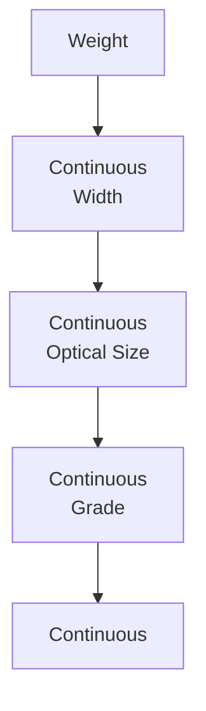
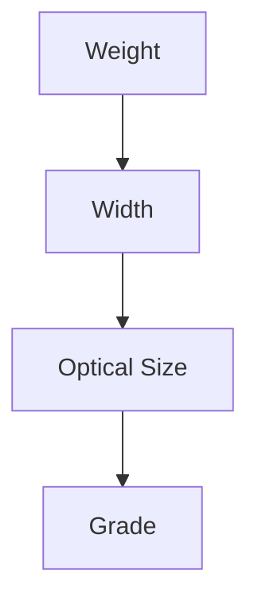
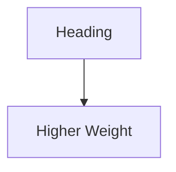
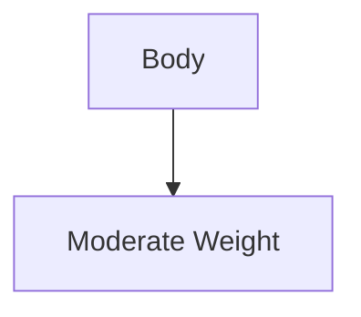
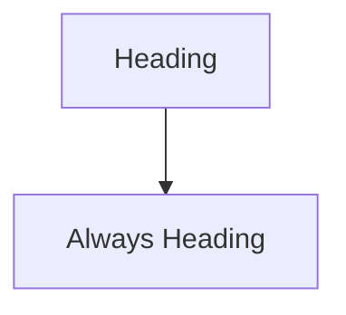
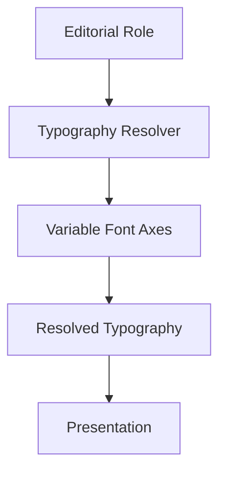
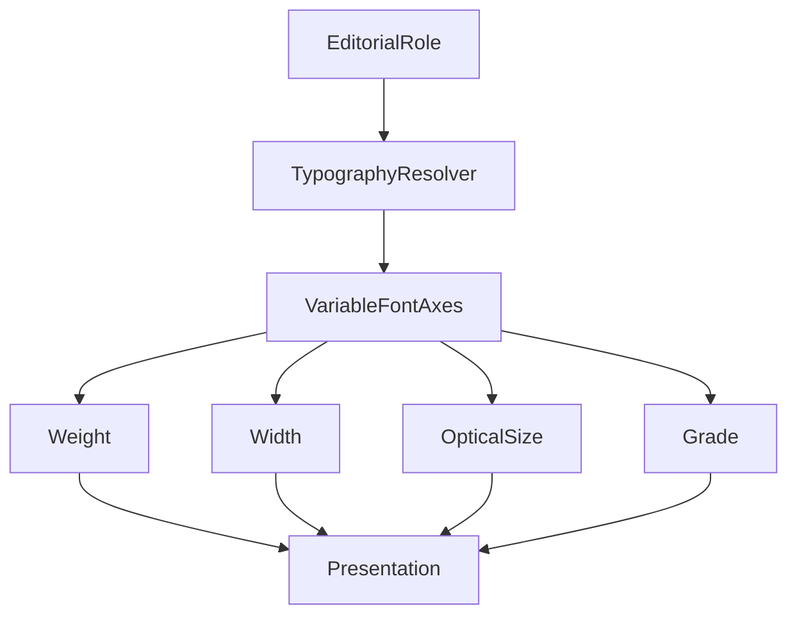

<!--
File: docs/design/system/mds-004-typography-system/10-variable-fonts.md
Document: MDS-004
Chapter: 10
Title: Variable Fonts
Status: Draft
Version: 0.4
-->

# Variable Fonts

---

# Purpose

Variable Fonts provide one of the most powerful implementation capabilities available to the Mosaic Typography System.

However...

Within Mosaic they are intentionally treated as an implementation technique rather than a design feature.

Contributors should never think:

> "How can we use variable fonts?"

Instead they should ask:

> **"How can variable typography better communicate understanding?"**

Variable Fonts exist to support the editorial language.

They never define it.

---

# Definition

Within MDS, **Variable Fonts** are defined as:

> **Typography capable of continuously adapting multiple visual characteristics while preserving one stable editorial language.**

Variable Fonts provide flexibility.

Editorial hierarchy provides meaning.

---

# Philosophy

Typography should adapt to readers.

Not force readers to adapt to typography.

Variable Fonts allow Mosaic to subtly improve:

- readability,
- hierarchy,
- rhythm,
- accessibility,
- device adaptation,

without introducing additional font families or breaking editorial consistency.

The adaptation should feel invisible.

---

# Why Variable Fonts Exist

Traditional typography requires discrete font files.

Examples.

```

Regular

Medium

SemiBold

Bold
```

Variable Fonts instead expose continuous typographic behaviour.

Conceptually.



The Typography Resolver determines appropriate values.

Applications remain unaware of these details.

---

# Supported Axes

The Typography System currently recognises the following conceptual variable axes.



Future axes may be supported provided they reinforce editorial understanding rather than visual novelty.

---

# Weight

Purpose.

Communicate hierarchy.

Examples.





Weight should communicate confidence rather than heaviness.

Avoid dramatic weight differences unless editorially justified.

Mosaic uses `400`, `500`, `600` and exceptional `700` output for normal product presentation.

Weights `800` and `900` are excluded from ordinary product UI.

---

# Width

Mosaic uses the Mona Sans default width.

Width is not a hierarchy tool, a Module control or a device-profile variation.

Any future width-axis use requires Typography governance and evidence that it improves accessibility without changing the brand voice.

---

# Optical Size

Purpose.

Optimise typography for its rendered size.

Smaller text may require:

- larger counters,
- increased spacing,
- adjusted stroke contrast.

Larger typography may become more refined.

Applications should never manipulate Optical Size directly.

The Typography Resolver owns these decisions.

---

# Grade

Purpose.

Improve readability without significantly affecting layout.

Examples.

High contrast.

↓

Slightly increased grade.

Low brightness.

↓

Slightly heavier grade.

Grade differs from Weight.

Weight influences hierarchy.

Grade primarily influences readability.

This distinction becomes increasingly valuable for accessibility.

---

# Runtime Adaptation

Variable Fonts should adapt according to:

- viewing distance,
- accessibility,
- platform,
- display density.

They should **not** adapt according to:

- artwork,
- runtime atmosphere,
- media genre.

Typography remains editorially stable.

Materials carry environmental adaptation.

---

# Editorial Stability

One of the strongest guarantees within Mosaic is:



Variable Font adjustments should never change editorial meaning.

They simply optimise implementation.

Users should perceive one consistent editorial voice.

---

# Responsive Behaviour

Future implementations may use Variable Fonts to preserve reading rhythm from measured viewing conditions, resolved size, accessibility and renderer capability.

Optical size should follow the resolved physical typography automatically.

The editorial hierarchy remains identical.

Only implementation adapts.

---

# Accessibility

Variable Fonts provide significant accessibility advantages.

Examples include:

- larger x-height,
- improved letter distinction,
- stronger grade,
- refined optical sizing.

Accessibility adaptations should remain subtle.

Readers should perceive increased comfort rather than dramatically different typography.

---

# Long-Form Reading

Books.

Reviews.

Descriptions.

Editorial content.

These experiences should receive the greatest benefit from Variable Fonts.

Future Typography Resolvers may optimise:

- paragraph rhythm,
- optical size,
- line spacing,
- grade,

according to reading duration.

Reading should become progressively more comfortable rather than mechanically consistent.

---

# Hero Typography

Hero Typography should use Variable Fonts conservatively.

Examples.

Slight optical refinement.

Subtle weight adjustment.

Improved spacing.

Avoid dramatic stylistic variation.

The Hero should communicate calm confidence rather than typographic experimentation.

---

# Cross-Platform Behaviour

Platforms supporting Variable Fonts should use them.

Platforms without support should approximate equivalent behaviour using traditional font weights.

The editorial language should remain identical.

Readers should never perceive which implementation strategy is being used.

---

# Runtime Resolution

Variable Fonts should participate within Runtime Typography Resolution.

Conceptually.



Applications request editorial intent.

The resolver determines font behaviour.

---

# Performance

Future implementations should:

- cache resolved typography,
- minimise axis recomputation,
- reuse layouts,
- preserve rendering stability.

Variable Fonts should improve flexibility without introducing perceptible performance costs.

---

# Modules

Modules should never manipulate Variable Font axes.

Modules contribute:

- language,
- information,
- editorial content.

The Typography Resolver determines:

- weight,
- width,
- optical size,
- grade.

Every module therefore inherits future typography improvements automatically.

---

# Good Examples

## Near Viewing Context

Heading.

↓

Slight optical adjustment.

↓

Improved readability.

The reader notices comfort rather than typography.

---

## Distant Viewing Context

Body.

↓

Greater viewing distance.

↓

Adjusted weight.

↓

Equivalent reading comfort.

---

## Reading

Long-form content.

↓

Runtime reading profile.

↓

Optimised optical size.

↓

Comfortable editorial rhythm.

---

# Anti-patterns

## Decorative Variation

Constant weight changes purely for visual interest.

---

## Artwork Typography

Artwork influencing Variable Font axes.

---

## Platform Typography

Each client independently selecting variable axes.

---

## Runtime Styling

Variable Fonts responding dramatically to atmosphere.

Typography should remain stable.

---

# Variable Font Model



Variable Fonts refine typography.

They never redefine editorial meaning.

---

# Relationship To Future Chapters

The next chapter defines **Typography Governance**.

Variable Fonts explain:

> **How typography becomes more adaptive.**

Governance explains:

> **How that adaptation remains architecturally consistent over the lifetime of Mosaic.**

Together they ensure flexibility without sacrificing editorial identity.

---

# Summary

Variable Fonts allow Mosaic to quietly adapt typography to:

- readers,
- devices,
- accessibility,
- environments.

The adaptation should feel invisible.

Readers should simply experience typography that always feels comfortable, calm and unmistakably Mosaic.

The technology exists to serve the editorial language.

Never to replace it.
