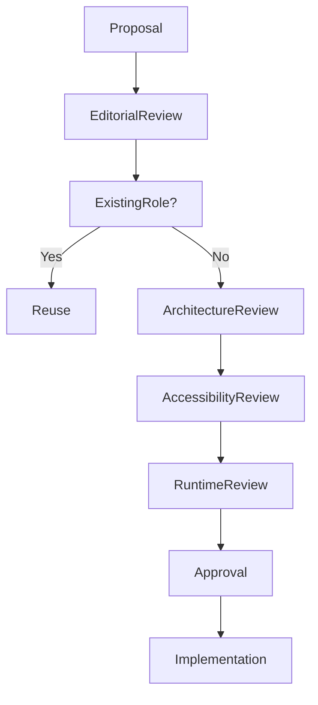

<!--
File: docs/design/system/mds-004-typography-system/11-governance.md
Document: MDS-004
Chapter: 11
Title: Typography System Governance
Status: Draft
Version: 0.2
-->

# Typography System Governance

---

# Purpose

Typography is one of the most recognisable characteristics of a product.

Users may never consciously remember:

- font families,
- point sizes,
- variable font axes.

They will remember:

- whether reading felt effortless,
- whether the interface sounded calm,
- whether the product felt trustworthy.

Typography therefore becomes part of the long-term identity of Mosaic.

This chapter defines how the Typography System should evolve while preserving that identity.

---

# Governance Philosophy

Typography should evolve technologically.

Its editorial voice should remain remarkably stable.

The objective is not preserving fonts.

It is preserving:

- editorial rhythm,
- hierarchy,
- readability,
- companionship.

Rendering technologies may change.

Typography should continue sounding like the same Companion.

---

# Typography Is Architecture

Within Mosaic, typography is treated as architectural language rather than visual styling.

Changing:

```
Heading
```

affects:

- hierarchy,
- composition,
- reading rhythm,
- accessibility,
- every supported client.

Typography changes should therefore receive architectural review.

Not merely visual approval.

---

# Stable Responsibilities

The following concepts should remain highly stable.

- Editorial Hierarchy
- Reading Rhythm
- Hero Typography
- Typographic Voice
- Editorial Roles
- Reading Philosophy

These concepts define the public typographic language of Mosaic.

---

# Evolvable Responsibilities

The following may evolve more frequently.

- font family
- variable font technology
- rendering engines
- optical sizing algorithms
- runtime scaling
- platform-specific typography

Implementation may evolve.

Editorial meaning should remain stable.

---

# Typography Ownership

Typography responsibilities are intentionally separated.

| Layer | Owner |
|--------|-------|
| Typography Philosophy | Design Systems |
| Editorial Hierarchy | Design Systems |
| Runtime Typography Resolver | Runtime Platform |
| Platform Rendering | Client Platform |
| Font Implementation | Platform Teams |

Ownership preserves consistency while allowing implementation to improve independently.

---

# Introducing New Typography

Before introducing a new typographic role ask:

## Question One

Does an existing editorial role already communicate this meaning?

---

## Question Two

Is this genuinely a new reading behaviour...

or merely another visual treatment?

---

## Question Three

Could spacing, hierarchy or composition solve this instead?

---

## Question Four

Will this role remain meaningful after a redesign?

---

## Question Five

Would another contributor naturally discover this role?

If uncertainty remains...

Refinement should continue before implementation.

---

# Editorial Drift

Editorial Drift occurs when:

- headings begin behaving differently,
- platforms invent new hierarchy,
- typography becomes decorative,
- marketing styles leak into runtime,
- multiple editorial voices emerge.

Editorial Drift weakens the Companion.

Users may not consciously notice it.

They simply begin feeling that the product has become inconsistent.

---

# Typography Debt

Typography Debt accumulates through:

- duplicate editorial roles,
- inconsistent spacing,
- decorative exceptions,
- platform-specific hierarchy,
- component-owned typography.

Typography Debt should be treated as architectural debt.

Reducing it often improves readability more than introducing new features.

---

# Runtime Governance

Runtime Typography Resolution may evolve continuously.

Examples include:

- better variable font support,
- improved optical sizing,
- smarter accessibility,
- adaptive reading profiles.

These improvements should require no changes to:

- Components,
- Composition,
- Editorial Hierarchy.

Applications should remain unaware of implementation improvements.

---

# Accessibility Governance

Accessibility always possesses higher authority than typography aesthetics.

If typography choices reduce:

- readability,
- rhythm,
- comprehension,

they should be reconsidered regardless of visual appeal.

Typography exists to communicate.

Not impress.

---

# Platform Governance

Every platform should communicate the same editorial language.

Desktop.

↓

Editorial.

Television.

↓

Editorial.

Phone.

↓

Editorial.

Implementation differences are expected.

Editorial differences are not.

---

# Module Governance

Modules should never introduce:

- custom typography scales,
- independent hierarchy,
- alternative editorial voices,
- decorative fonts.

Modules inherit:

- Typography Roles,
- Reading Rhythm,
- Accessibility,
- Runtime Resolution.

This guarantees one coherent editorial language throughout the ecosystem.

---

# Review Questions

Every typography proposal should answer:

- Does this strengthen understanding?
- Does this preserve editorial rhythm?
- Does this improve reading comfort?
- Does this reinforce the Companion?
- Would users still recognise Mosaic after this change?
- Is this solving a reading problem or adding visual novelty?

If the proposal exists primarily because it "looks better", it should be reconsidered.

---

# Validation

Future tooling should automatically validate:

- editorial hierarchy
- typography token usage
- accessibility compliance
- runtime consistency
- responsive behaviour
- platform parity

Validation should reinforce architectural review.

It should never replace thoughtful editorial judgement.

---

# Governance Workflow



Typography should evolve through refinement rather than expansion.

---

# Success Criteria

The Typography System succeeds when:

- users instinctively know what to read first,
- reading feels calm,
- editorial rhythm remains consistent,
- accessibility remains effortless,
- contributors naturally reuse existing editorial roles,
- every Mosaic client sounds like the same Companion.

Typography should become invisible.

Only understanding should remain.

---

# Architectural Decisions

| ADR | Decision |
|------|----------|
| ADR-120 | Typography is treated as editorial architecture rather than visual styling. |
| ADR-121 | Editorial hierarchy is a stable public design contract. |
| ADR-122 | Runtime Typography Resolution owns implementation while preserving editorial meaning. |
| ADR-123 | Accessibility always has higher authority than typographic aesthetics. |
| ADR-124 | Modules inherit the Typography System rather than extending it. |

---

# Review Status

**Status**

Draft

**Next File**

`12-adrs.md`
