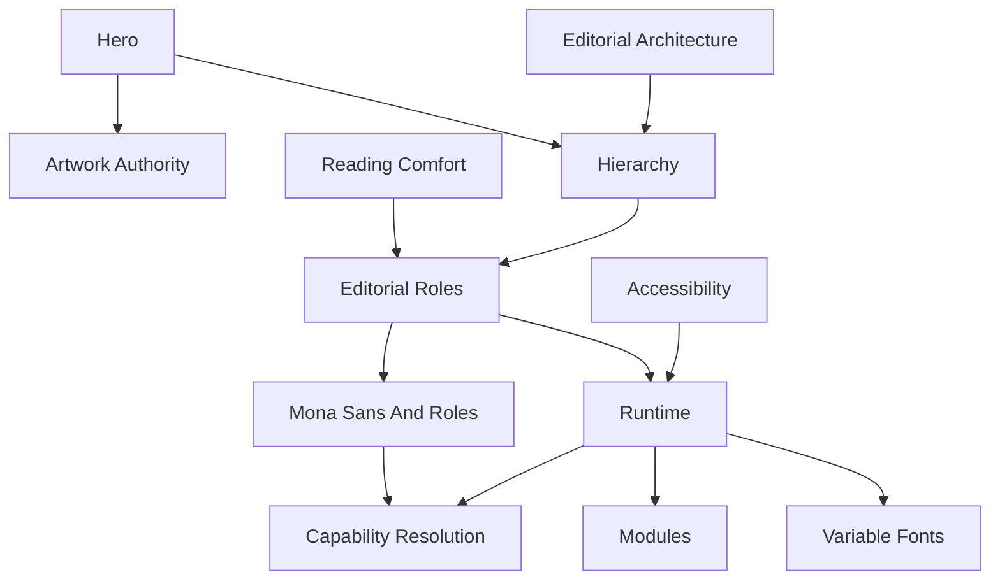

<!--
File: docs/design/system/mds-004-typography-system/12-adrs.md
Document: MDS-004
Chapter: 12
Title: Architectural Decision Records
Status: Draft
Version: 0.4
-->

# Architectural Decision Records

---

# Purpose

The Architectural Decision Records (ADRs) contained within MDS-004 preserve the architectural reasoning behind the Mosaic Typography System.

Where previous specifications established:

- Design Tokens
- Colour
- Materials

MDS-004 establishes the editorial voice through which the Mosaic Companion communicates.

These ADRs explain why Mosaic deliberately treats typography as language rather than decoration.

Future contributors should understand these decisions before proposing changes to typography behaviour or hierarchy.

---

# Decision Format

Decision format, lifecycle and review expectations are governed by **[MDG-001 — Documentation Authority Guide](../../../engineering/documentation/mdg-001-documentation-authority-guide/index.md)**.

This chapter records decisions specific to this specification and avoids redefining the shared ADR process.

# ADR-125

## Title

Treat Typography As Editorial Architecture

### Status

Accepted

### Context

Many interface systems optimise typography for information density.

Founder workshops consistently described Mosaic as a Companion rather than a dashboard.

### Decision

Typography becomes editorial architecture rather than interface styling.

### Consequences

Reading becomes calmer, more natural and more immersive across every Mosaic client.

---

# ADR-126

## Title

Editorial Hierarchy Drives Typography

### Status

Accepted

### Context

Allowing typography to determine hierarchy creates inconsistent experiences.

### Decision

Composition defines hierarchy.

Typography expresses hierarchy.

### Consequences

Editorial consistency is preserved across every device and future redesign.

---

# ADR-127

## Title

Separate Editorial Roles From Font Sizes

### Status

Amended by ADR-134

### Context

Pixel-based typography tightly couples application code to implementation.

### Decision

Applications consume editorial roles such as:

- Display
- Heading
- Section
- Body
- Supporting
- Caption

Runtime determines physical implementation.

### Consequences

Typography becomes platform independent and future proof.

---

# ADR-128

## Title

Runtime Typography Owns Adaptation

### Status

Amended by ADR-136

### Context

Accessibility, viewing distance and device capabilities require adaptive typography.

### Decision

The Runtime Typography Resolver becomes solely responsible for runtime adaptation.

Applications remain unaware of implementation details.

### Consequences

Typography adapts continuously while preserving one editorial language.

---

# ADR-129

## Title

Reading Comfort Has Higher Priority Than Density

### Status

Accepted

### Context

Many media applications sacrifice reading comfort to display additional information.

### Decision

Reading comfort always takes precedence over interface density.

Composition should reduce information before typography becomes uncomfortable.

### Consequences

Long-form reading becomes significantly more enjoyable.

---

# ADR-130

## Title

Hero Typography Introduces Rather Than Advertises

### Status

Amended by ADR-135

### Context

Traditional Hero typography frequently behaves like marketing.

Founder workshops consistently favoured calm editorial presentation.

### Decision

Hero Typography communicates confidence through restraint rather than spectacle.

### Consequences

Entertainment remains emotionally dominant while typography quietly establishes orientation.

---

# ADR-131

## Title

Accessibility Overrides Typography Aesthetics

### Status

Accepted

### Context

Decorative typography frequently reduces readability.

### Decision

Accessibility possesses higher authority than typographic styling.

### Consequences

Typography remains understandable regardless of:

- theme,
- device,
- accessibility settings,
- runtime adaptation.

---

# ADR-132

## Title

Variable Fonts Are An Implementation Detail

### Status

Accepted

### Context

Variable Fonts provide significant flexibility but should not influence editorial architecture.

### Decision

Variable Fonts remain entirely behind the Runtime Typography Resolver.

Applications consume editorial roles.

### Consequences

Future typography technologies may evolve without affecting application code.

---

# ADR-133

## Title

Modules Inherit Typography

### Status

Accepted

### Context

Allowing modules to introduce independent typographic systems fragments product identity.

### Decision

Modules contribute editorial content.

The platform owns typography.

### Consequences

Community modules inherit future typography improvements automatically.

---

# ADR-134

## Title

Use Mona Sans And Six Semantic Typography Roles

### Status

Accepted

### Context

Mosaic requires one recognisable voice across cinematic media, dense administration and future clients without fragmenting hierarchy through multiple font families.

### Decision

Mona Sans becomes the provisional Platform typeface.

Mosaic defines Hero, Title, Heading, Body, Label and Metadata roles.

Hierarchy uses size, weight, line height, spacing and Composition rather than additional typefaces.

Normal product typography uses weights `400`, `500`, `600` and exceptional `700`, with the default width and automatic optical sizing where supported.

### Consequences

One family supports expressive and utility contexts while semantic roles remain independent from physical values.

The alpha Design System must validate language coverage, font metrics, loading and renderer parity before the typeface dependency becomes final.

---

# ADR-135

## Title

Keep Typography Subordinate To Media Artwork

### Status

Accepted

### Context

Media artwork should remain the primary emotional and visual focus.

### Decision

Hero typography uses restrained scale and weight.

Composition may replace the visible title with an HD ClearLogo in verified landscape negative space.

Unsafe ClearLogo placement falls back to Mona Sans on Acrylic, while portrait poster titles appear below unobstructed artwork.

### Consequences

Media identity remains legible without turning Mosaic into a promotional poster layout or obscuring artwork.

---

# ADR-136

## Title

Resolve Typography From Reading Conditions Rather Than Device Class

### Status

Accepted

### Context

Browser, native application and television labels do not reliably describe viewing distance, accessibility, available extent or renderer behaviour.

### Decision

The client resolves physical typography from semantic role, viewing distance, available extent, content density, accessibility and renderer capability.

Text follows governed alignment, wrapping, truncation and reflow rules.

Automatic marquees and arbitrary fit-to-box shrinking are prohibited.

### Consequences

Equivalent reading conditions produce equivalent hierarchy across clients, and accessibility may reflow Composition without preserving a device-specific template.

---

# ADR Relationships

Together these decisions establish typography as the editorial voice of the Mosaic Companion.

---

# Future ADRs

Future Typography ADRs are expected to formalise:

- AI-assisted Reading Profiles
- Adaptive Reading Tempo
- Cross-Language Editorial Behaviour
- Dynamic Optical Scaling
- Immersive Reading Mode
- Long-Distance Typography Validation
- Accessibility Reading Personas
- Editorial Voice Localisation

These intentionally remain outside the scope of MDS-004 Version 0.1.

---

# ADR Governance

Typography ADRs should change only when:

- editorial research identifies deficiencies,
- accessibility research requires refinement,
- runtime typography architecture evolves,
- the Design Language itself changes.

Rendering technology alone should never justify architectural changes.

Typography should remain recognisably Mosaic regardless of implementation.

---

# Summary

The ADRs contained within MDS-004 define the editorial identity of Mosaic.

Typography is not treated as decoration.

It is treated as language.

Every implementation should therefore preserve:

- calmness,
- hierarchy,
- reading rhythm,
- companionship,

while allowing rendering technology to evolve independently.
