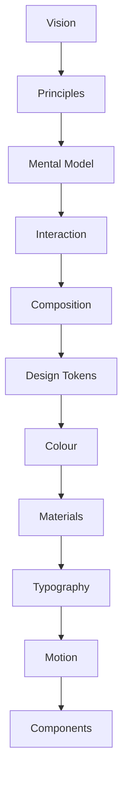
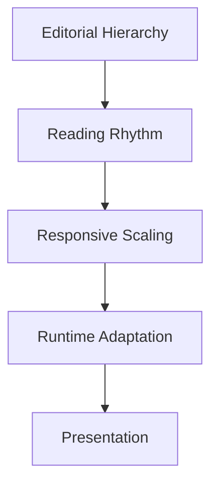

<!--
File: docs/design/system/mds-004-typography-system/index.md
Document: MDS-004
Status: Draft
Version: 0.4
-->

# MDS-004 — Typography System

> *Typography is not decoration. It is the voice of the Companion.*

---

# Purpose

The Material System defines how Mosaic physically exists.

The Typography System defines how Mosaic speaks.

Unlike conventional interface typography systems, which primarily optimise for information density, the Mosaic Typography System is designed around companionship.

Typography should communicate:

- confidence
- calmness
- clarity
- editorial quality
- restraint

The objective is not simply readability.

It is effortless understanding.

---

# Relationship to Previous Specifications



Typography consumes:

- Design Tokens
- Composition
- Material Hierarchy

It reinforces:

- hierarchy
- rhythm
- understanding
- atmosphere

---

# Scope

This specification defines:

- Typography Philosophy
- Reading Hierarchy
- Editorial Rhythm
- Type Scales
- Responsive Typography
- Hero Typography
- Reading Density
- Accessibility
- Typography Resolution
- Runtime Typography
- Mona Sans Platform typeface
- capability-driven text behaviour

This specification intentionally does **not** define:

- Components
- Motion
- Layout
- Colour
- Materials

Those systems work alongside Typography.

---

# Guiding Question

MDS-004 exists to answer one question.

> **How should language communicate understanding?**

Not:

> Which font size should this screen use?

Mona Sans is the selected provisional Platform typeface.

The guiding question prevents consumers from bypassing semantic roles; it does not prevent this specification from governing the shared typeface resource.

---

# Typography Statement

Within Mosaic:

> **Typography should disappear behind understanding.**

Users should remember:

- what they read

Not:

- how the type looked.

---

# Typography Responsibilities

Typography separates into several conceptual systems.



Each layer contributes one responsibility.

---

# Expected Outcome

After reading MDS-004 contributors should understand:

- how Mosaic uses typography
- why editorial rhythm matters
- how typography supports Composition
- how responsive typography behaves
- how runtime adaptation works
- how accessibility influences type

without discussing specific font families or rendering engines.

---

# Repository Structure

```text
design/

└── mds/

    └── MDS-004 Typography System/

        README.md

        00-document-control.md

        01-typography-philosophy.md

        02-editorial-hierarchy.md

        03-type-scale.md

        04-reading-rhythm.md

        05-hero-typography.md

        06-responsive-typography.md

        07-accessibility.md

        08-runtime-resolution.md

        09-platform-typography.md

        10-variable-fonts.md

        11-governance.md

        12-adrs.md

        13-contributor-guidance.md

        references.md

        glossary.md
```

---

# Dependencies

Required reading:

- [MDL-001](../../language/mdl-001-vision/index.md) → [MDL-005](../../language/mdl-005-composition-model/index.md)
- [MDS-001 — Design Token Architecture](../mds-001-design-token-architecture/index.md)
- [MDS-002 — Colour System](../mds-002-colour-system/index.md)
- [MDS-003 — Material System](../mds-003-material-system/index.md)

Downstream specifications:

- [MDS-005 — Motion System](../mds-005-motion-system/index.md)
- [MDP-001 — Adaptive Composition Runtime](../../../engineering/architecture/mdp-001-adaptive-composition-runtime/index.md)
- [MDP-001 — Adaptive Composition Runtime](../../../engineering/architecture/mdp-001-adaptive-composition-runtime/14-adaptive-tile-model.md)
- [MDS-008 — Component Library](../mds-008-component-library/index.md)
