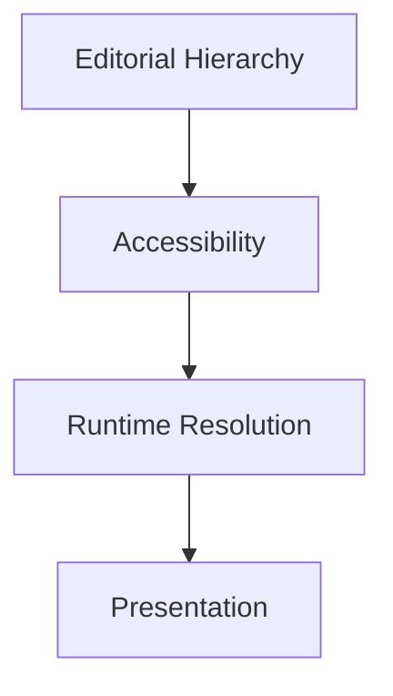
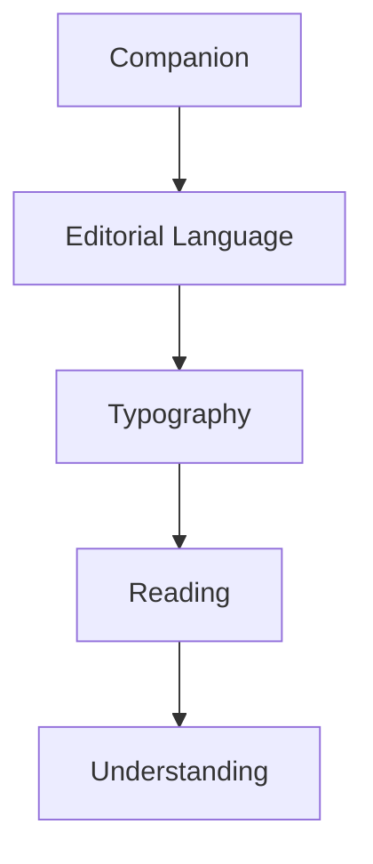

<!--
File: docs/design/system/mds-004-typography-system/references.md
Document: MDS-004
Title: References
Status: Draft
Version: 0.4
-->

# References

---

# Purpose

This document records the architectural influences and conceptual foundations that informed **MDS-004 — Typography System**.

Unlike implementation documentation, these references explain *why* Mosaic speaks the way it does rather than prescribing specific font technologies or rendering techniques.

The Typography System intentionally combines ideas from:

- editorial design,
- book typography,
- information architecture,
- human perception,
- accessibility,
- responsive reading,

into one coherent editorial language centred around companionship rather than software.

---

# Reading Order

Contributors should approach references in the following order.

1. MDL Specifications
2. Design Token Architecture
3. Colour System
4. Material System
5. Typography System
6. Platform Implementations

The Mosaic Design Language remains the primary authority.

External references provide inspiration rather than specification.

---

# Internal References

## [MDL-001 — Mosaic Design Language Vision](../../language/mdl-001-vision/index.md)

Provides:

- Companion philosophy
- Entertainment-first thinking
- Calm interaction
- Long-term product identity

Typography should reinforce the feeling that the user is accompanied rather than instructed.

---

## [MDL-002 — Principles](../../language/mdl-002-principles/index.md)

Provides:

- Content Leads
- Be A Companion
- Every Feature Earns Its Place
- Calm Interfaces

Typography should strengthen these principles through language, hierarchy and rhythm.

---

## [MDL-003 — Mental Model](../../language/mdl-003-mental-model/index.md)

Provides:

- World
- Focus
- Context
- Information

Typography communicates these concepts.

It should never redefine them.

---

## [MDL-004 — Interaction Model](../../language/mdl-004-interaction-model/index.md)

Provides:

- Continuity
- Behaviour
- Reading flow
- User understanding

Editorial rhythm should reinforce behavioural continuity.

---

## [MDL-005 — Composition Model](../../language/mdl-005-composition-model/index.md)

Provides:

- Hero
- Hierarchy
- Priority
- Density
- Breathing Space

Typography expresses compositional hierarchy.

It should never compete with it.

---

## [MDS-001 — Design Token Architecture](../mds-001-design-token-architecture/index.md)

Provides:

- Semantic Tokens
- Typography Roles
- Runtime Resolution

The Typography System consumes semantic roles rather than defining implementation values directly.

---

## [MDS-002 — Colour System](../mds-002-colour-system/index.md)

Provides:

- Semantic Colours
- Accessibility
- Runtime Atmosphere

Typography should remain readable regardless of atmospheric adaptation.

---

## [MDS-003 — Material System](../mds-003-material-system/index.md)

Provides:

- Canvas
- Hero Material
- Overlay Material
- Physical hierarchy

Typography exists within Materials.

Its rhythm should feel physically related to them.

---

# Future Specifications

The following specifications directly depend upon MDS-004.

- [MDS-005 — Motion System](../mds-005-motion-system/index.md)
- [MDP-001 — Adaptive Composition Runtime](../../../engineering/architecture/mdp-001-adaptive-composition-runtime/index.md)
- [MDP-001 — Adaptive Composition Runtime](../../../engineering/architecture/mdp-001-adaptive-composition-runtime/14-adaptive-tile-model.md)
- [MDS-008 — Component Library](../mds-008-component-library/index.md)

These specifications should consume Typography.

They should not redefine editorial hierarchy.

---

# Editorial Design

The Typography System draws heavily from editorial publishing rather than application dashboards.

Primary influences include:

- book typography
- magazine layout
- newspaper hierarchy
- long-form reading
- visual pacing

The objective is sustained understanding rather than information throughput.

---

# Human Perception

Several characteristics of reading behaviour influenced the Typography System.

Examples include:

- eye movement
- reading rhythm
- line length
- paragraph pacing
- typographic hierarchy
- cognitive load

Typography should support natural reading behaviour rather than forcing users into interface scanning.

---

# Accessibility

Accessibility is considered an architectural requirement.

The Typography System assumes:

This ordering ensures that readability always has higher priority than stylistic expression.

---

# Responsive Reading

Unlike many responsive systems, Mosaic optimises typography according to:

- viewing distance
- reading behaviour
- editorial rhythm

rather than viewport size alone.

This distinction is expected to become increasingly important as Mosaic expands across:

- televisions
- tablets
- desktop
- mobile
- future display technologies.

---

# Variable Typography

Variable Fonts are treated as implementation capability rather than design philosophy.

Typography should remain editorially stable regardless of whether the platform supports:

- variable fonts
- static font families
- future font technologies.

The Companion should always sound the same.

---

# Platform Independence

Typography should remain conceptually identical across:

- Web
- Flutter
- SwiftUI
- Jetpack Compose
- Future rendering engines

Implementation differences should never alter editorial voice.

---

# Mosaic-Specific Influences

The Typography System emerged directly from founder exploration.

Major architectural discoveries included:

- Typography should sound like a Companion rather than software.
- Editorial rhythm is more valuable than interface density.
- Hero Typography should introduce rather than advertise.
- Responsive Typography should optimise reading rather than layouts.
- Typography should quietly disappear behind understanding.

These ideas collectively define the typographic identity of Mosaic.

---

# Relationship To The Companion

The Typography System represents the spoken voice of the Companion.

Conceptually.

This relationship should remain consistent throughout every Mosaic experience.

Typography is therefore considered behavioural as well as visual.

---

# Normative References

Required reading before contributing to MDS-004.

- [MDL-001 — Mosaic Design Language Vision](../../language/mdl-001-vision/index.md)
- [MDL-002 — Principles](../../language/mdl-002-principles/index.md)
- [MDL-003 — Mental Model](../../language/mdl-003-mental-model/index.md)
- [MDL-004 — Interaction Model](../../language/mdl-004-interaction-model/index.md)
- [MDL-005 — Composition Model](../../language/mdl-005-composition-model/index.md)
- [MDS-001 — Design Token Architecture](../mds-001-design-token-architecture/index.md)
- [MDS-002 — Colour System](../mds-002-colour-system/index.md)
- [MDS-003 — Material System](../mds-003-material-system/index.md)

Together these specifications define the conceptual foundation of the Typography System.

---

# Informative References

Future contributors may also wish to review:

- [Mona Sans](https://github.com/github/mona-sans)
- [SIL Open Font License 1.1](https://openfontlicense.org/)
- [MDS-005 — Motion System](../mds-005-motion-system/index.md)
- [MDP-001 — Adaptive Composition Runtime](../../../engineering/architecture/mdp-001-adaptive-composition-runtime/index.md)
- [MDP-001 — Adaptive Composition Runtime](../../../engineering/architecture/mdp-001-adaptive-composition-runtime/14-adaptive-tile-model.md)
- [MDS-008 — Component Library](../mds-008-component-library/index.md)

These specifications describe how typography participates in interaction, composition and presentation.

---

# Living Document

This reference list should remain intentionally concise.

References should only be introduced when they materially influence:

- editorial hierarchy,
- reading behaviour,
- runtime typography,
- implementation boundaries.

The objective is to preserve architectural reasoning rather than catalogue typography literature.

---

# Completion

This concludes **MDS-004 — Typography System**.

The next specification in the Mosaic Design System is:

> **[MDS-005 — Motion System](../mds-005-motion-system/index.md)**

Where MDS-004 defines **how the Companion speaks**, [MDS-005](../mds-005-motion-system/index.md) defines **how the world moves**.

It formalises:

- Motion philosophy
- Behaviour-driven animation
- Temporal continuity
- Material motion
- Refraction movement
- Transition architecture
- Physics
- Accessibility-aware motion
- Runtime motion resolution

Motion is not decoration.

Within Mosaic, motion is the physical expression of understanding over time.
