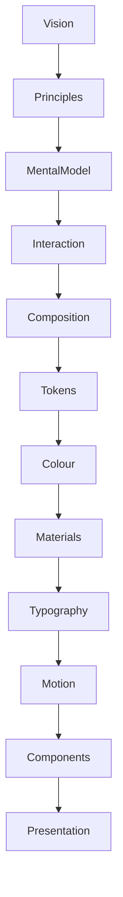

<!--
File: docs/design/system/mds-005-motion-system/00-document-control.md
Document: MDS-005
Title: Motion System
Status: Draft
Version: 0.4
-->

# Document Control

---

# Document Information

| Property | Value |
|----------|-------|
| Document ID | MDS-005 |
| Title | Mosaic Design System — Motion System |
| Classification | Internal |
| Status | Draft |
| Version | 0.4 |
| Owner | AdamNi-7080 |
| Parent Specifications | [MDL-001](../../language/mdl-001-vision/index.md) → [MDL-005](../../language/mdl-005-composition-model/index.md), [MDS-001](../mds-001-design-token-architecture/index.md) → [MDS-004](../mds-004-typography-system/index.md) |
| Repository | `/design/mds/MDS-005 Motion System/` |

---

# Purpose

MDS-005 defines the Motion System used throughout Mosaic.

Motion is not treated as visual decoration.

It is treated as the visible expression of behavioural change.

Where the Interaction Model explains:

> **Why the user's World changes.**

The Motion System explains:

> **How that change should become perceptible.**

Its responsibility is to transform behavioural evolution into physical continuity.

---

# Authority

MDS-005 governs:

- Motion philosophy
- Behavioural transitions
- Material motion
- Refraction movement
- Temporal continuity
- Motion hierarchy
- Behavioural Cost
- Identity-Preserving Transition Resolution
- Critically Damped Spatial Motion
- Runtime motion resolution
- Motion accessibility
- Platform motion

This specification intentionally does **not** govern:

- Interaction behaviour
- Business logic
- Component implementation
- Layout

Those systems initiate change.

Motion communicates it.

---

# Relationship To MDS

Motion sits after Materials and Typography because both participate in movement.

Motion consumes:

- Behaviour
- Composition
- Materials
- Typography

It communicates:

- continuity
- hierarchy
- physical evolution

---

# Design Intent

Many motion systems begin by asking:

> Which animation should play?

Mosaic intentionally asks:

> What changed?

Motion therefore begins with behaviour rather than animation.

Animation is merely one possible implementation.

Understanding remains the architectural objective.

---

# Reader Expectations

Before reading this specification contributors should already understand:

- [MDL-001 — Mosaic Design Language Vision](../../language/mdl-001-vision/index.md)
- [MDL-002 — Principles](../../language/mdl-002-principles/index.md)
- [MDL-003 — Mental Model](../../language/mdl-003-mental-model/index.md)
- [MDL-004 — Interaction Model](../../language/mdl-004-interaction-model/index.md)
- [MDL-005 — Composition Model](../../language/mdl-005-composition-model/index.md)
- [MDS-001 — Design Token Architecture](../mds-001-design-token-architecture/index.md)
- [MDS-002 — Colour System](../mds-002-colour-system/index.md)
- [MDS-003 — Material System](../mds-003-material-system/index.md)
- [MDS-004 — Typography System](../mds-004-typography-system/index.md)

The Motion System assumes those concepts already exist.

Its responsibility is to make them perceptible over time.

---

# Architectural Scope

The Motion System defines:

- behavioural motion
- material response
- temporal evolution
- runtime motion
- accessibility
- platform adaptation

It intentionally avoids implementation-specific concerns such as:

- CSS animations
- Flutter animation controllers
- SwiftUI transitions
- Compose animation APIs
- easing function syntax

These are implementation artefacts.

The Motion System defines only the architectural model.

---

# Stability

Expected lifetime.

| Artefact | Expected Lifetime |
|----------|-------------------|
| Animation APIs | Months |
| Motion Curves | Years |
| Motion Hierarchy | Years |
| Behavioural Motion | Decades |
| Motion Philosophy | Decades |

Rendering technology may evolve.

Motion behaviour should remain recognisably Mosaic.

---

# Success Criteria

MDS-005 succeeds when:

- users always understand what changed
- movement preserves continuity
- materials move believably
- typography remains readable during transitions
- accessibility remains uncompromised
- motion quietly reinforces understanding rather than demanding attention
- every interaction responds immediately while heavier change settles more deliberately
- shared identity survives movement, resizing, reparenting and depth changes

Users should rarely notice animation.

They should simply feel that the interface naturally evolved.
