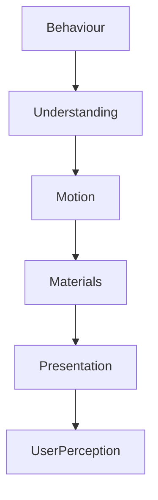

<!--
File: design/mds/MDS-005 Motion System/01-motion-philosophy.md
Document: MDS-005
Chapter: 01
Title: Motion Philosophy
Status: Draft
Version: 0.1
-->

# Motion Philosophy

---

# Purpose

Before defining curves, transitions or runtime behaviour, contributors must first understand what Motion represents within Mosaic.

Most interface systems treat motion as animation.

Animation is viewed as:

- delight,
- feedback,
- polish,
- visual quality.

Mosaic intentionally rejects this perspective.

Motion exists to communicate understanding.

It is part of the behavioural language of the platform.

Without Motion, users should still understand the interface.

With Motion, that understanding should become effortless.

---

# Philosophy Statement

> **Motion should explain behavioural change while preserving continuity, never drawing attention to itself.**

Everything within the Motion System derives from this statement.

---

# Motion Is Communication

Motion communicates:

- change,
- continuity,
- hierarchy,
- causality,
- physicality.

It should never exist purely because movement appears visually attractive.

If removing Motion reduces understanding...

The Motion belongs.

If removing Motion only changes aesthetics...

The Motion should be questioned.

---

# Motion Begins With Behaviour

Motion should never originate from interface events.

Incorrect.

```text
Button Click

↓

Animation
```

Preferred.

```text
Behaviour Changes

↓

Motion Explains Behaviour

↓

Presentation
```

Behaviour always possesses higher authority than animation.

This principle is inherited directly from the Interaction Model.

---

# Motion Is Continuity

The user's World should feel continuous.

Motion preserves that continuity.

Instead of:

```text
Old State

↓

Replace

↓

New State
```

Mosaic prefers:

```text
Old State

↓

Evolve

↓

Understanding

↓

New State
```

Users should perceive evolution.

Not replacement.

---

# Motion Is Physical

Because Mosaic possesses a Material System...

Motion should feel physical.

Examples include:

- Acrylic carrying momentum,
- Refraction redistributing gradually,
- Overlay Materials emerging naturally,
- Hero Materials settling into place.

Nothing should feel disconnected from the physical world established by the Material System.

---

# Motion Supports Composition

Motion should reinforce the Composition Model.

Examples.

Hero changes.

↓

Hero moves first.

Supporting information follows.

Peripheral information settles last.

Movement reinforces editorial hierarchy.

It never competes with it.

---

# Motion Supports Reading

Typography should remain readable throughout movement.

Poor.

Fast transitions.

↓

Text becomes difficult to read.

Preferred.

Typography remains stable.

↓

Movement occurs around it.

The interface should continue feeling editorial even while changing.

---

# Motion Supports Atmosphere

Runtime Atmosphere should evolve through motion.

Example.

Artwork changes.

↓

Atmosphere blends.

↓

Materials respond.

↓

Refraction redistributes.

↓

The environment settles.

Users should perceive environmental evolution rather than colour replacement.

---

# Motion Is Restrained

The Motion System intentionally values restraint.

Avoid:

- exaggerated overshoot,
- playful bounce,
- unnecessary elasticity,
- decorative choreography.

The interface should feel:

- confident,
- deliberate,
- physically believable.

Entertainment already provides excitement.

Motion should provide clarity.

---

# Motion Is Predictable

Users should gradually learn how Mosaic moves.

After sufficient use they should instinctively predict:

- where objects come from,
- where they go,
- what changed,
- why it changed.

Predictability reduces cognitive effort.

Novelty should never become a design objective.

---

# Motion Is Layered

Motion should occur at multiple conceptual layers.

```text
Behaviour

↓

Composition

↓

Materials

↓

Typography

↓

Presentation
```

Every layer contributes movement.

No layer should dominate the others.

---

# Motion Has Meaning

Every movement should answer at least one question.

Examples.

Why did this appear?

↓

It became relevant.

Why did this move?

↓

Hierarchy changed.

Why did this disappear?

↓

Its purpose ended.

If contributors cannot answer these questions...

The movement probably should not exist.

---

# Motion And Time

Motion should communicate temporal progression.

Examples.

Playback.

↓

Episode complete.

↓

Next episode.

↓

Continuation.

The movement should make the passage of time feel understandable.

Not merely animated.

---

# Motion Across Themes

Themes should never alter motion philosophy.

Light Mode.

↓

Calm movement.

Dark Mode.

↓

Calm movement.

Only Material interpretation changes.

Motion behaviour remains identical.

---

# Motion Across Devices

Desktop.

↓

Pointer interaction.

Phone.

↓

Touch interaction.

Television.

↓

Remote interaction.

Despite differing interaction methods...

Motion should communicate identical behavioural meaning.

Users should recognise the same Motion language everywhere.

---

# Accessibility

Motion should always remain optional.

Reducing Motion should never reduce understanding.

Examples.

Reduced Motion.

↓

Less animation.

↓

Identical hierarchy.

↓

Identical behaviour.

Accessibility should remove movement.

Never remove meaning.

---

# Good Examples

## Hero Transition

Current Hero.

↓

Hero gently evolves.

↓

Atmosphere follows.

↓

Supporting information reorganises.

Nothing appears replaced.

---

## Overlay

Overlay emerges.

↓

Interaction.

↓

Overlay retreats.

↓

World continues.

The user's Context remains uninterrupted.

---

## Playback

Video becomes dominant.

↓

Controls appear only when required.

↓

Controls quietly disappear.

↓

Entertainment continues.

Motion supports immersion.

---

# Anti-patterns

## Decorative Motion

Movement exists because it looks impressive.

---

## Surprise Motion

Objects move unexpectedly without behavioural justification.

---

## Competitive Motion

Multiple unrelated animations occur simultaneously.

Hierarchy weakens.

---

## Motion As Branding

Movement exists primarily to advertise product identity.

Understanding decreases.

---

# Motion Philosophy Model



Motion exists because behaviour changed.

Never because animation is available.

---

# Relationship To Future Chapters

The remaining chapters define how this philosophy becomes implementation.

Including:

- Motion Hierarchy
- Behavioural Motion
- Material Motion
- Refraction Motion
- Temporal Continuity
- Motion Curves
- Accessibility
- Runtime Motion Resolution

Every implementation should reinforce the philosophy established here.

---

# Summary

Motion is not visual decoration.

It is behavioural communication.

Users should never admire the animation.

They should simply understand what happened.

When Motion succeeds, the interface feels alive without ever feeling busy.

That quiet clarity is the defining characteristic of the Mosaic Motion System.

---

# Review Status

**Status**

Draft

**Next File**

`02-motion-hierarchy.md`
