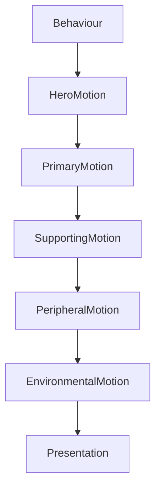

<!--
File: docs/design/system/mds-005-motion-system/02-motion-hierarchy.md
Document: MDS-005
Chapter: 02
Title: Motion Hierarchy
Status: Draft
Version: 0.2
-->

# Motion Hierarchy

---

# Purpose

Not every movement deserves equal attention.

Just as Composition organises understanding through hierarchy...

Motion organises change through hierarchy.

Motion Hierarchy determines:

- what moves first,
- what moves most,
- what should barely move at all.

Without hierarchy, movement becomes visual noise.

With hierarchy, movement quietly reinforces understanding.

---

# Definition

Within MDS, **Motion Hierarchy** is defined as:

> **The ordered system through which behavioural importance determines the visibility, timing and physical presence of movement.**

Motion Hierarchy communicates significance.

It does not create significance.

Behaviour already determines importance.

Motion simply expresses it.

---

# Why Hierarchy Exists

Imagine every element moving simultaneously.

```
Hero

Navigation

Timeline

Metadata

Artwork

Background

Buttons
```

Nothing feels important.

Everything competes.

Instead.

```
Hero

↓

Supporting Information

↓

Peripheral Information
```

Movement naturally guides attention.

Users immediately understand where behavioural change occurred.

---

# Behaviour Before Motion

Motion Hierarchy always follows Behaviour.

Conceptually.

```text
Behaviour

↓

Composition

↓

Hierarchy

↓

Motion

↓

Presentation
```

Movement should never invent hierarchy.

It should reveal hierarchy that already exists.

---

# Motion Levels

The Motion System defines five conceptual levels.

```text
Hero

↓

Primary

↓

Supporting

↓

Peripheral

↓

Environmental
```

Each level communicates a different behavioural importance.

---

# Hero Motion

Purpose.

Communicate major behavioural transitions.

Examples.

- Focus changes
- Hero evolution
- Playback beginning
- Playback ending

Hero Motion receives:

- greatest visual attention,
- longest perceived continuity,
- richest material behaviour.

Hero Motion should remain calm.

Never theatrical.

---

# Primary Motion

Purpose.

Communicate immediate supporting changes.

Examples.

- Continue Watching
- Progress
- Timeline
- Reading Position

Primary Motion follows Hero Motion naturally.

It should never compete with it.

---

# Supporting Motion

Purpose.

Communicate contextual evolution.

Examples.

- Cast
- Reviews
- Metadata
- Related Works

Supporting Motion should remain subtle.

Readers should perceive continuity without consciously following movement.

---

# Peripheral Motion

Purpose.

Communicate background adaptation.

Examples.

- Collections
- Recommendations
- History

Peripheral Motion should be restrained.

Users should notice it only when looking directly at it.

---

# Environmental Motion

Purpose.

Communicate changes in the surrounding environment.

Examples.

- Runtime Atmosphere
- Acrylic lighting
- Refraction
- Canvas

Environmental Motion should rarely attract conscious attention.

Instead...

Users should simply feel that the environment evolved naturally.

---

# Motion Order

Motion should generally follow this sequence.

```text
Behaviour

↓

Hero

↓

Primary

↓

Supporting

↓

Peripheral

↓

Environment Settles
```

The interface should feel as though understanding propagates naturally through the World.

---

# Hierarchy Is Temporal

Hierarchy influences timing.

Hero Motion begins first.

Supporting Motion follows.

Environmental Motion settles last.

This staggered behaviour reinforces:

- causality,
- continuity,
- physicality.

Movement should resemble consequence rather than choreography.

---

# Hierarchy Is Physical

Motion should respect Material Hierarchy.

Hero Material.

↓

Moves first.

Surface.

↓

Responds.

Canvas.

↓

Barely changes.

Physical behaviour should reinforce perceived material depth.

The environment should feel believable.

---

# Hierarchy Across Domains

The Motion Hierarchy remains identical across every entertainment domain.

Television.

↓

Episode becomes Hero.

Books.

↓

Current Chapter becomes Hero.

Music.

↓

Current Track becomes Hero.

Different content.

One Motion language.

---

# Runtime Hierarchy

Runtime systems should resolve Motion Hierarchy automatically.

Components should never decide:

- movement priority,
- animation order,
- timing relationships.

Applications simply communicate behavioural change.

The Motion System determines everything else.

---

# Accessibility

Reduced Motion should preserve hierarchy.

Example.

Instead of:

```
Hero Moves

↓

Timeline Moves

↓

Environment Moves
```

Use.

```
Hero Appears

↓

Timeline Updates

↓

Environment Quietly Changes
```

The amount of movement changes.

The order of understanding does not.

---

# Good Examples

## Hero Change

Hero evolves.

↓

Primary information follows.

↓

Supporting information settles.

↓

Atmosphere completes.

Users understand exactly what changed.

---

## Playback

Video becomes dominant.

↓

Controls quietly respond.

↓

Environment stabilises.

Nothing distracts from entertainment.

---

## Reading

Chapter changes.

↓

Progress updates.

↓

Bookmarks settle.

↓

Ambient atmosphere gently adapts.

The rhythm remains calm.

---

# Anti-patterns

## Simultaneous Motion

Everything moves together.

Hierarchy disappears.

---

## Decorative Priority

Visually interesting objects move before behaviourally important ones.

Understanding weakens.

---

## Background Dominance

Environmental movement becomes more noticeable than interaction.

Atmosphere competes with content.

---

## Random Ordering

Movement order changes between different parts of the platform.

Users lose predictability.

---

# Motion Hierarchy Model



Behaviour establishes importance.

Motion communicates it over time.

---

# Relationship To Future Chapters

The next chapter defines **Behavioural Motion**.

Motion Hierarchy answers:

> **What should move first?**

Behavioural Motion answers:

> **How should different kinds of behavioural change be communicated?**

Together they establish one coherent language of movement across the entire Mosaic platform.

---

# Summary

Motion Hierarchy transforms behavioural importance into temporal understanding.

Users should instinctively perceive:

- what changed,
- where it changed,
- why it mattered,

without consciously analysing animation.

When Motion Hierarchy succeeds, movement quietly guides attention exactly where understanding requires it.

---

# Review Status

**Status**

Draft

**Next File**

`03-behavioural-motion.md`
