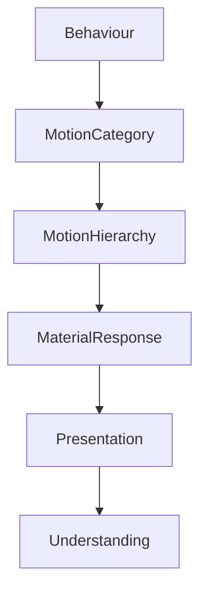

<!--
File: docs/design/system/mds-005-motion-system/03-behavioural-motion.md
Document: MDS-005
Chapter: 03
Title: Behavioural Motion
Status: Draft
Version: 0.2
-->

# Behavioural Motion

---

# Purpose

Motion exists because behaviour changes.

Not because interfaces need animation.

This chapter defines the relationship between behavioural events and the movement used to communicate them.

Every meaningful motion within Mosaic should originate from a behavioural change already defined by the Interaction Model.

If no behavioural change occurred...

No motion should occur.

---

# Definition

Within MDS, **Behavioural Motion** is defined as:

> **The visible expression of behavioural change through controlled physical movement.**

Behavioural Motion answers three questions.

- What changed?
- Why did it change?
- What should the user understand next?

It intentionally avoids answering:

- Which animation should play?

---

# Behaviour Drives Motion

Motion should never be triggered directly by interaction.

Incorrect.

```text
Tap

↓

Animation
```

Correct.

```text
Tap

↓

Behaviour Changes

↓

Composition Evolves

↓

Motion Explains

↓

Presentation
```

Motion should always describe behaviour.

Never input.

---

# Behaviour Categories

The Motion System recognises several categories of behavioural change.

```text
Focus

↓

Context

↓

Composition

↓

Information

↓

Material

↓

Environment
```

Each category produces different movement.

---

# Focus Motion

Purpose.

Communicate a change in primary attention.

Examples.

- selecting new media
- opening a new Hero
- changing Domains

Characteristics.

- strongest motion
- greatest continuity
- highest editorial importance

Focus Motion should feel deliberate.

Not dramatic.

---

# Context Motion

Purpose.

Communicate changing activity while preserving Focus.

Examples.

- playback begins
- playback pauses
- reading resumes
- search opens

Context Motion should generally feel lighter than Focus Motion.

Users remain inside the same World.

---

# Composition Motion

Purpose.

Communicate changes in hierarchy.

Examples.

- Timeline promoted
- Supporting information reordered
- Hero expands
- Relationships appear

Composition Motion should reinforce understanding.

Not redraw layouts.

---

# Information Motion

Purpose.

Communicate changes to information itself.

Examples.

- progress updates
- downloads complete
- metadata refreshes
- episode released

Information Motion should remain highly local.

Only affected information should move.

---

# Material Motion

Purpose.

Communicate physical response.

Examples.

- Acrylic settles
- Refraction redistributes
- Overlay emerges
- Hero illumination shifts

Material Motion reinforces physicality.

It should never become the centre of attention.

---

# Environmental Motion

Purpose.

Communicate environmental evolution.

Examples.

- Runtime Atmosphere
- Canvas adaptation
- ambient lighting

Environmental Motion should almost disappear into peripheral vision.

Users should feel it more than observe it.

---

# Behavioural Continuity

Every behavioural transition should preserve identity.

Poor.

```text
Old Hero

↓

Removed

↓

New Hero
```

Preferred.

```text
Hero Evolves

↓

Understanding Continues
```

Movement should communicate transformation.

Not replacement.

---

# Locality

Behavioural Motion should remain local whenever possible.

Example.

Progress updates.

Only:

- progress indicator
- remaining time
- nearby timeline

should respond.

The rest of the interface should remain calm.

This significantly reduces cognitive load.

---

# Cause Before Effect

Movement should always respect causality.

Preferred.

```text
Focus Changes

↓

Hero Moves

↓

Supporting Information Responds

↓

Environment Settles
```

Avoid.

```text
Everything Moves

↓

User Works Out What Happened
```

Understanding should precede interpretation.

---

# Behavioural Weight

Different behavioural events possess different conceptual weight.

Examples.

```
Pause Playback
```

↓

Light Motion.

```
Change Hero
```

↓

Medium Motion.

```
Change Domain
```

↓

Strong Motion.

Motion intensity should reflect behavioural significance rather than visual distance.

---

# Behavioural Persistence

Movement should never interrupt ongoing understanding.

Example.

```
Reading

↓

Search

↓

Close Search

↓

Reading
```

Search Motion should preserve reading continuity.

The reader should feel that the original activity remained alive beneath the interaction.

---

# Behaviour Across Domains

Different entertainment domains share the same behavioural language.

Television.

↓

Episode changes.

Books.

↓

Chapter changes.

Music.

↓

Track changes.

Different media.

Identical behavioural categories.

This consistency strengthens the Mental Model.

---

# Runtime Behaviour

The Runtime Motion Resolver should receive behavioural events.

Not interface events.

Conceptually.

```text
Behaviour

↓

Motion Resolver

↓

Material Motion

↓

Presentation
```

Components should never decide:

- timing
- sequencing
- hierarchy

They simply communicate behavioural change.

---

# Accessibility

Reduced Motion should preserve behavioural communication.

Instead of:

```text
Movement
```

Use:

- opacity
- hierarchy
- spacing
- composition

Understanding should remain identical.

Only physical movement reduces.

---

# Good Examples

## Hero Change

Focus changes.

↓

Hero evolves.

↓

Supporting information follows.

↓

Atmosphere settles.

Behaviour remains immediately understandable.

---

## Playback

Playback begins.

↓

Controls reduce.

↓

Video becomes Hero.

↓

Environment calms.

The transition feels inevitable.

---

## Reading

Chapter advances.

↓

Progress updates.

↓

Bookmarks settle.

↓

Reader continues naturally.

Nothing feels interrupted.

---

# Anti-patterns

## Animation Libraries

Movement selected because an animation exists.

---

## Decorative Motion

Movement exists without behavioural meaning.

---

## Interface Motion

Components moving because layouts changed rather than behaviour.

---

## Behaviour Replacement

Motion replacing behavioural clarity rather than communicating it.

---

# Behavioural Motion Model



Behaviour always precedes motion.

Understanding always follows it.

---

# Relationship To Future Chapters

The next chapter defines **Material Motion**.

Behavioural Motion explains:

> **Why movement occurs.**

Material Motion explains:

> **How physical materials participate in that movement.**

Together they establish one coherent physical language of change throughout Mosaic.

---

# Summary

Behavioural Motion transforms behavioural change into understandable physical evolution.

Users should never wonder:

- what happened,
- why it happened,
- what changed.

Movement should quietly answer those questions before they are consciously asked.

That clarity is the defining objective of Behavioural Motion.

---

# Review Status

**Status**

Draft

**Next File**

`04-material-motion.md`
