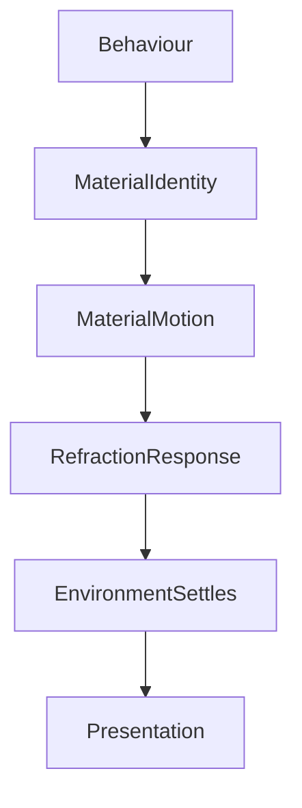

<!--
File: docs/design/system/mds-005-motion-system/04-material-motion.md
Document: MDS-005
Chapter: 04
Title: Material Motion
Status: Draft
Version: 0.2
-->

# Material Motion

---

# Purpose

The Material System established that Mosaic materials are physical behaviours rather than decorative effects.

This chapter defines how those materials move.

Material Motion ensures that:

- Acrylic behaves like Acrylic.
- Canvas behaves like Canvas.
- Hero Materials feel physically substantial.
- Overlay Materials emerge naturally.

Movement should reinforce the illusion that every material occupies one coherent physical environment.

Materials should never feel like independently animated interface layers.

---

# Definition

Within MDS, **Material Motion** is defined as:

> **The physical response of Mosaic materials to behavioural change while preserving the perception of a coherent environment.**

Material Motion communicates:

- physical presence,
- continuity,
- environmental response.

It intentionally avoids decorative animation.

---

# Philosophy

Imagine several sheets of polished acrylic resting on a table.

Move one.

Nearby sheets respond subtly.

The table remains stable.

Nothing teleports.

Nothing jitters.

The environment behaves as one physical system.

Material Motion should create the same impression.

---

# Materials Move Differently

Not every material should move equally.

Each material possesses its own behavioural characteristics.

| Material | Motion Behaviour |
|----------|------------------|
| Canvas | Almost static |
| Surface | Gentle response |
| Acrylic | Soft physical movement |
| Hero | Strongest physical response |
| Overlay | Controlled emergence |

Material identity should remain recognisable through movement alone.

---

# Canvas Motion

Canvas represents the environment.

It should rarely move.

Examples.

Allowed.

- atmosphere settling
- subtle luminance evolution

Avoid.

- translation
- scaling
- dramatic movement

The environment should remain behaviourally stable while objects move within it.

---

# Surface Motion

Surfaces group information.

Movement should communicate:

- organisation,
- hierarchy,
- continuity.

Surface Motion should feel:

- restrained,
- deliberate,
- stable.

Surfaces should never bounce or exaggerate movement.

---

# Acrylic Motion

Acrylic possesses physical weight.

Movement should therefore include:

- subtle inertia,
- soft settling,
- restrained elasticity.

The objective is not simulation.

The objective is perceived substance.

Users should feel that Acrylic occupies space.

---

# Hero Motion

Hero Material receives the richest physical behaviour.

Examples.

Focus changes.

↓

Hero glides naturally.

↓

Atmosphere redistributes.

↓

Refraction settles.

↓

Supporting materials respond.

Hero Motion should communicate confidence rather than speed.

The Hero should feel physically important.

---

# Overlay Motion

Overlay Material temporarily interrupts the environment.

Its movement should communicate:

- emergence,
- assistance,
- departure.

Preferred.

```text
Overlay

↓

Emerges

↓

Interaction

↓

Returns
```

Avoid.

```text
Overlay

↓

Instantly Appears

↓

Instantly Disappears
```

Users should perceive Overlay as a physical object briefly entering the environment.

---

# Material Relationships

Materials should influence one another.

Example.

Hero shifts.

↓

Nearby Acrylic responds.

↓

Canvas subtly receives new atmosphere.

↓

Overlay remains largely independent.

Movement therefore propagates through the environment rather than occurring independently.

---

# Environmental Stability

Material Motion should preserve one important illusion.

The environment already existed.

Behaviour changed.

The environment responded.

Users should never feel that the interface rebuilt itself.

---

# Refraction Motion

Refraction should move through materials.

Not with them.

Example.

Hero changes.

↓

Material moves.

↓

Environmental light gradually redistributes.

↓

Edges settle.

↓

Atmosphere stabilises.

Light should appear to possess inertia independent from geometry.

---

# Motion And Composition

Composition determines which materials move.

Example.

Progress updates.

↓

Timeline responds.

↓

Supporting Acrylic subtly updates.

↓

Hero remains stable.

Movement should remain local whenever practical.

---

# Temporal Behaviour

Material Motion should evolve over time.

Preferred.

```text
Behaviour

↓

Material Responds

↓

Environment Settles
```

Avoid.

```text
Behaviour

↓

Everything Immediately Complete
```

Settling communicates physical realism.

It also reinforces behavioural continuity.

---

# Motion Across Themes

Light Theme.

↓

Softer diffusion.

↓

Gentler settling.

Dark Theme.

↓

Richer environmental response.

↓

Slightly deeper perceived momentum.

Theme influences perception.

Not behaviour.

---

# Motion Across Devices

Desktop.

↓

Highest fidelity.

Television.

↓

Greater perceived depth.

Phone.

↓

Simplified motion.

Low Power Device.

↓

Reduced material complexity.

Despite differing implementations...

Materials should always feel like the same physical objects.

---

# Accessibility

Reduced Motion should simplify physical response.

Examples.

Instead of:

- translation,
- layered settling,
- atmospheric redistribution,

prefer:

- opacity,
- hierarchy,
- subtle luminance changes.

The physical language should remain understandable even when movement is reduced.

---

# Runtime Material Motion

The Runtime Motion Resolver should resolve Material Motion according to:

```text
Behaviour

↓

Material Identity

↓

Accessibility

↓

Device Capability

↓

Runtime Motion
```

Components should never manually animate materials.

The Material System owns physical behaviour.

---

# Performance

Future implementations should optimise Material Motion through:

- shared material timelines,
- cached atmospheric interpolation,
- GPU acceleration,
- incremental updates.

Materials should continue feeling premium without compromising responsiveness.

---

# Modules

Modules never animate materials.

Modules contribute:

- behavioural events,
- artwork,
- information.

The Motion System determines:

- material response,
- atmosphere redistribution,
- physical continuity.

Every module therefore inherits one coherent physical language automatically.

---

# Good Examples

## Hero Transition

Hero moves.

↓

Nearby Acrylic follows.

↓

Atmosphere settles.

↓

Canvas remains calm.

The World feels continuous.

---

## Overlay

Overlay rises naturally.

↓

Interaction occurs.

↓

Overlay returns.

↓

Hero immediately regains presence.

No visual competition exists.

---

## Playback

Video becomes dominant.

↓

Overlay controls softly emerge.

↓

Controls disappear.

↓

Environment settles.

Motion supports immersion.

---

# Anti-patterns

## Floating Materials

Materials move independently from one another.

Physical coherence disappears.

---

## Decorative Bounce

Elasticity exists purely because it appears playful.

Material credibility weakens.

---

## Static Acrylic

Materials ignore behavioural change.

The environment feels lifeless.

---

## Instant Atmosphere

Environmental lighting changes without physical transition.

Continuity weakens.

---

# Material Motion Model



Behaviour changes first.

Materials respond.

The environment quietly settles afterwards.

---

# Relationship To Future Chapters

The next chapter defines **Refraction Motion**.

Material Motion explains:

> **How physical materials move.**

Refraction Motion explains:

> **How light itself moves through those materials over time.**

Together they complete the physical language of movement within Mosaic.

---

# Summary

Material Motion transforms behavioural change into believable physical response.

Materials should feel:

- substantial,
- connected,
- calm,
- consistent.

Users should never perceive animated panels.

They should perceive one coherent environment naturally responding to the evolution of their entertainment World.

---

# Review Status

**Status**

Draft

**Next File**

`05-refraction-motion.md`
