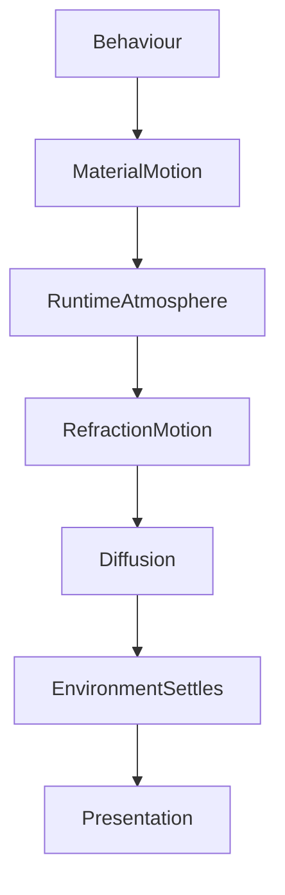

<!--
File: design/mds/MDS-005 Motion System/05-refraction-motion.md
Document: MDS-005
Chapter: 05
Title: Refraction Motion
Status: Draft
Version: 0.1
-->

# Refraction Motion

---

# Purpose

The Material System established that Refraction is the transport of environmental light through Mosaic materials.

Material Motion established that physical materials respond to behavioural change.

This chapter defines how **light itself** behaves over time.

Unlike geometry, light possesses inertia.

It spreads.

Settles.

Diffuses.

Refraction Motion exists to communicate that environmental behaviour.

The objective is not visual spectacle.

It is environmental continuity.

---

# Definition

Within MDS, **Refraction Motion** is defined as:

> **The temporal evolution of environmental light as it propagates through the Mosaic Material System following behavioural change.**

Refraction Motion belongs to:

- atmosphere,
- light,
- diffusion,

rather than:

- geometry,
- layout,
- components.

---

# Philosophy

Imagine changing the lighting within a room.

The walls do not instantly change.

The light gradually redistributes.

Shadows soften.

Reflections move.

The room settles.

Mosaic should create the same perception.

Behaviour changes.

The environment responds.

---

# Light Moves Differently

Materials move physically.

Light moves environmentally.

These are different behaviours.

Conceptually.

```text
Behaviour

↓

Material Motion

↓

Light Redistribution

↓

Environment Settles
```

Users should perceive:

- objects moving,
- light following.

Not both occurring simultaneously.

---

# Refraction Follows Behaviour

Refraction Motion should never occur independently.

Incorrect.

```text
Light Moves

↓

Nothing Changed
```

Correct.

```text
Behaviour Changes

↓

Composition Evolves

↓

Materials Respond

↓

Light Redistributes
```

Light should always appear to respond.

Never initiate.

---

# Refraction Timeline

Every significant environmental transition should broadly follow the same conceptual sequence.

```text
Behaviour

↓

Material Motion Begins

↓

Refraction Redistributes

↓

Diffusion Softens

↓

Environment Settles
```

Each stage reinforces physical continuity.

---

# Hero Refraction

Hero changes produce the strongest Refraction Motion.

Example.

```
Old Hero

↓

New Hero

↓

Atmosphere Blends

↓

Light Field Reprojects

↓

Hero Acrylic Settles
```

The Hero should appear to illuminate the surrounding environment naturally.

Not instantly repaint it.

---

# Supporting Refraction

Supporting materials receive delayed environmental response.

Example.

Hero changes.

↓

Nearby Timeline.

↓

Related Works.

↓

Peripheral Surfaces.

↓

Canvas.

Light should appear to propagate naturally through the interface.

---

# Canvas Behaviour

Canvas should respond last.

Examples.

Atmosphere changes.

↓

Canvas luminance subtly evolves.

↓

Environmental colour gently settles.

Canvas should never appear animated.

It should feel like the environment itself slowly responding.

---

# Overlay Behaviour

Overlay Materials intentionally reduce Refraction Motion.

Reasons include:

- readability,
- interaction,
- accessibility.

Interaction should never compete with environmental lighting.

While an Overlay is active:

Environment.

↓

Quiet.

Interaction.

↓

Clear.

---

# Directionality

Refraction Motion should preserve directional continuity.

Example.

Hero.

↓

Upper Left.

↓

Light travels diagonally.

↓

Nearby Acrylic responds first.

↓

Distant Materials respond later.

The environment should preserve a believable spatial relationship.

---

# Diffusion Over Time

Diffusion should evolve continuously.

Preferred.

```text
Strong Reflection

↓

Soft Diffusion

↓

Environmental Balance
```

Avoid.

```text
Strong Reflection

↓

Instant Neutral
```

Users should perceive the atmosphere settling rather than disappearing.

---

# Temporal Weight

Not every behavioural event deserves environmental redistribution.

Examples.

Progress updates.

↓

No environmental change.

Playback pause.

↓

Minimal environmental change.

Hero changes.

↓

Full environmental redistribution.

The Motion System should respect behavioural significance.

---

# Runtime Atmosphere

Runtime Atmosphere should never jump between states.

Preferred.

```text
Old Atmosphere

↓

Blend

↓

Redistribution

↓

New Atmosphere
```

The user should perceive one continuous environment.

Not multiple independent themes.

---

# Motion And Refraction

Material Motion and Refraction Motion intentionally differ.

Material Motion answers:

> What moved?

Refraction Motion answers:

> How did the environment respond?

These systems should complement one another.

Never duplicate one another.

---

# Accessibility

Reduced Motion should simplify Refraction Motion.

Examples.

Instead of:

- gradual light transport,
- animated diffusion,
- atmospheric settling,

prefer:

- immediate stable lighting,
- subtle luminance adjustment.

The environment should remain coherent without unnecessary movement.

---

# Performance

Future implementations should optimise Refraction Motion aggressively.

Preferred techniques include:

- cached UV fields,
- temporal interpolation,
- GPU blending,
- incremental updates.

Environmental motion should never become computationally dominant.

---

# Plugins

Extensions never participate in Refraction Motion.

Plugins contribute:

- artwork,
- behavioural events.

The Motion System determines:

- light redistribution,
- diffusion,
- temporal behaviour.

Every extension therefore inherits identical environmental motion.

---

# Good Examples

## Hero Change

Hero moves.

↓

Materials respond.

↓

Environmental light follows.

↓

Canvas settles.

The world feels physically believable.

---

## Playback

Video becomes Hero.

↓

Controls emerge.

↓

Environment calms.

↓

Playback continues.

Motion quietly supports immersion.

---

## Reading

Chapter changes.

↓

Hero evolves.

↓

Warm atmosphere slowly redistributes.

↓

Reading continues uninterrupted.

The transition feels almost imperceptible.

---

# Anti-patterns

## Animated Glow

Glow moves independently from behavioural change.

---

## Flashing Atmosphere

Entire interface instantly changes colour.

---

## Uniform Refraction

Every material receives identical environmental updates.

---

## Decorative Light

Light exists because animation is available.

Not because behaviour changed.

---

# Refraction Motion Model



Behaviour begins the transition.

Refraction completes the environmental response.

---

# Relationship To Future Chapters

The next chapter defines **Temporal Continuity**.

Refraction Motion explains:

> **How environmental light evolves.**

Temporal Continuity explains:

> **How every movement across the entire platform becomes one continuous behavioural experience.**

Together they ensure Mosaic feels like one living environment rather than a collection of animated interfaces.

---

# Summary

Refraction Motion is the movement of environmental light.

It should feel:

- calm,
- physical,
- continuous,
- inevitable.

Users should never consciously follow the light.

They should simply feel that the world around their entertainment naturally responded when something meaningful changed.

That quiet environmental response is one of the defining characteristics of the Mosaic Motion System.

---

# Review Status

**Status**

Draft

**Next File**

`06-temporal-continuity.md`
