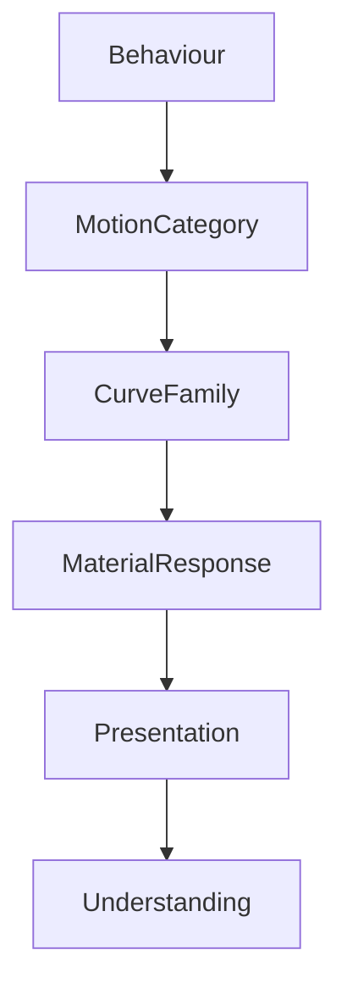

<!--
File: design/mds/MDS-005 Motion System/07-motion-curves.md
Document: MDS-005
Chapter: 07
Title: Motion Curves
Status: Draft
Version: 0.1
-->

# Motion Curves

---

# Purpose

Movement possesses character.

Two objects may travel the same distance over the same duration while communicating completely different meanings.

Motion Curves define that character.

Within Mosaic, Motion Curves are **not** aesthetic preferences.

They communicate physical behaviour.

They answer one question.

> **"How should this movement feel?"**

Not:

> "Which easing function should we use?"

---

# Definition

Within MDS, **Motion Curves** are defined as:

> **The behavioural characteristics governing how movement accelerates, travels and settles over time while preserving the physical language of the Mosaic Material System.**

Curves communicate behaviour.

They do not decorate movement.

---

# Philosophy

Imagine gently placing a book onto a wooden table.

The book does not:

- snap,
- bounce,
- overshoot dramatically.

It slows naturally.

Settles.

Stops.

Mosaic Motion should communicate the same confidence.

Movement should feel:

- deliberate,
- physical,
- calm.

---

# Curves Follow Behaviour

Motion Curves should always be selected according to behavioural intent.

Incorrect.

```text
Every Animation

↓

Same Curve
```

Preferred.

```text
Behaviour

↓

Motion Category

↓

Motion Curve
```

The curve exists because behaviour differs.

Not because movement exists.

---

# Curve Families

The Motion System defines five conceptual curve families.

```text
Emergence

↓

Transition

↓

Settlement

↓

Environment

↓

Instant
```

Each family communicates a different behavioural meaning.

---

# Emergence

Purpose.

Communicate appearance.

Examples.

- Overlay enters
- Hero appears
- Search opens

Characteristics.

- confident acceleration,
- gentle arrival,
- no overshoot.

Emergence should feel intentional rather than theatrical.

---

# Transition

Purpose.

Communicate evolution.

Examples.

- Hero changes
- Composition reorganises
- Context changes

Transition Curves should minimise the feeling of interruption.

Objects should appear to continue their journey rather than restart it.

---

# Settlement

Purpose.

Communicate completion.

Examples.

- Acrylic settles
- Refraction stabilises
- Materials finish responding

Settlement should feel calm.

Not elastic.

Users should perceive confidence rather than softness.

---

# Environment

Purpose.

Communicate environmental adaptation.

Examples.

- Runtime Atmosphere
- Canvas evolution
- Refraction redistribution

Environmental Curves should remain almost imperceptible.

The environment should appear to breathe rather than animate.

---

# Instant

Purpose.

Communicate immediate understanding.

Examples.

- accessibility changes
- reduced motion
- urgent interaction feedback

Instant behaviour intentionally removes unnecessary movement.

The user's understanding remains identical.

Only the transition changes.

---

# Physical Behaviour

Every Motion Curve should suggest:

- inertia,
- momentum,
- restraint,
- physical presence.

Avoid:

- exaggerated bounce,
- rubber-band behaviour,
- cartoon elasticity.

Mosaic materials should feel premium.

Not playful.

---

# Material Curves

Different materials naturally prefer different curves.

| Material | Preferred Curve |
|----------|-----------------|
| Canvas | Environment |
| Surface | Settlement |
| Acrylic | Transition |
| Hero | Transition + Settlement |
| Overlay | Emergence + Settlement |

The Material System therefore reinforces the Motion Hierarchy.

---

# Behavioural Weight

Heavier behavioural events should generally feel:

- slower to begin,
- smoother through transition,
- more deliberate when settling.

Lighter behavioural events should feel:

- quicker,
- simpler,
- quieter.

Motion duration alone should never communicate behavioural importance.

The curve contributes equally.

---

# Typography

Typography should move differently from Materials.

Examples.

Preferred.

```text
Typography

↓

Minimal Movement

↓

Maximum Readability
```

Avoid.

Large positional movement.

Excessive scaling.

Typography should preserve reading continuity.

Materials should communicate physicality.

---

# Refraction

Refraction should not use the same curve as geometry.

Preferred.

```text
Material Moves

↓

Refraction Lags Slightly

↓

Environment Settles
```

This subtle temporal offset strengthens perceived physical realism.

---

# Runtime Atmosphere

Runtime Atmosphere should evolve using Environmental Curves.

Artwork changes.

↓

Atmosphere slowly blends.

↓

Materials respond.

↓

Environment settles.

Atmosphere should never appear to animate independently.

---

# Accessibility

Reduced Motion should simplify curves.

Preferred.

```
Transition

↓

Minimal

↓

Immediate Settlement
```

Understanding should remain.

Only the amount of physical movement changes.

---

# Platform Behaviour

Different rendering technologies may implement curves differently.

Web.

↓

CSS timing.

Flutter.

↓

Physics simulation.

SwiftUI.

↓

Native interpolation.

The perceived behaviour should remain recognisably Mosaic.

---

# Performance

Curves should remain computationally inexpensive.

Future implementations should favour:

- deterministic interpolation,
- shared timing profiles,
- predictable execution.

Complex mathematical models should be introduced only when they improve behavioural understanding.

---

# Plugins

Extensions never choose Motion Curves.

Plugins communicate:

- behavioural events.

The Motion System determines:

- hierarchy,
- sequencing,
- curve family,
- timing.

Every extension therefore inherits the same movement language.

---

# Good Examples

## Hero

Hero begins confidently.

↓

Moves smoothly.

↓

Settles naturally.

↓

Environment follows.

The transition feels inevitable.

---

## Overlay

Overlay emerges.

↓

Interaction occurs.

↓

Overlay settles.

↓

Environment remains calm.

The user never loses orientation.

---

## Reading

Chapter changes.

↓

Typography remains readable.

↓

Materials respond quietly.

↓

Reading continues.

Movement supports rather than interrupts reading.

---

# Anti-patterns

## Bounce Everywhere

Every movement overshoots.

Physical credibility disappears.

---

## Linear Motion

Objects move mechanically.

Nothing feels physically present.

---

## Decorative Curves

Curves selected because they appear fashionable.

Behaviour becomes inconsistent.

---

## Material Competition

Typography, Materials and Atmosphere all use different movement languages.

The interface fragments.

---

# Motion Curve Model



Curves communicate behavioural character.

They never define behaviour themselves.

---

# Relationship To Future Chapters

The next chapter defines **Accessibility**.

Motion Curves explain:

> **How movement should feel.**

Accessibility explains:

> **How that movement adapts while preserving understanding for every user.**

Together they complete the behavioural language of motion.

---

# Summary

Motion Curves are the emotional cadence of movement.

They should feel:

- calm,
- confident,
- physical,
- inevitable.

Users should never notice the easing function.

They should simply feel that the world moved exactly as they expected it would.

That quiet predictability is the defining characteristic of Mosaic Motion.

---

# Review Status

**Status**

Draft

**Next File**

`08-accessibility.md`
