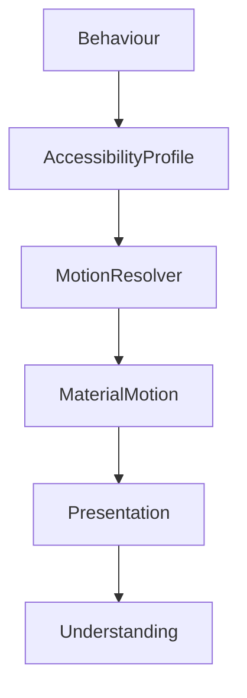

<!--
File: design/mds/MDS-005 Motion System/08-accessibility.md
Document: MDS-005
Chapter: 08
Title: Motion Accessibility
Status: Draft
Version: 0.1
-->

# Motion Accessibility

---

# Purpose

Motion exists to communicate understanding.

If movement becomes uncomfortable, distracting or inaccessible, it ceases to fulfil that purpose.

Accessibility is therefore not a limitation placed upon the Motion System.

It is one of its primary design objectives.

The Motion System should adapt to people.

People should never be expected to adapt to movement.

---

# Philosophy

The Motion System follows one fundamental rule.

> **Understanding must survive the complete removal of motion.**

Movement may strengthen understanding.

It must never become the only mechanism communicating:

- hierarchy,
- continuity,
- causality,
- orientation,
- behavioural change.

Reduced Motion should remove animation.

It should never remove meaning.

---

# Accessibility Before Motion

Whenever behavioural understanding conflicts with animation:

Understanding wins.

Always.

Poor.

```text
Beautiful Animation

↓

User Discomfort
```

Preferred.

```text
Clear Behaviour

↓

Optional Motion
```

The purpose of Motion is communication.

Not spectacle.

---

# Behaviour Is Stable

Accessibility should never alter:

- Behaviour,
- Composition,
- Hierarchy,
- Editorial Structure.

Instead it alters:

- movement,
- timing,
- interpolation,
- material response.

The behavioural language of Mosaic should remain identical regardless of motion preference.

---

# Reduced Motion

Reduced Motion should preserve behavioural understanding while reducing physical movement.

Examples.

Instead of:

- translation,
- scaling,
- layered transitions,

prefer:

- opacity,
- hierarchy changes,
- material state changes,
- immediate continuity.

Users should still understand exactly what changed.

---

# Material Accessibility

Materials should simplify naturally.

Examples.

Hero Material.

↓

Reduced physical movement.

Refraction.

↓

Reduced redistribution.

Atmosphere.

↓

Simplified blending.

Canvas.

↓

Almost unchanged.

The Material System should remain recognisably Mosaic while respecting accessibility preferences.

---

# Refraction Accessibility

Refraction Motion should reduce significantly.

Preferred.

```text
Atmosphere

↓

Stable Lighting

↓

Subtle Material Update
```

Avoid.

```text
Moving Refraction

↓

Animated Lighting

↓

Environmental Drift
```

The environment should remain calm.

---

# Overlay Behaviour

Overlays should prioritise:

- clarity,
- orientation,
- predictability.

Reduced Motion should simplify Overlay behaviour.

Preferred.

```text
Overlay Appears

↓

Interaction

↓

Overlay Disappears
```

No unnecessary physical transitions should remain.

---

# Hero Behaviour

The Hero should remain recognisable even when movement is removed.

Examples.

Hero changes.

↓

Editorial hierarchy updates.

↓

Materials update.

↓

Understanding preserved.

Movement is optional.

Behaviour is not.

---

# Temporal Continuity

Temporal Continuity should survive Reduced Motion.

Users should continue feeling that:

The same World continues.

Rather than:

A different interface appeared.

Continuity is conceptual.

Not animated.

---

# Typography

Typography should remain extremely stable.

Avoid:

- animated line movement,
- character transitions,
- decorative text effects.

Preferred.

Stable typography.

↓

Editorial hierarchy updates.

↓

Readers continue naturally.

Reading comfort always possesses higher priority than movement.

---

# Runtime Atmosphere

Atmosphere should simplify rather than disappear.

Preferred.

```text
Reduced Motion

↓

Shorter Blend

↓

Stable Environment
```

The interface should remain emotionally coherent while reducing environmental animation.

---

# Interaction Feedback

Essential interaction feedback should remain.

Examples include:

- focus indication,
- selection,
- activation,
- confirmation.

Removing these entirely weakens usability.

The Motion System should distinguish between:

Decorative movement.

and

Functional feedback.

Only the former should disappear.

---

# Accessibility Profiles

Future implementations may expose conceptual motion profiles.

Examples.

```text
Full Motion

↓

Reduced Motion

↓

Minimal Motion

↓

Instant
```

Each profile preserves:

- hierarchy,
- continuity,
- understanding.

Only physical expression changes.

---

# Runtime Resolution

The Runtime Motion Resolver should evaluate:

```text
Behaviour

↓

Accessibility

↓

Material Identity

↓

Motion Profile

↓

Presentation
```

Accessibility should always be evaluated before motion curves.

---

# Platform Behaviour

Platforms should honour operating system accessibility preferences automatically.

Examples include:

- iOS Reduce Motion,
- Android Remove Animations,
- Windows Animation Effects,
- macOS Reduce Motion.

Platform behaviour should integrate naturally into the Runtime Motion Resolver.

Applications should not implement platform-specific logic independently.

---

# Plugins

Extensions should never override Motion Accessibility.

Plugins contribute:

- behavioural events.

The Motion System determines:

- movement,
- simplification,
- continuity.

Every extension therefore automatically inherits accessible motion.

---

# Good Examples

## Hero Change

Reduced Motion.

↓

Hero updates.

↓

Materials settle immediately.

↓

Reader understands the new Focus.

Nothing essential has been lost.

---

## Playback

Overlay appears.

↓

Playback continues.

↓

Overlay disappears.

Interaction remains clear.

Motion remains minimal.

---

## Reading

Chapter changes.

↓

Editorial hierarchy updates.

↓

Reader continues naturally.

Movement never interrupts comprehension.

---

# Anti-patterns

## Accessibility Theme

Creating an entirely different motion language.

---

## No Feedback

Removing all movement including functional interaction feedback.

---

## Decorative Accessibility

Retaining decorative motion while removing useful motion.

---

## Platform Divergence

Different clients implementing incompatible Reduced Motion behaviour.

---

# Motion Accessibility Model



Accessibility refines movement.

It never changes behaviour.

---

# Relationship To Future Chapters

The next chapter defines **Runtime Motion Resolution**.

Motion Accessibility explains:

> **How movement adapts to people.**

Runtime Motion Resolution explains:

> **How every behavioural event becomes the correct motion profile at runtime.**

Together they complete the adaptive architecture of the Motion System.

---

# Summary

Motion Accessibility ensures that every user experiences the same:

- understanding,
- continuity,
- hierarchy,
- Companion,

regardless of how much movement they prefer.

Movement should always remain optional.

Understanding never should.

---

# Review Status

**Status**

Draft

**Next File**

`09-runtime-motion-resolution.md`
