<!--
File: docs/design/system/mds-005-motion-system/09-runtime-motion-resolution.md
Document: MDS-005
Chapter: 09
Title: Runtime Motion Resolution
Status: Draft
Version: 0.4
-->

# Runtime Motion Resolution

---

# Purpose

Previous chapters defined:

- Behavioural Motion
- Material Motion
- Refraction Motion
- Temporal Continuity
- Motion Curves
- Motion Accessibility

This chapter defines how those concepts become concrete movement at runtime.

Runtime Motion Resolution is the mechanism that transforms behavioural change into consistent physical motion across every Mosaic client.

Applications should never determine:

- animation timing,
- easing,
- sequencing,
- choreography,
- material response.

Instead they communicate behaviour.

The Motion System resolves everything else.

---

# Definition

Within MDS, **Runtime Motion Resolution** is defined as:

> **The deterministic process through which behavioural change is transformed into platform-specific motion while preserving continuity, hierarchy and accessibility.**

Runtime Motion Resolution never changes behaviour.

It only determines how that behaviour becomes visible.

---

# Why Resolution Exists

Without Runtime Motion Resolution, every component would need to understand:

- behavioural priority,
- animation timing,
- accessibility,
- motion profiles,
- material response,
- platform capabilities.

Instead.

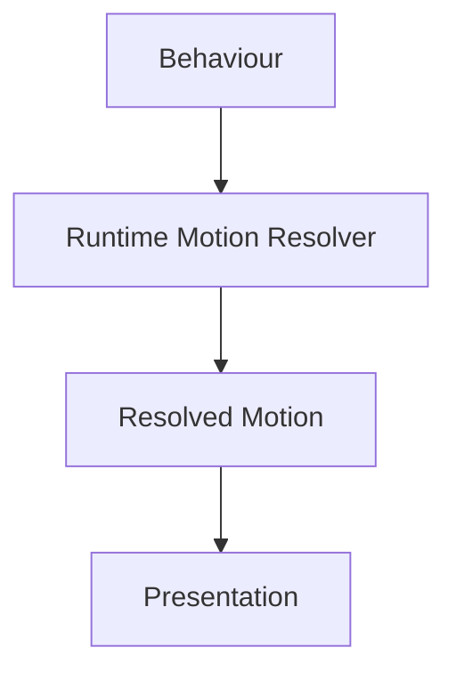

Components remain behaviourally simple.

The Motion System remains globally consistent.

---

# Resolution Pipeline

Every behavioural event follows the same conceptual pipeline.

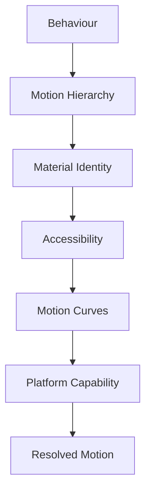

Each stage contributes one responsibility.

---

# Resolution Inputs

The Runtime Motion Resolver evaluates:

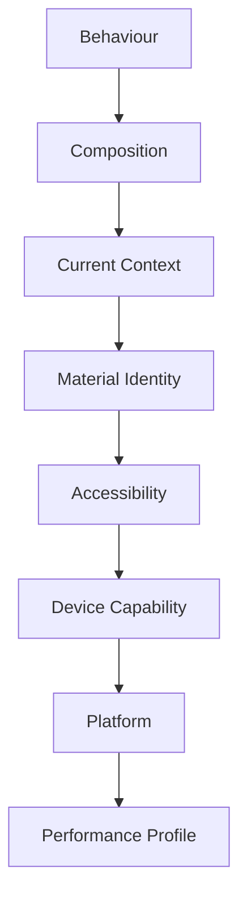

No individual input should override behavioural intent.

Behaviour remains the highest authority.

For Mosaic v1, the component renderer uses governed transition profiles and the Continuity Keys defined by [MDS-008 — Component Library](../mds-008-component-library/09-runtime-rendering.md#continuity-keys).

Composition-wide identity classification, Behavioural Cost and spatial-path solving are deferred to [MDP-001 — Adaptive Composition Runtime](../../../engineering/architecture/mdp-001-adaptive-composition-runtime/15-motion-model.md).

---

# Resolution Order

Motion should always resolve using the same conceptual order.

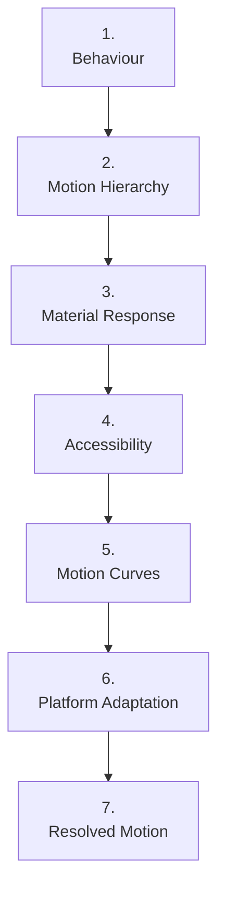

Meaning always precedes implementation.

---

# Behavioural Stability

One of the strongest guarantees within Mosaic is:

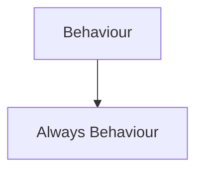

Playback remains Playback.

Hero remains Hero.

Overlay remains Overlay.

Runtime Resolution changes only:

- timing,
- interpolation,
- sequencing,
- material response.

Behaviour never changes.

---

# Runtime Context

Motion may adapt according to current activity.

Examples.

Watching.

↓

Minimal movement.

Browsing.

↓

Greater compositional evolution.

Reading.

↓

Editorial pacing.

Administration.

↓

Efficient transitions.

The Motion Resolver selects appropriate physical behaviour while preserving one behavioural language.

---

# Motion Profiles

Future implementations may internally resolve Motion Profiles.

Conceptually.

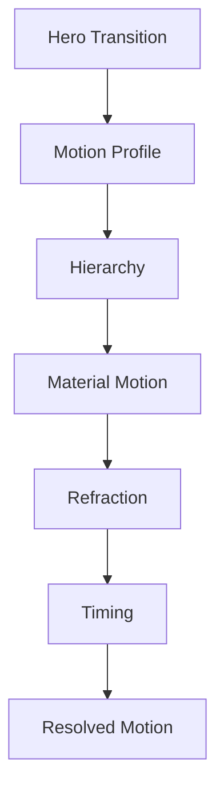

Components consume only the completed profile.

---

# Runtime Caching

Resolved Motion Profiles should be reusable.

Typical invalidation events include:

- accessibility changes,
- platform changes,
- performance profile changes,
- Motion System updates.

Ordinary interaction should reuse existing behavioural profiles whenever practical.

---

# Incremental Motion

Motion should resolve incrementally.

Preferred.

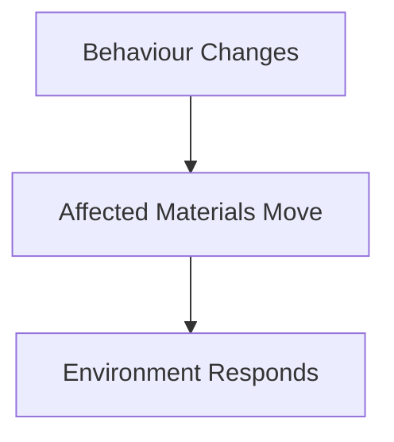

Avoid.

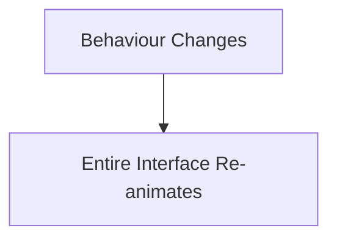

Incremental movement preserves continuity while reducing unnecessary computation.

---

# Platform Adaptation

Different platforms possess different motion capabilities.

Desktop.

↓

Full Material Motion.

Phone.

↓

Reduced complexity.

Television.

↓

Longer perceived distance.

Reduced Motion.

↓

Simplified transitions.

Despite implementation differences...

Users should perceive identical behavioural communication.

---

# Material Awareness

Motion should respect Material Identity.

Examples.

Hero.

↓

Highest fidelity.

Overlay.

↓

Interaction-first.

Canvas.

↓

Environmental stability.

Material Identity should always influence motion behaviour.

---

# Runtime Atmosphere

Motion may influence how Runtime Atmosphere evolves.

Examples.

Hero changes.

↓

Atmosphere redistributes.

↓

Refraction settles.

Atmosphere should never animate independently from behaviour.

The environment responds because behaviour changed.

---

# Performance Profiles

Future runtime implementations may expose conceptual performance profiles.

Examples.

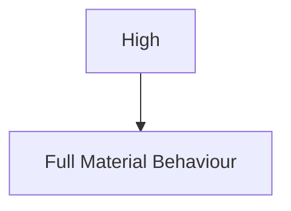

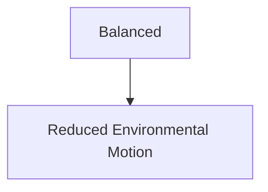

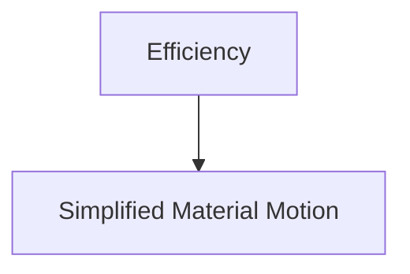

Every profile should preserve behavioural understanding.

Only rendering complexity changes.

---

# Deterministic Behaviour

Given identical behavioural inputs...

The Runtime Motion Resolver should always produce identical motion.

This determinism improves:

- testing,
- predictability,
- caching,
- cross-platform consistency.

Users gradually learn the movement language because it remains consistent.

---

# Modules

Modules never resolve motion.

Modules contribute:

- behavioural events,
- information,
- artwork.

The Motion Resolver determines:

- hierarchy,
- sequencing,
- material response,
- timing,
- accessibility.

Every module therefore inherits one coherent movement language automatically.

---

# Good Examples

## Hero Transition

Behaviour.

↓

Focus changes.

↓

Motion Resolver.

↓

Hero evolves.

↓

Atmosphere settles.

↓

Understanding preserved.

---

## Playback

Playback begins.

↓

Overlay retracts.

↓

Video becomes Hero.

↓

Environment stabilises.

Motion reinforces immersion.

---

## Reading

Chapter advances.

↓

Typography remains stable.

↓

Materials respond quietly.

↓

Reader continues naturally.

---

# Anti-patterns

## Component Animations

Components independently selecting transitions.

---

## Platform Motion

Every platform inventing different behavioural timing.

---

## Runtime Behaviour

Runtime modifying behavioural meaning.

---

## Full Re-animation

Entire interface animates for local behavioural changes.

---

# Runtime Motion Model

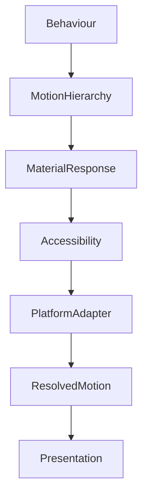

Applications communicate behaviour.

The Motion System resolves movement.

---

# Relationship To Future Chapter

The next chapter defines **Platform Motion**.

Runtime Motion Resolution explains:

> **How behaviour becomes motion.**

Platform Motion explains:

> **How different rendering technologies faithfully express that motion while preserving one behavioural language.**

Together they complete the runtime architecture of the Motion System.

---

# Summary

Runtime Motion Resolution transforms behavioural intent into consistent physical movement.

It preserves:

- hierarchy,
- continuity,
- accessibility,
- material behaviour,
- cross-platform consistency.

Applications should never ask:

> **"Which animation should I play?"**

They should simply communicate:

> **Behaviour changed.**

The Motion System does everything else.
