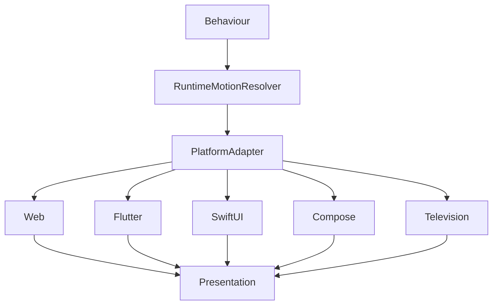

<!--
File: design/mds/MDS-005 Motion System/10-platform-motion.md
Document: MDS-005
Chapter: 10
Title: Platform Motion
Status: Draft
Version: 0.1
-->

# Platform Motion

---

# Purpose

The Motion System defines one behavioural language.

Every Mosaic client is responsible for expressing that language through different rendering technologies.

Platform Motion ensures that:

- Web
- Flutter
- SwiftUI
- Jetpack Compose
- Desktop
- Television
- Future platforms

all communicate identical behavioural understanding despite differing animation APIs and rendering capabilities.

Platform implementation should never redefine motion.

It should simply express it faithfully.

---

# Definition

Within MDS, **Platform Motion** is defined as:

> **The platform-specific implementation of the Mosaic Motion System while preserving one consistent behavioural language.**

Platform Motion concerns implementation.

It does not concern behavioural meaning.

---

# Philosophy

Different rendering engines possess different strengths.

Examples include:

- CSS animations
- Flutter Impeller
- SwiftUI Animation
- Jetpack Compose Animation
- Native television frameworks

These differences are implementation concerns.

Users should never perceive different motion languages because they changed devices.

The Companion should move identically everywhere.

---

# Platform Independence

Behavioural meaning should remain platform independent.

Conceptually.

```text
Hero Transition

↓

Web

Hero Transition

↓

Flutter

Hero Transition

↓

SwiftUI

Hero Transition

↓

Compose
```

The implementation changes.

The behavioural communication remains identical.

---

# Platform Responsibilities

Each platform implementation is responsible for:

- rendering movement
- timing interpolation
- frame scheduling
- animation APIs
- GPU integration
- performance optimisation

Platforms are **not** responsible for:

- behavioural sequencing
- motion hierarchy
- accessibility policy
- material choreography

Those responsibilities belong to the Motion System.

---

# Motion Resolver

Every platform should consume the output of the Runtime Motion Resolver.

Conceptually.

```text
Behaviour

↓

Motion Resolver

↓

Platform Motion

↓

Rendering
```

Platform implementations should never reinterpret behavioural events.

---

# Frame Consistency

Platform Motion should prioritise:

- smoothness
- determinism
- consistency
- responsiveness

before introducing platform-specific visual enhancements.

Behaviour always possesses higher priority than rendering sophistication.

---

# Material Motion

Every platform should preserve Material Motion.

Examples.

Hero.

↓

Physical transition.

Overlay.

↓

Controlled emergence.

Canvas.

↓

Environmental stability.

Platforms may implement these differently.

Users should perceive identical material behaviour.

---

# Refraction Motion

Platforms supporting advanced rendering may implement:

- GPU refraction
- shader-based diffusion
- dynamic light transport

Platforms without these capabilities should approximate equivalent behaviour.

The physical language should remain recognisable even when implementation differs.

---

# Typography Motion

Typography should remain comparatively stable across every platform.

Platform implementations should avoid:

- unnecessary glyph animation
- decorative text transforms
- platform-specific typography effects

Reading comfort remains the primary objective.

---

# Responsive Motion

Different platforms naturally possess different interaction characteristics.

Phone.

↓

Short interactions.

Desktop.

↓

Pointer precision.

Television.

↓

Remote navigation.

Responsive Motion should adapt:

- physical implementation,
- travel distance,
- responsiveness.

It should never alter behavioural sequencing.

---

# Platform Performance

Different hardware possesses different performance budgets.

Examples.

Desktop GPU.

↓

Highest fidelity.

Phone.

↓

Balanced fidelity.

Low-power device.

↓

Simplified environmental motion.

Performance optimisation should reduce rendering complexity before reducing behavioural clarity.

---

# Accessibility

Platform Motion should automatically respect:

- operating system Reduce Motion
- platform animation preferences
- accessibility APIs

Applications should not implement independent accessibility behaviour.

Platform capabilities should integrate directly into Runtime Motion Resolution.

---

# Synchronisation

Future Mosaic clients may render multiple motion systems simultaneously.

Examples.

- Materials
- Typography
- Atmosphere
- Refraction

Platforms should synchronise these systems so users perceive one coherent behavioural transition rather than independent animations.

---

# Timing Fidelity

Exact animation durations are less important than behavioural timing relationships.

For example.

Hero.

↓

Moves first.

↓

Supporting Materials.

↓

Respond.

↓

Environment settles.

Maintaining this ordering is more important than matching millisecond durations across every platform.

---

# Runtime Atmosphere

Platform implementations should preserve atmospheric continuity.

Examples.

Artwork changes.

↓

Atmosphere blends.

↓

Materials respond.

↓

Refraction settles.

Platforms should avoid abrupt environmental changes even if implementation techniques differ.

---

# International Behaviour

Platform Motion should remain culturally neutral.

Movement should communicate behaviour through:

- continuity
- physicality
- hierarchy

rather than culturally specific animation styles.

The Motion System should remain understandable regardless of locale.

---

# Plugins

Extensions should never provide platform-specific animations.

Plugins contribute:

- behaviour
- information
- artwork

Platform Motion determines:

- implementation
- interpolation
- rendering

Every extension therefore automatically inherits future motion improvements.

---

# Good Examples

## Web

CSS or WebGPU.

↓

Runtime Motion Resolver.

↓

Behaviour preserved.

Readers perceive identical continuity.

---

## Flutter

Impeller.

↓

Material Motion.

↓

Refraction.

↓

Consistent behavioural language.

---

## Television

Longer travel.

↓

Greater physical scale.

↓

Identical sequencing.

Users continue feeling the same Companion.

---

# Anti-patterns

## Platform Personality

Each client inventing independent movement.

---

## Decorative APIs

Platform-specific effects replacing behavioural clarity.

---

## Performance Behaviour

Reducing behavioural hierarchy to improve frame rate.

---

## Independent Animation

Components animating without Runtime Motion Resolution.

---

# Platform Motion Model



One behavioural language.

Many rendering implementations.

---

# Relationship To Future Chapter

The next chapter defines **Motion System Governance**.

Platform Motion explains:

> **How platforms implement movement.**

Governance explains:

> **How that movement remains recognisably Mosaic as the platform evolves over many years.**

Together they complete the implementation architecture of the Motion System.

---

# Summary

Platform Motion ensures that Mosaic moves with one behavioural language across every rendering technology.

Rendering engines may evolve.

Animation APIs may disappear.

New platforms will inevitably emerge.

Users should continue feeling that:

The same Companion.

The same World.

The same calm continuity.

That consistency is one of the defining objectives of the Mosaic Motion System.

---

# Review Status

**Status**

Draft

**Next File**

`11-governance.md`
