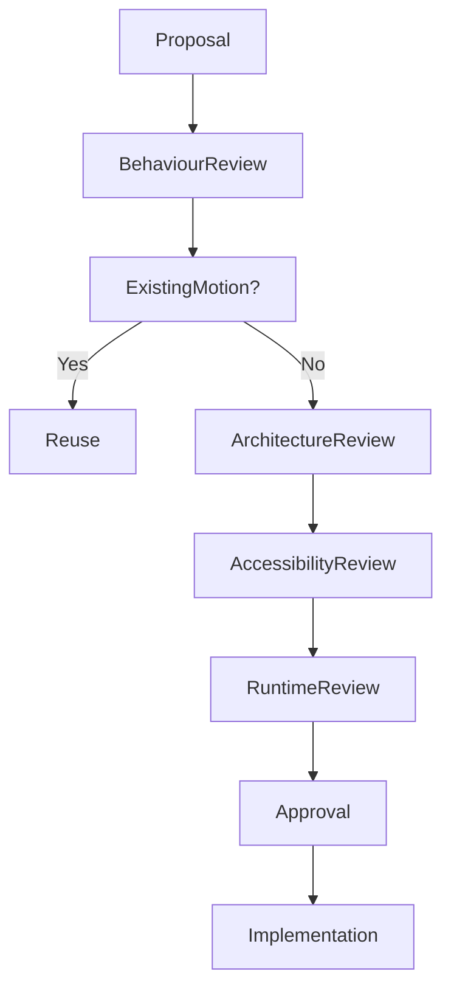

<!--
File: design/mds/MDS-005 Motion System/11-governance.md
Document: MDS-005
Chapter: 11
Title: Motion System Governance
Status: Draft
Version: 0.1
-->

# Motion System Governance

---

# Purpose

Motion is one of the most memorable characteristics of a digital product.

Users may never consciously remember:

- easing curves,
- durations,
- interpolation,
- animation APIs.

They will remember:

- whether the interface felt calm,
- whether movement made sense,
- whether the application felt effortless to use.

The Motion System therefore becomes part of the long-term behavioural identity of Mosaic.

This chapter defines how Motion should evolve while preserving that identity.

---

# Governance Philosophy

Motion should evolve technically.

Its behavioural language should remain remarkably stable.

The objective is not preserving animation.

It is preserving:

- behavioural continuity,
- physical consistency,
- calmness,
- predictability.

Rendering technologies will change.

The user's understanding should not.

---

# Motion Is Behaviour

Within Mosaic, Motion is considered behavioural architecture.

Changing Motion changes how users understand the platform.

Consequently, Motion should never be treated as visual polish.

Changes affecting:

- Hero transitions,
- Material Motion,
- Motion Hierarchy,
- Temporal Continuity,

should receive architectural review.

---

# Stable Responsibilities

The following concepts should remain highly stable.

- Motion Philosophy
- Motion Hierarchy
- Behavioural Motion
- Material Motion
- Temporal Continuity
- Accessibility behaviour

These concepts define the behavioural identity of Mosaic.

---

# Evolvable Responsibilities

The following may evolve more frequently.

- animation APIs
- rendering engines
- interpolation algorithms
- GPU pipelines
- performance optimisation
- platform-specific implementation

Implementation should evolve.

Behaviour should remain stable.

---

# Motion Ownership

Motion responsibilities are intentionally separated.

| Layer | Owner |
|--------|-------|
| Motion Philosophy | Design Systems |
| Behavioural Motion | Design Systems |
| Runtime Motion Resolver | Runtime Platform |
| Platform Motion | Client Platforms |
| Rendering Implementation | Rendering Layer |

Ownership protects behavioural consistency while allowing implementation to improve independently.

---

# Introducing New Motion

Before introducing a new movement ask:

## Question One

Does behaviour actually require movement?

---

## Question Two

Could existing Motion Hierarchy already communicate this?

---

## Question Three

Does this improve understanding...

or simply increase animation?

---

## Question Four

Would users naturally predict this movement?

---

## Question Five

Will this still feel appropriate after future rendering technologies evolve?

If uncertainty remains...

The proposal should be refined before implementation.

---

# Motion Drift

Motion Drift occurs when:

- different areas move differently,
- platforms invent independent behaviours,
- decorative animation accumulates,
- behavioural sequencing diverges,
- transitions lose predictability.

Motion Drift weakens user confidence because movement gradually stops communicating meaning.

It should therefore be treated as architectural debt.

---

# Motion Debt

Examples include:

- duplicated transitions,
- inconsistent easing,
- component-owned animation,
- decorative choreography,
- undocumented behavioural exceptions.

Motion Debt should be removed continuously.

One coherent behavioural language is more valuable than dozens of impressive transitions.

---

# Runtime Governance

The Runtime Motion Resolver may evolve continuously.

Examples include:

- better scheduling,
- improved interpolation,
- adaptive performance,
- predictive pre-resolution,
- GPU optimisation.

These improvements should require no changes to:

- Components,
- Behaviour,
- Composition,
- Materials.

Applications should remain unaware of runtime improvements.

---

# Accessibility Governance

Accessibility possesses higher authority than animation quality.

No motion proposal should weaken:

- readability,
- predictability,
- orientation,
- comfort.

Movement should always adapt to people.

Never the reverse.

---

# Platform Governance

Every client should communicate one movement language.

Desktop.

↓

Behaviourally identical.

Mobile.

↓

Behaviourally identical.

Television.

↓

Behaviourally identical.

Only implementation changes.

Behaviour must remain recognisably Mosaic.

---

# Plugin Governance

Extensions must never introduce:

- independent animation systems,
- custom transition languages,
- proprietary Material Motion,
- alternative behavioural timing.

Plugins contribute:

- behavioural events,
- information,
- artwork.

The Motion System owns movement.

This guarantees one coherent behavioural experience across the ecosystem.

---

# Review Questions

Every Motion proposal should answer:

- Does this explain behaviour?
- Does this preserve continuity?
- Does this reinforce hierarchy?
- Does this strengthen Material behaviour?
- Would removing this movement reduce understanding?
- Does this still feel unmistakably Mosaic?

If the proposal exists primarily because it "looks smooth", it should be reconsidered.

---

# Validation

Future tooling should automatically validate:

- behavioural sequencing
- Motion Hierarchy
- accessibility profiles
- runtime consistency
- platform parity
- unnecessary motion

Validation should reinforce architectural review.

It should never replace behavioural reasoning.

---

# Governance Workflow

Refinement should always be preferred over expanding the motion vocabulary.

---

# Success Criteria

The Motion System succeeds when:

- users instinctively understand behavioural change,
- movement remains calm,
- continuity feels effortless,
- accessibility remains uncompromised,
- contributors naturally reuse existing behavioural patterns,
- every Mosaic client moves like the same Companion.

Motion should become invisible.

Only understanding should remain.

---

# Architectural Decisions

| ADR | Decision |
|------|----------|
| ADR-134 | Motion is treated as behavioural architecture rather than visual decoration. |
| ADR-135 | Behaviour always precedes movement. |
| ADR-136 | Runtime Motion Resolution owns implementation while preserving behavioural meaning. |
| ADR-137 | Accessibility always has higher authority than animation fidelity. |
| ADR-138 | Extensions inherit the Motion System rather than extending it. |

---

# Review Status

**Status**

Draft

**Next File**

`12-adrs.md`
