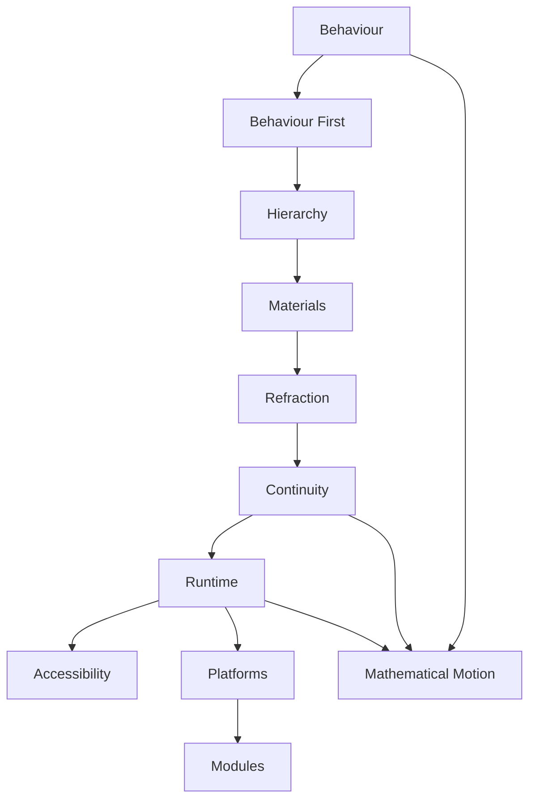

<!--
File: docs/design/system/mds-005-motion-system/12-adrs.md
Document: MDS-005
Chapter: 12
Title: Architectural Decision Records
Status: Draft
Version: 0.4
-->

# Architectural Decision Records

---

# Purpose

The Architectural Decision Records (ADRs) contained within MDS-005 preserve the architectural reasoning behind the Mosaic Motion System.

Where previous specifications established:

- Design Tokens
- Colour
- Materials
- Typography

this specification establishes the behavioural language through which the user's World evolves over time.

These ADRs explain why Mosaic deliberately treats motion as behavioural communication rather than visual animation.

Future contributors should consult these records before proposing changes to movement, transitions or runtime motion architecture.

---

# Decision Format

Decision format, lifecycle and review expectations are governed by **[MDG-001 — Documentation Authority Guide](../../../engineering/documentation/mdg-001-documentation-authority-guide/index.md)**.

This chapter records decisions specific to this specification and avoids redefining the shared ADR process.

# ADR-139

## Title

Treat Motion As Behaviour

### Status

Accepted

### Context

Most interface frameworks define motion as animation.

Founder workshops consistently reinforced that movement should explain behaviour rather than decorate interfaces.

### Decision

Motion becomes a behavioural system.

Animation becomes an implementation detail.

### Consequences

Future rendering technologies may evolve without changing the behavioural language of Mosaic.

---

# ADR-140

## Title

Behaviour Always Precedes Motion

### Status

Accepted

### Context

Component-driven animation creates inconsistent behavioural communication.

### Decision

Behaviour generates Motion.

Motion never generates Behaviour.

### Consequences

Users consistently understand:

- what changed,
- why it changed,
- what happens next.

---

# ADR-141

## Title

Establish Motion Hierarchy

### Status

Accepted

### Context

Simultaneous movement weakens attention and increases cognitive effort.

### Decision

Movement follows:

- Hero
- Primary
- Supporting
- Peripheral
- Environmental

### Consequences

Motion naturally reinforces Composition without requiring additional explanation.

---

# ADR-142

## Title

Treat Materials As Participants In Motion

### Status

Accepted

### Context

Early exploration animated interface geometry independently from materials.

This weakened the illusion of a coherent physical environment.

### Decision

Materials become first-class participants within Motion.

### Consequences

Hero Materials, Acrylic and Canvas evolve together as one physical system.

---

# ADR-143

## Title

Refraction Moves Independently From Geometry

### Status

Accepted

### Context

Environmental light behaves differently from physical objects.

### Decision

Refraction receives its own temporal behaviour.

Geometry moves first.

Environmental light settles afterwards.

### Consequences

Materials feel physically illuminated rather than digitally animated.

---

# ADR-144

## Title

Temporal Continuity Is A First-Class Architectural Concern

### Status

Accepted

### Context

Traditional applications frequently interrupt users through unrelated transitions and page replacements.

### Decision

The Motion System prioritises preserving one continuous World.

### Consequences

Users perceive behavioural evolution rather than interface replacement.

---

# ADR-145

## Title

Runtime Motion Owns Implementation

### Status

Accepted

### Context

Allowing components to define transitions fragments behavioural consistency.

### Decision

Components communicate Behaviour.

The Runtime Motion Resolver determines:

- sequencing,
- timing,
- curves,
- material response.

### Consequences

Applications remain behaviourally simple while runtime implementation continues evolving.

---

# ADR-146

## Title

Accessibility Overrides Motion Fidelity

### Status

Accepted

### Context

Highly expressive motion systems frequently reduce comfort and accessibility.

### Decision

Accessibility possesses higher authority than animation quality.

### Consequences

Behaviour remains understandable regardless of motion preference.

---

# ADR-147

## Title

Platform Motion Implements Rather Than Redefines

### Status

Accepted

### Context

Different rendering technologies naturally expose different animation capabilities.

### Decision

Platforms implement the Motion System.

They do not reinterpret it.

### Consequences

Users experience one behavioural language across every Mosaic client.

---

# ADR-148

## Title

Modules Inherit Motion

### Status

Accepted

### Context

Allowing modules to introduce independent motion languages fragments behavioural consistency.

### Decision

Modules contribute:

- behaviour,
- information,
- artwork.

The platform owns all movement.

### Consequences

Community modules automatically inherit future Motion System improvements.

---

# ADR-196

## Title

Resolve Identity-Preserving Motion Through Behavioural Cost And Critical Damping

### Status

Accepted

### Context

Fixed durations and generic easing cannot consistently express conceptual distance, permanent depth changes, interrupted transitions and shared identity across SDUI updates.

Delaying the start of heavier motion also makes Mosaic feel unresponsive.

### Decision

The Runtime Motion Resolver derives normalised Behavioural Cost from Focus significance, Domain Boundary Cost, Composition topology change and continuity credit.

Stable Continuity Keys classify identities as persistent, repositioned, resized, reparented, moved between Composition Planes, entering or exiting.

Rigid spatial geometry uses a governed critically damped response with immediate initial acknowledgement, no bounce and no overshoot.

Behavioural Cost governs the scale of participating choreography and bounded settlement character rather than authoring a delay.

Geometry leads while internal optical parallax, Refraction and environmental light settle through governed following responses.

### Consequences

Mosaic preserves one evolving World across navigation, resizing, depth changes and live SDUI patches.

Renderers may use different native animation APIs while producing time-correct, interruptible and perceptually equivalent motion.

---

# ADR Relationships

Together these decisions establish one coherent behavioural language for movement throughout the Mosaic platform.

---

# Future ADRs

Future Motion ADRs are expected to formalise:

- Predictive Motion
- AI-assisted Behaviour Resolution
- Shared Multi-User Motion
- Cross-Device Continuation Motion
- HDR Motion Synchronisation
- Haptic Motion Integration
- Spatial Computing Motion
- Adaptive Motion Personas

These intentionally remain outside the scope of MDS-005 Version 0.1.

---

# ADR Governance

Motion ADRs should change only when:

- behavioural research identifies deficiencies,
- accessibility research requires refinement,
- runtime architecture evolves,
- the Design Language itself changes.

New animation technologies alone should never justify architectural changes.

Behaviour should remain recognisably Mosaic regardless of implementation.

---

# Summary

The ADRs contained within MDS-005 define the behavioural identity of Mosaic.

Movement is not treated as visual polish.

It is treated as behavioural communication.

Every implementation should therefore preserve:

- continuity,
- hierarchy,
- physicality,
- calmness,

while allowing animation technologies to evolve independently.
