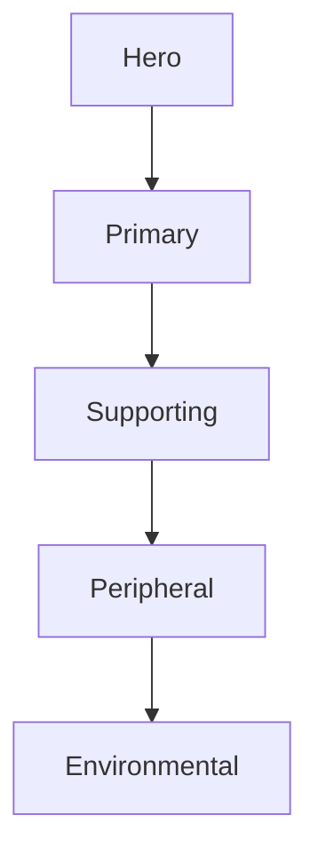

<!--
File: docs/design/system/mds-005-motion-system/glossary.md
Document: MDS-005
Title: Glossary
Status: Draft
Version: 0.4
-->

# Glossary

---

# Purpose

This glossary defines the terminology introduced by **MDS-005 — Motion System**.

Unlike previous glossaries, these definitions describe the architectural language of behavioural motion rather than animation technology.

These definitions should remain stable regardless of:

- rendering engine,
- animation framework,
- platform,
- device.

Future specifications should reuse these terms consistently.

---

# B

## Behavioural Motion

The visible expression of behavioural change.

Behavioural Motion communicates:

- what changed,
- why it changed,
- what should happen next.

It exists because behaviour evolved.

Not because animation exists.

---

## Behavioural Cost

A normalised runtime measure of conceptual transition significance derived from Focus change, Domain boundaries, Composition topology and continuity credit.

Behavioural Cost governs choreography and settlement without delaying initial response.

---

# C

## Continuity

The perception that the user's World remains persistent while behaviour evolves.

Continuity is one of the primary objectives of the Motion System.

Users should feel that experiences continue.

Not restart.

---

## Continuity Key

A stable semantic identifier representing domain identity across Tile, component, layout and SDUI lifetimes.

The Runtime Motion Resolver uses Continuity Keys to match previous and next Composition states.

---

## Critically Damped Motion

A governed second-order response with damping ratio \(\zeta=1\), producing the fastest return to equilibrium without bounce or overshoot.

---

# D

## Domain Boundary Cost

The Behavioural Cost contribution introduced when a transition crosses conceptual Domains and changes the relevant information model.

---

# E

## Environmental Motion

The quiet evolution of:

- Runtime Atmosphere,
- Canvas,
- environmental lighting,
- surrounding Materials.

Environmental Motion should remain almost imperceptible.

Users should feel it more than consciously observe it.

---

# H

## Hero Motion

The highest-priority movement within the Motion Hierarchy.

Hero Motion communicates major behavioural changes such as:

- Focus changes,
- Hero transitions,
- playback evolution.

Hero Motion should feel confident rather than dramatic.

---

# M

## Material Motion

The physical movement of Mosaic materials in response to behavioural change.

Material Motion communicates:

- depth,
- physicality,
- continuity.

It should never become decorative.

---

## Motion Hierarchy

The ordered system through which behavioural importance determines movement priority.

The hierarchy consists of:

Movement follows this hierarchy.

Not interface structure.

---

## Motion Resolver

The runtime subsystem responsible for transforming behavioural events into resolved movement.

Applications communicate behaviour.

The Motion Resolver determines implementation.

---

# P

## Platform Motion

The platform-specific implementation of the Mosaic Motion System.

Platform Motion preserves behavioural meaning while adapting to rendering technologies such as:

- Web
- Flutter
- SwiftUI
- Compose

Implementation changes.

Behaviour remains constant.

---

# R

## Refraction Motion

The temporal evolution of environmental light as it propagates through Mosaic materials.

Refraction Motion follows Material Motion.

It should never precede behavioural change.

---

## Runtime Motion Resolution

The deterministic process that transforms behavioural events into platform-specific motion.

Runtime Motion Resolution evaluates:

- Behaviour,
- Hierarchy,
- Materials,
- Accessibility,
- Platform.

before producing resolved movement.

---

# T

## Temporal Continuity

The preservation of behavioural continuity across time.

Temporal Continuity ensures users perceive one evolving World rather than disconnected interface states.

---

## Transition

A behavioural evolution between two meaningful states.

Within Mosaic, transitions communicate continuity rather than replacement.

---

# U

## Understanding

The successful communication of behavioural change.

Understanding is considered the primary success metric of the Motion System.

Motion exists to improve understanding.

Not visual richness.

---

# Cross References

| Specification | Primary Concepts |
|---------------|------------------|
| [MDL-001 — Mosaic Design Language Vision](../../language/mdl-001-vision/index.md) | Companion, Immersion |
| [MDL-002 — Principles](../../language/mdl-002-principles/index.md) | Behaviour, Calmness |
| [MDL-003 — Mental Model](../../language/mdl-003-mental-model/index.md) | World, Focus |
| [MDL-004 — Interaction Model](../../language/mdl-004-interaction-model/index.md) | Behavioural Evolution |
| [MDL-005 — Composition Model](../../language/mdl-005-composition-model/index.md) | Hierarchy |
| [MDS-003 — Material System](../mds-003-material-system/index.md) | Material Motion, Refraction |
| [MDS-004 — Typography System](../mds-004-typography-system/index.md) | Editorial Continuity |

---

# Terminology Rules

Future contributors should:

- describe behaviour before animation,
- describe continuity before transitions,
- distinguish Motion from animation,
- distinguish Material Motion from Refraction Motion,
- avoid implementation-specific animation terminology within architectural documentation.

Motion terminology should remain independent from rendering technology.
