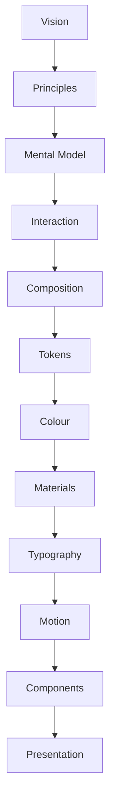
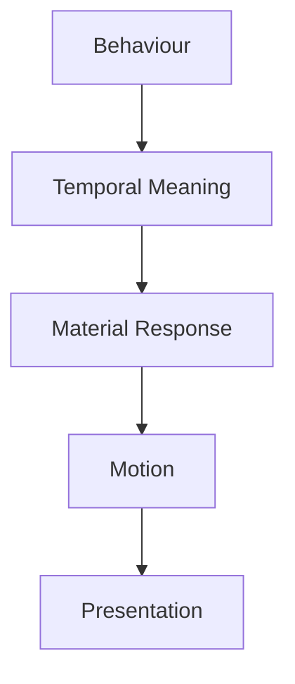

<!--
File: docs/design/system/mds-005-motion-system/index.md
Document: MDS-005
Status: Draft
Version: 0.4
-->

# MDS-005 — Motion System

> *Motion is not animation. Motion is the visible expression of understanding changing over time.*

> **Release applicability:** Mosaic v1 uses governed component transitions and Motion Tokens. Behavioural Cost, critical damping and Composition-wide mathematical resolution are preserved for the post-v1 Adaptive Composition Runtime. Refraction Motion remains governed separately and is not deferred.

---

# Purpose

The previous Mosaic Design System specifications established:

- Design Tokens
- Colour
- Materials
- Typography

These define what the interface is.

MDS-005 defines **how that interface changes**.

Unlike conventional motion systems, which primarily focus on visual transitions, the Mosaic Motion System exists to communicate behavioural continuity.

Motion should explain:

- what changed,
- why it changed,
- how it relates to the previous state.

The user should never perceive animation.

They should perceive understanding.

---

# Relationship to Previous Specifications



The Motion System consumes:

- Interaction Model
- Composition
- Material System
- Typography

It communicates behavioural evolution over time.

---

# Scope

This specification defines:

- Motion Philosophy
- Motion Hierarchy
- Behavioural Motion
- Material Motion
- Refraction Motion
- Temporal Continuity
- Motion Curves
- Continuity-Key Matching
- Motion Accessibility
- Runtime Motion Resolution
- Platform Motion

This specification intentionally does **not** define:

- Components
- Layout
- Business Logic
- Interaction Behaviour

Those systems drive motion.

Behavioural Cost, critical damping and Composition-wide mathematical resolution are preserved as deferred research in [MDP-001 — Adaptive Composition Runtime](../../../engineering/architecture/mdp-001-adaptive-composition-runtime/15-motion-model.md).

They do not define it.

---

# Guiding Question

MDS-005 exists to answer one question.

> **How should behavioural change become visible?**

Not:

> Which animation should play?

---

# Motion Statement

Within Mosaic:

> **Motion communicates understanding.**

If removing motion reduces understanding...

The motion belongs.

If removing motion changes only appearance...

The motion should be questioned.

---

# Motion Responsibilities

The Motion System separates motion into several conceptual layers.



Each layer contributes one responsibility.

Motion is therefore the consequence of behaviour rather than an isolated visual system.

---

# Expected Outcome

After reading MDS-005 contributors should understand:

- why Mosaic moves,
- how behaviour drives motion,
- how materials participate,
- how continuity is preserved,
- how accessibility affects motion,
- how runtime motion is resolved,
- how conceptual distance and shared identity determine transition scale,

without discussing rendering technologies or animation frameworks.

---

# Repository Structure

```text
design/

└── mds/

    └── MDS-005 Motion System/

        README.md

        00-document-control.md

        01-motion-philosophy.md

        02-motion-hierarchy.md

        03-behavioural-motion.md

        04-material-motion.md

        05-refraction-motion.md

        06-temporal-continuity.md

        07-motion-curves.md

        08-accessibility.md

        09-runtime-motion-resolution.md

        10-platform-motion.md

        11-governance.md

        12-adrs.md

        13-contributor-guidance.md

        references.md

        glossary.md
```

---

# Dependencies

Required reading:

- [MDL-001](../../language/mdl-001-vision/index.md) → [MDL-005](../../language/mdl-005-composition-model/index.md)
- [MDS-001 — Design Token Architecture](../mds-001-design-token-architecture/index.md)
- [MDS-002 — Colour System](../mds-002-colour-system/index.md)
- [MDS-003 — Material System](../mds-003-material-system/index.md)
- [MDS-004 — Typography System](../mds-004-typography-system/index.md)

Downstream specifications:

- [MDP-001 — Adaptive Composition Runtime](../../../engineering/architecture/mdp-001-adaptive-composition-runtime/index.md)
- [MDP-001 — Adaptive Composition Runtime](../../../engineering/architecture/mdp-001-adaptive-composition-runtime/14-adaptive-tile-model.md)
- [MDS-008 — Component Library](../mds-008-component-library/index.md)
