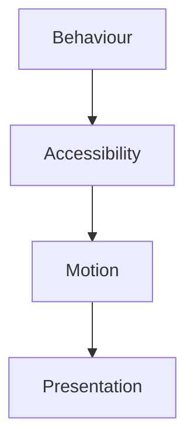
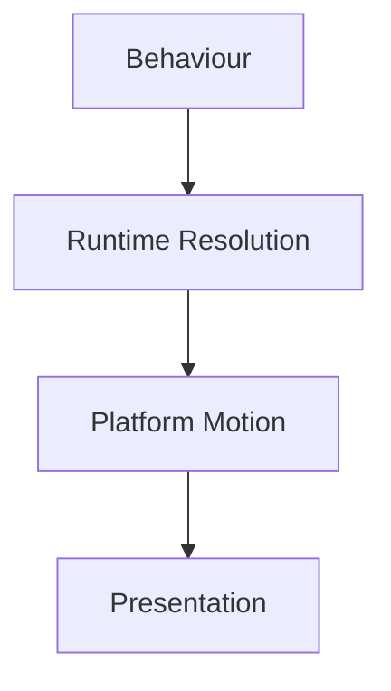
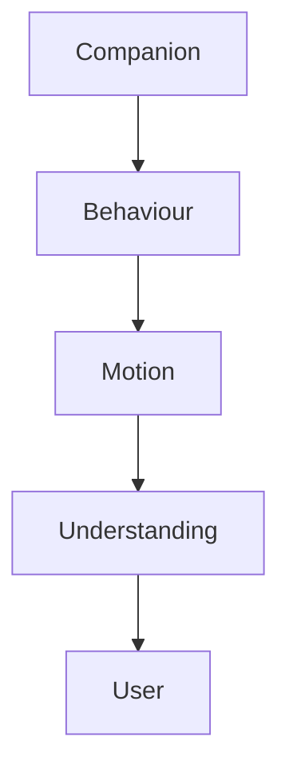

<!--
File: docs/design/system/mds-005-motion-system/references.md
Document: MDS-005
Title: References
Status: Draft
Version: 0.4
-->

# References

---

# Purpose

This document records the architectural influences and conceptual foundations that informed **MDS-005 — Motion System**.

Unlike implementation documentation, these references explain *why* Mosaic moves the way it does rather than prescribing animation techniques or platform APIs.

The Motion System intentionally combines ideas from:

- behavioural psychology,
- physical movement,
- environmental continuity,
- industrial motion,
- human perception,
- interaction design,

into one coherent behavioural language centred around understanding rather than animation.

---

# Reading Order

Contributors should approach references in the following order.

1. MDL Specifications
2. Design Token Architecture
3. Colour System
4. Material System
5. Typography System
6. Motion System
7. Platform Implementations

The Mosaic Design Language remains the authoritative source.

External references provide inspiration rather than specification.

---

# Internal References

## [MDL-001 — Mosaic Design Language Vision](../../language/mdl-001-vision/index.md)

Provides:

- Companion philosophy
- Entertainment-first thinking
- Calm interaction
- Immersion

Motion should reinforce the feeling that the Companion understands what the user is trying to do.

It should never compete for attention.

---

## [MDL-002 — Principles](../../language/mdl-002-principles/index.md)

Provides:

- Behaviour Before Interface
- Content Leads
- Calm Interfaces
- Every Feature Earns Its Place

Motion is the direct implementation of these principles over time.

---

## [MDL-003 — Mental Model](../../language/mdl-003-mental-model/index.md)

Provides:

- World
- Focus
- Context
- Relationships

Motion exists because the World evolves.

It should never imply unrelated change.

---

## [MDL-004 — Interaction Model](../../language/mdl-004-interaction-model/index.md)

Provides:

- Behaviour
- Continuity
- Focus transitions
- Context evolution

The Motion System is the physical expression of the Interaction Model.

Without [MDL-004](../../language/mdl-004-interaction-model/index.md) there is no behavioural basis for movement.

---

## [MDL-005 — Composition Model](../../language/mdl-005-composition-model/index.md)

Provides:

- Hero
- Hierarchy
- Priority
- Anchors
- Density

Motion Hierarchy is intentionally derived from the Composition Hierarchy.

Movement reinforces understanding already established by Composition.

---

## [MDS-001 — Design Token Architecture](../mds-001-design-token-architecture/index.md)

Provides:

- Resolved Tokens
- Resolution
- Semantic hierarchy

Runtime Motion Resolution extends the architectural resolution model established within [MDS-001](../mds-001-design-token-architecture/index.md).

---

## [MDS-002 — Colour System](../mds-002-colour-system/index.md)

Provides:

- Runtime Atmosphere
- Colour Resolution
- Atmosphere Synthesis

Environmental Motion directly evolves Runtime Atmosphere.

Atmosphere should therefore never animate independently from behaviour.

---

## [MDS-003 — Material System](../mds-003-material-system/index.md)

Provides:

- Acrylic
- Hero Material
- Refraction
- Light Transport
- Runtime Material Resolution

Material Motion and Refraction Motion are direct continuations of the Material System.

---

## [MDS-004 — Typography System](../mds-004-typography-system/index.md)

Provides:

- Editorial Hierarchy
- Reading Rhythm
- Runtime Typography

Motion should preserve editorial continuity.

Typography should remain readable throughout every behavioural transition.

---

# Future Specifications

The following specifications directly depend upon MDS-005.

- [MDP-001 — Adaptive Composition Runtime](../../../engineering/architecture/mdp-001-adaptive-composition-runtime/index.md)
- [MDP-001 — Adaptive Composition Runtime](../../../engineering/architecture/mdp-001-adaptive-composition-runtime/14-adaptive-tile-model.md)
- [MDS-008 — Component Library](../mds-008-component-library/index.md)

These specifications consume Motion.

They should never redefine behavioural sequencing independently.

---

# Behavioural Design

The Motion System draws significant inspiration from behavioural design.

Primary influences include:

- causality
- continuity
- progressive disclosure
- object permanence
- predictable interaction

Movement exists to explain behaviour.

Not to entertain.

---

# Human Perception

Several characteristics of perception influenced the Motion System.

Examples include:

- motion prediction
- spatial memory
- object permanence
- peripheral perception
- temporal continuity

The Motion Hierarchy is designed to work with these behaviours rather than against them.

---

# Physical Motion

The Motion System intentionally borrows concepts from physical objects rather than digital animation.

Examples include:

- inertia
- settling
- diffusion
- environmental response
- momentum

The objective is perceived physicality rather than simulation accuracy.

---

# Environmental Behaviour

One of the defining influences behind Mosaic Motion is environmental behaviour.

Objects move.

Light follows.

Atmosphere settles.

The environment remains coherent.

This relationship strongly differentiates Mosaic from conventional interface animation.

---

# Accessibility

Accessibility is treated as a first-class architectural concern.

The Motion System intentionally assumes:

This ordering ensures movement never becomes a prerequisite for understanding.

---

# Runtime Systems

Unlike traditional animation systems, Mosaic assumes behaviour changes continuously.

Examples include:

- Focus
- Context
- Playback
- Reading
- Runtime Atmosphere
- Material response

Motion therefore becomes a continuously evolving behavioural system rather than a collection of isolated transitions.

---

# Platform Independence

The Motion System intentionally separates:

Every client should therefore communicate identical behavioural understanding while remaining free to implement movement using:

- CSS
- Flutter
- SwiftUI
- Compose
- future rendering technologies.

---

# Mosaic-Specific Influences

The Motion System emerged directly from founder exploration.

Major architectural discoveries included:

- Motion should explain behaviour rather than animate interfaces.
- Environmental light should move independently from geometry.
- Materials should respond before the environment settles.
- Behaviour should always precede animation.
- Users should experience one continuous World rather than a sequence of screens.

Together these discoveries define the behavioural language unique to Mosaic.

---

# Relationship To The Companion

Motion represents the physical body language of the Companion.

Conceptually.

Words express intent.

Motion expresses confidence.

Together they create a Companion that feels calm, deliberate and predictable.

---

# Normative References

Required reading before contributing to MDS-005.

- [MDL-001 — Mosaic Design Language Vision](../../language/mdl-001-vision/index.md)
- [MDL-002 — Principles](../../language/mdl-002-principles/index.md)
- [MDL-003 — Mental Model](../../language/mdl-003-mental-model/index.md)
- [MDL-004 — Interaction Model](../../language/mdl-004-interaction-model/index.md)
- [MDL-005 — Composition Model](../../language/mdl-005-composition-model/index.md)
- [MDS-001 — Design Token Architecture](../mds-001-design-token-architecture/index.md)
- [MDS-002 — Colour System](../mds-002-colour-system/index.md)
- [MDS-003 — Material System](../mds-003-material-system/index.md)
- [MDS-004 — Typography System](../mds-004-typography-system/index.md)

Together these specifications define the conceptual foundation of the Motion System.

---

# Informative References

Future contributors may also wish to review:

- [MDP-001 — Adaptive Composition Runtime](../../../engineering/architecture/mdp-001-adaptive-composition-runtime/index.md)
- [MDP-001 — Adaptive Composition Runtime](../../../engineering/architecture/mdp-001-adaptive-composition-runtime/14-adaptive-tile-model.md)
- [MDS-008 — Component Library](../mds-008-component-library/index.md)

These specifications describe how behavioural motion becomes runtime interaction throughout the Mosaic platform.

---

# Living Document

This reference list should remain intentionally concise.

References should only be introduced when they materially influence:

- behavioural architecture,
- temporal continuity,
- runtime motion,
- implementation boundaries.

The objective is to preserve architectural reasoning rather than catalogue animation literature.

---

# Completion

This concludes **MDS-005 — Motion System**.

The next specification in the Mosaic Design System is:

> **[MDP-001 — Adaptive Composition Runtime](../../../engineering/architecture/mdp-001-adaptive-composition-runtime/index.md)**

Where MDS-005 defines **how the world moves**, [MDP-001 — Adaptive Composition Runtime](../../../engineering/architecture/mdp-001-adaptive-composition-runtime/index.md) defines **how the world is assembled at runtime**.

It formalises:

- Runtime Composition Engine
- Composition Solver implementation
- Expression resolution
- Adaptive layouts
- Runtime hierarchy
- Behaviour orchestration
- Graph-driven composition
- Multi-device rendering
- Expression pipelines

[MDP-001 — Adaptive Composition Runtime](../../../engineering/architecture/mdp-001-adaptive-composition-runtime/index.md) is expected to become the architectural heart of Mosaic, where every concept introduced by the MDL and earlier MDS specifications converges into one runtime system capable of constructing the user's World dynamically.
