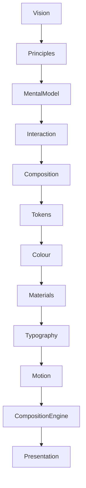
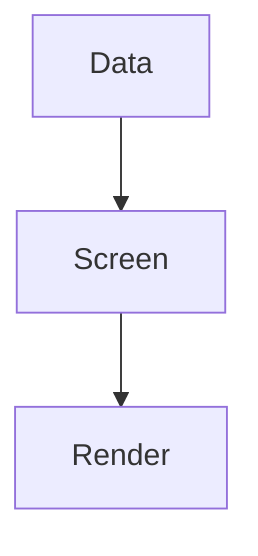
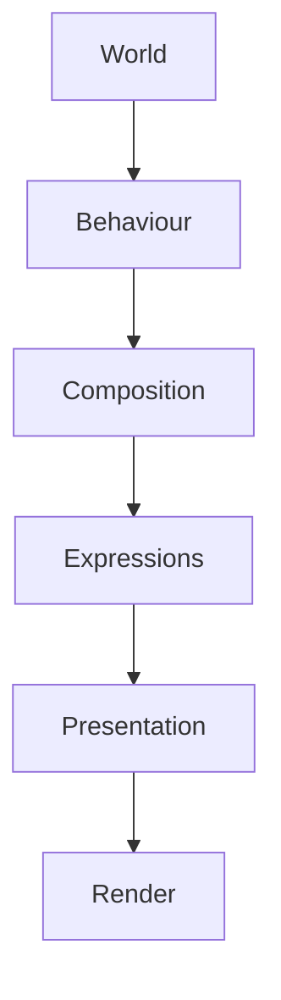

<!--
File: docs/design/system/mds-006-composition-engine/00-document-control.md
Document: MDS-006
Title: Composition Engine
Status: Draft
Version: 0.4
-->

# Document Control

---

# Document Information

| Property | Value |
|----------|-------|
| Document ID | MDS-006 |
| Title | Mosaic Design System — Composition Engine |
| Classification | Internal |
| Status | Draft |
| Version | 0.4 |
| Owner | AdamNi-7080 |
| Parent Specifications | [MDL-001](../../language/mdl-001-vision/index.md) → [MDL-005](../../language/mdl-005-composition-model/index.md), [MDS-001](../mds-001-design-token-architecture/index.md) → [MDS-005](../mds-005-motion-system/index.md) |
| Repository | `/design/mds/MDS-006 Composition Engine/` |

---

# Purpose

MDS-006 defines the runtime architecture responsible for constructing the user's World.

Every previous specification described:

- what the platform believes,
- how it behaves,
- how it communicates.

The Composition Engine is responsible for turning those architectural concepts into a living experience.

Unlike conventional UI frameworks, which render predefined interface trees, the Composition Engine continuously solves:

- behavioural intent,
- hierarchy,
- expressions,
- presentation,

before a single component is rendered.

The Composition Engine is therefore the runtime embodiment of the Mosaic Design Language.

---

# Authority

MDS-006 governs:

- Runtime World construction
- Composition Solver implementation
- Expression Resolution
- Runtime Hierarchy
- Behaviour Orchestration
- Adaptive Layout Resolution
- Composition-Plane Occupancy
- Airspace Reserve Resolution
- Composition Pipelines
- Runtime Caching
- Multi-device Composition

This specification intentionally does **not** govern:

- rendering frameworks,
- GraphQL schemas,
- storage,
- transport,
- platform widgets.

Those systems provide capabilities.

The Composition Engine creates experience.

---

# Relationship To MDS

The Composition Engine consumes every conceptual system defined before it.

Everything before the Composition Engine defines intent.

Everything after it implements presentation.

---

# Design Intent

Traditional applications typically follow:

Mosaic intentionally follows:

The distinction is fundamental.

Applications render components.

Mosaic constructs understanding.

---

# Reader Expectations

Before reading this specification contributors should already understand:

- [MDL-001 — Mosaic Design Language Vision](../../language/mdl-001-vision/index.md)
- [MDL-002 — Principles](../../language/mdl-002-principles/index.md)
- [MDL-003 — Mental Model](../../language/mdl-003-mental-model/index.md)
- [MDL-004 — Interaction Model](../../language/mdl-004-interaction-model/index.md)
- [MDL-005 — Composition Model](../../language/mdl-005-composition-model/index.md)
- [MDS-001 — Design Token Architecture](../mds-001-design-token-architecture/index.md)
- [MDS-002 — Colour System](../mds-002-colour-system/index.md)
- [MDS-003 — Material System](../mds-003-material-system/index.md)
- [MDS-004 — Typography System](../mds-004-typography-system/index.md)
- [MDS-005 — Motion System](../mds-005-motion-system/index.md)

The Composition Engine assumes every conceptual decision has already been made.

Its responsibility is runtime orchestration.

---

# Architectural Scope

The Composition Engine defines:

- runtime solving
- behavioural orchestration
- expression selection
- hierarchy resolution
- adaptive composition
- presentation modelling

It intentionally avoids implementation technologies such as:

- Flutter Widgets
- React Components
- SwiftUI Views
- Compose Composables

These become consumers of the Presentation Model produced by the engine.

---

# Stability

Expected lifetime.

| Artefact | Expected Lifetime |
|----------|-------------------|
| UI Components | Months |
| Rendering Backends | Months |
| Runtime Optimisations | Years |
| Composition Engine Architecture | Years |
| Runtime Philosophy | Decades |

The engine implementation may evolve continuously.

Its conceptual model should remain remarkably stable.

---

# Success Criteria

MDS-006 succeeds when:

- every client constructs identical understanding
- behaviour consistently produces identical composition
- adaptive layouts preserve the user's World
- modules integrate naturally
- rendering frameworks remain replaceable
- contributors think in runtime worlds rather than interface trees
- permanent depth and cross-plane visibility remain deterministic
- artwork protection and plane-local capacity resolve without continuous image analysis

Users should never feel that screens are loading.

They should simply feel that their World continuously evolves around them.
