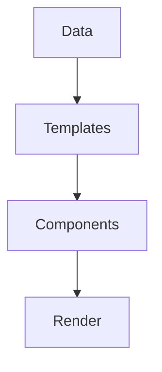
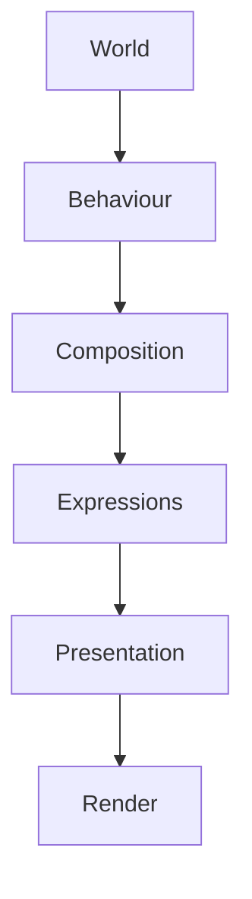
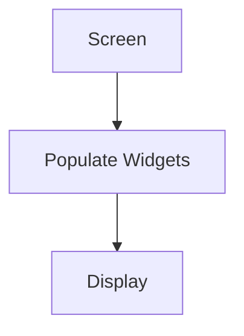
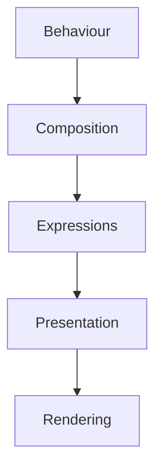
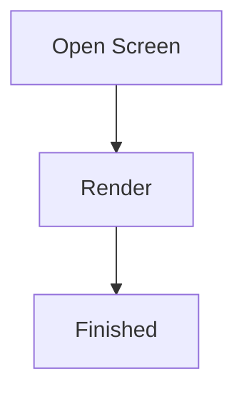
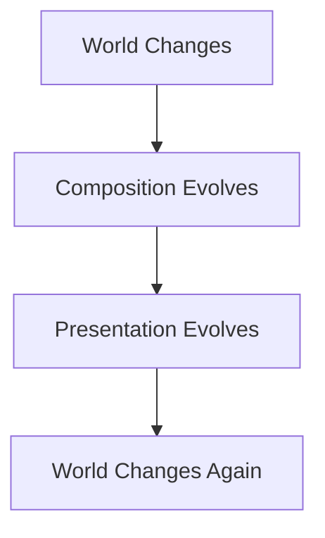
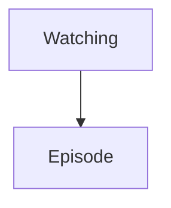
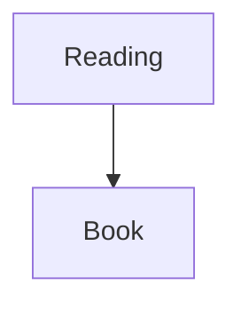
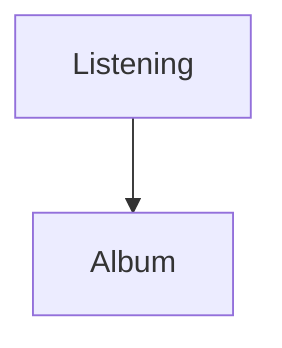
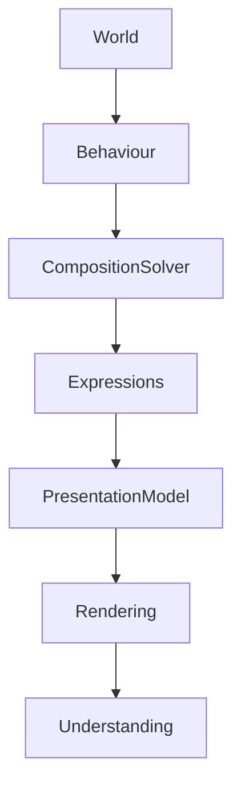

<!--
File: docs/design/system/mds-006-composition-engine/01-composition-engine-philosophy.md
Document: MDS-006
Chapter: 01
Title: Composition Engine Philosophy
Status: Draft
Version: 0.4
-->

# Composition Engine Philosophy

---

# Purpose

Before defining runtime pipelines, graph processing or expression resolution, contributors must first understand what the Composition Engine represents within Mosaic.

Most UI frameworks answer the question:

> **"How should this interface be rendered?"**

Mosaic intentionally answers a different question.

> **"What should the user understand right now?"**

The Composition Engine exists to answer that question continuously.

It is not a layout engine.

It is not a widget framework.

It is not a rendering library.

It is an **understanding engine**.

---

# Philosophy Statement

> **The interface is never authored. It is continuously solved from the user's current World.**

Everything within the Composition Engine derives from this statement.

---

# Why The Engine Exists

Traditional software typically follows this model.



Every user receives essentially the same interface.

Mosaic intentionally rejects this assumption.

Instead.



The interface becomes the consequence of understanding.

Not the starting point.

---

# The Engine Solves Worlds

The Composition Engine does not solve layouts.

It solves Worlds.

A World already contains:

- information,
- relationships,
- hierarchy,
- behaviour,
- context.

The engine simply determines the most understandable way to communicate that World.

---

# Behaviour Before Rendering

Rendering is the final stage.

Never the first.

Incorrect.



Preferred.



Rendering technology should remain almost irrelevant to the conceptual architecture.

---

# Runtime Is Continuous

The Composition Engine never stops.

Traditional interfaces frequently behave like this.



Mosaic instead behaves like this.



The runtime continuously accompanies the user.

---

# The World Is Primary

Everything begins with the user's World.

Examples.







The engine never asks:

> "Which screen should I open?"

Instead it asks:

> **"What World currently exists?"**

---

# Components Are Incidental

Components are implementation.

The engine reasons about:

- Information,
- Expressions,
- Relationships,
- Behaviour.

Only after those concepts have been solved are components selected.

This separation dramatically increases long-term flexibility.

---

# Expressions Are The Bridge

The Composition Engine never produces widgets.

It produces Expressions.

Examples.

```

Timeline

Progress

Hero

Metadata

Relationships
```

The Tile Framework later determines how those Expressions become visible.

Expressions therefore become the shared language between runtime behaviour and presentation.

---

# Behaviour Creates Composition

Every runtime update begins with behaviour.

Examples.

Playback starts.

↓

Composition changes.

Episode ends.

↓

Composition changes.

Search opens.

↓

Composition changes.

Behaviour remains the highest authority throughout the runtime architecture.

---

# Understanding Before Performance

Performance matters.

Understanding matters more.

The Composition Engine should always preserve:

- hierarchy,
- continuity,
- behavioural correctness,

before pursuing optimisation.

Optimisation should never alter conceptual correctness.

---

# Adaptive By Default

The engine assumes that:

- devices change,
- layouts change,
- accessibility changes,
- runtime context changes.

Adaptation is therefore considered the normal operating mode.

Static interfaces are treated as a special case.

---

# Runtime Is Deterministic

Given identical:

- World,
- Behaviour,
- Context,
- Information,

the Composition Engine should produce identical Expressions.

Deterministic behaviour enables:

- predictable interaction,
- reproducible testing,
- caching,
- platform consistency.

---

# One Runtime

Every Mosaic client shares one conceptual runtime.

Examples.

Desktop.

↓

Runtime.

Phone.

↓

Same Runtime.

Television.

↓

Same Runtime.

Voice.

↓

Same Runtime.

Only Presentation differs.

The World remains identical.

---

# Modules Enrich Worlds

Modules do not build interfaces.

They enrich the World.

Modules contribute:

- information,
- relationships,
- artwork,
- behaviour.

The Composition Engine determines:

- hierarchy,
- expressions,
- runtime presentation.

This separation ensures every module naturally feels native.

---

# Runtime Is Invisible

Users should never perceive:

- runtime solving,
- composition graphs,
- expression resolution.

They should simply feel that:

The interface always understands what they need next.

The strongest runtime engine is the one users never realise exists.

---

# Good Examples

## Watching

Playback progresses.

↓

Timeline updates.

↓

Continue Watching evolves.

↓

Environment responds.

The World naturally continues.

---

## Reading

Current chapter advances.

↓

Reading progress updates.

↓

Bookmarks adapt.

↓

Nothing feels rebuilt.

The experience quietly evolves.

---

## Music

Track changes.

↓

Album becomes Hero.

↓

Playback continues.

↓

Atmosphere follows.

The transition feels inevitable.

---

# Anti-patterns

## Screen Thinking

Beginning implementation from pages.

---

## Component Thinking

Designing widgets before understanding.

---

## Layout Thinking

Treating layout as the primary runtime concern.

---

## Module Interfaces

Allowing modules to bypass runtime composition.

---

# Composition Engine Model



The engine exists to transform Worlds into understanding.

Rendering is simply the final implementation step.

---

# Relationship To Future Chapters

The remaining chapters define how this philosophy becomes runtime architecture.

Including:

- Runtime World
- Composition Solver
- Expression Resolution
- Runtime Hierarchy
- Adaptive Layout
- Behaviour Orchestration
- Runtime Pipelines
- Composition Caching

Every implementation decision should reinforce the philosophy established here.

---

# Summary

The Composition Engine is the architectural heart of Mosaic.

It continuously transforms:

- behaviour,
- information,
- relationships,
- context,

into one coherent user experience.

Users should never feel that screens are appearing.

They should feel that their World is naturally evolving around them.

That uninterrupted evolution is the defining objective of the Composition Engine.
