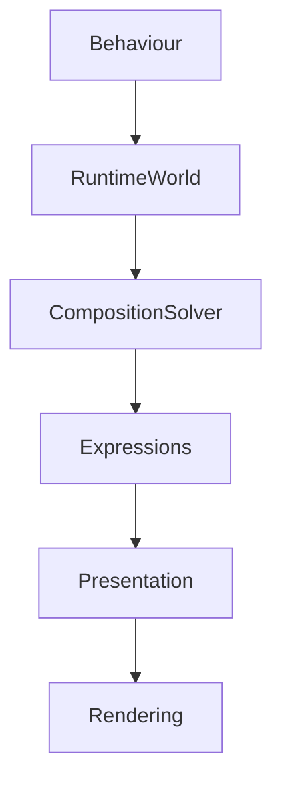

<!--
File: design/mds/MDS-006 Composition Engine/02-runtime-world.md
Document: MDS-006
Chapter: 02
Title: Runtime World
Status: Draft
Version: 0.1
-->

# Runtime World

---

# Purpose

Everything within Mosaic begins with one concept.

The **World**.

Previous MDL specifications defined the World conceptually.

This chapter defines how that World exists at runtime.

The Runtime World is the authoritative representation of the user's current experience.

It is **not** a database.

It is **not** application state.

It is **not** a view model.

It is the living model from which every Composition is continuously solved.

---

# Definition

Within MDS, the **Runtime World** is defined as:

> **The continuously evolving runtime representation of the user's current reality from which all behaviour, composition and presentation are derived.**

Everything the user experiences originates here.

---

# Why A Runtime World Exists

Traditional applications frequently construct interfaces from application state.

Examples.

```text
Database

↓

API

↓

State

↓

UI
```

Mosaic intentionally follows a different model.

```text
World

↓

Behaviour

↓

Composition

↓

Presentation
```

The Runtime World represents meaning.

Application state represents implementation.

These are intentionally different concepts.

---

# One World

A Mosaic session possesses one Runtime World.

Not:

- Home World
- Playback World
- Search World
- Settings World

Instead.

```
World

↓

Current Behaviour

↓

Current Context

↓

Current Focus
```

The World evolves.

It is never replaced.

---

# Runtime World Contents

The Runtime World contains conceptual information.

Examples include:

```text
Focus

Context

Relationships

Behaviour

Identity

Timeline

Capabilities

Environment
```

Notice what is absent.

- widgets
- layouts
- screens
- components

The Runtime World remains presentation independent.

---

# World Is Behavioural

The Runtime World is defined by behaviour.

Example.

```
Watching

↓

Episode

↓

Playback

↓

Paused
```

The World changes because behaviour changed.

Not because the interface changed.

---

# World Is Continuous

The Runtime World should never reset unnecessarily.

Example.

```
Playback

↓

Search

↓

Playback
```

Search temporarily changes Context.

The World remains continuous.

Users should always feel they returned to the same experience.

---

# World Is Shared

Every subsystem consumes the same Runtime World.

Examples.

Composition Engine.

↓

World.

Motion.

↓

World.

Colour.

↓

World.

Materials.

↓

World.

Typography.

↓

World.

The Runtime World becomes the single source of behavioural truth.

---

# World Owns Focus

Only the Runtime World determines current Focus.

Examples.

```
Current Film
```

```
Current Book
```

```
Current Album
```

Other systems consume Focus.

They never redefine it.

---

# World Owns Context

The Runtime World also owns Context.

Examples.

```
Browsing

Watching

Reading

Searching

Managing
```

Context determines:

- Composition
- Motion
- Density
- Atmosphere

Presentation follows afterwards.

---

# World Owns Relationships

Relationships are considered first-class runtime concepts.

Examples.

```
Episode

↓

Series

↓

Franchise

↓

Studio
```

The Composition Engine consumes these relationships while solving understanding.

Relationships should never be reconstructed by components.

---

# World Is Observable

Every behavioural system observes the Runtime World.

Conceptually.

```text
Runtime World

↓

Behaviour

↓

Composition

↓

Presentation
```

Changes propagate naturally.

No subsystem should poll independently.

---

# World Mutations

The Runtime World evolves through behavioural mutations.

Examples.

```
Playback Started
```

```
Playback Paused
```

```
Focus Changed
```

```
Episode Completed
```

Mutations should describe behavioural events.

Never implementation details.

---

# Deterministic Evolution

Given identical behavioural events...

The Runtime World should evolve identically.

Example.

```
Watch Episode

↓

Pause

↓

Resume

↓

Complete
```

Every Mosaic client should produce the same Runtime World.

Presentation may differ.

Behaviour must not.

---

# Runtime Ownership

Only the Runtime Engine should mutate the Runtime World.

Applications.

↓

Observe.

Plugins.

↓

Contribute Behaviour.

Composition.

↓

Consume.

Presentation.

↓

Render.

Ownership should remain centralised.

---

# World Snapshots

Future implementations may expose immutable Runtime World snapshots.

Conceptually.

```text
Runtime World

↓

Snapshot

↓

Composition Solver

↓

Presentation
```

Snapshots improve:

- determinism
- testing
- caching
- replayability

The live World continues evolving independently.

---

# World Lifetime

The Runtime World exists for the lifetime of the user session.

Individual Compositions come and go.

Materials evolve.

Atmosphere changes.

The World persists.

Users should therefore experience one continuous reality rather than a series of disconnected screens.

---

# Multi-User Worlds

Future Mosaic capabilities may support:

- shared households
- collaborative sessions
- watch parties

Each participant should possess an independent Runtime World.

Shared behaviour should synchronise through explicit runtime events.

The World model intentionally supports this evolution.

---

# Plugins

Extensions contribute to the Runtime World.

Examples include:

- metadata
- artwork
- relationships
- behavioural events

Plugins never directly modify:

- Composition
- Hierarchy
- Presentation

The Runtime World remains the only behavioural authority.

---

# Good Examples

## Playback

Behaviour.

↓

Playback progresses.

↓

Runtime World updates.

↓

Composition evolves.

↓

Presentation updates.

Everything remains continuous.

---

## Reading

Chapter changes.

↓

Runtime World updates.

↓

Progress evolves.

↓

Reader continues.

No interface reconstruction occurs.

---

## Music

Track changes.

↓

Album remains Focus.

↓

Playback Context evolves.

↓

Atmosphere adapts.

The World remains coherent.

---

# Anti-patterns

## UI State World

Treating widget state as the Runtime World.

---

## Multiple Worlds

Creating independent runtime models for different screens.

---

## Component Ownership

Components mutating behavioural state.

---

## Runtime Reset

Reconstructing the World whenever navigation changes.

---

# Runtime World Model



Every runtime system begins with the World.

Everything else is derived.

---

# Relationship To Future Chapters

The next chapter defines the **Composition Solver**.

The Runtime World explains:

> **What exists.**

The Composition Solver explains:

> **How that World becomes understandable.**

Together they establish the runtime intelligence that distinguishes Mosaic from conventional interface frameworks.

---

# Summary

The Runtime World is the living behavioural model of the user's experience.

It is the single source of truth for:

- Focus,
- Context,
- Relationships,
- Behaviour,
- Continuity.

Every runtime system observes it.

None redefine it.

The Runtime World is therefore the foundation upon which the entire Mosaic runtime architecture is built.

---

# Review Status

**Status**

Draft

**Next File**

`03-composition-solver.md`
