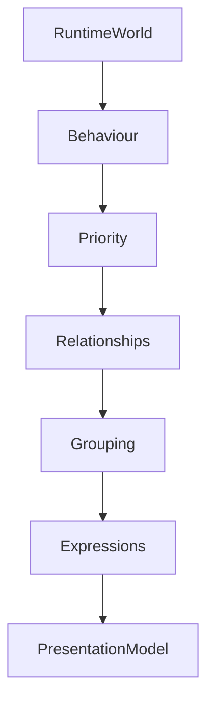

<!--
File: docs/design/system/mds-006-composition-engine/03-composition-solver.md
Document: MDS-006
Chapter: 03
Title: Composition Solver
Status: Draft
Version: 0.2
-->

# Composition Solver

---

# Purpose

The Runtime World represents everything the user currently knows and experiences.

The Composition Solver transforms that World into understanding.

It is the decision-making centre of the Composition Engine.

Unlike traditional layout engines, the Composition Solver does not determine:

- grids,
- rows,
- columns,
- widgets.

Instead it determines:

- importance,
- relationships,
- hierarchy,
- expressions,
- behavioural presentation.

Every runtime experience produced by Mosaic begins here.

---

# Definition

Within MDS, the **Composition Solver** is defined as:

> **The deterministic runtime system responsible for transforming the Runtime World into the optimal Composition for the user's current behavioural context.**

The Solver produces understanding.

Presentation is derived afterwards.

---

# Why A Solver Exists

Traditional applications generally solve interfaces.

```text
Data

↓

Templates

↓

Layout

↓

Render
```

Mosaic intentionally solves understanding.

```text
Runtime World

↓

Composition Solver

↓

Expressions

↓

Presentation
```

The Solver therefore replaces manually authored interface structure with behavioural reasoning.

---

# The Solver Never Designs

The Composition Solver should never make aesthetic decisions.

It does not determine:

- colour,
- typography,
- materials,
- spacing.

Those systems already exist.

The Solver determines:

> **What deserves attention?**

Everything else follows naturally.

---

# Inputs

The Solver consumes one Runtime World snapshot.

Conceptually.

```text
Runtime World

↓

Focus

↓

Context

↓

Behaviour

↓

Relationships

↓

Information

↓

Capabilities
```

These become the complete behavioural inputs for solving.

No rendering information is required.

---

# Outputs

The Solver produces a solved Composition.

Outputs include:

```text
Hero

↓

Hierarchy

↓

Expressions

↓

Priority

↓

Grouping

↓

Behavioural Intent

↓

Presentation Model
```

Every downstream runtime system consumes these outputs.

---

# Deterministic Solving

The Composition Solver must always remain deterministic.

Given identical:

- Runtime World,
- Behaviour,
- Context,
- Relationships,

the Solver should produce identical Composition.

This enables:

- predictable behaviour,
- runtime caching,
- replay,
- testing,
- cross-platform consistency.

---

# Behaviour Is Authority

Behaviour always possesses highest authority.

Examples.

Playback begins.

↓

Playback becomes primary.

Hero changes.

↓

Composition reorganises.

Search opens.

↓

Overlay Composition appears.

Behaviour determines composition.

The Solver simply communicates it.

---

# Focus Resolution

Only one Focus should normally exist.

Example.

```
Watching Frieren
```

The Solver identifies:

```
Hero

↓

Frieren

↓

Episode 18
```

Everything else becomes supporting information.

Focus should emerge naturally from the Runtime World.

---

# Relationship Resolution

Relationships significantly influence Composition.

Example.

```
Episode

↓

Season

↓

Series

↓

Manga

↓

Author
```

The Solver evaluates:

- proximity,
- behavioural relevance,
- contextual usefulness.

Relationships strengthen understanding.

Not complexity.

---

# Priority Resolution

Priority should emerge from behaviour.

Conceptually.

```text
Behaviour

↓

Priority

↓

Hierarchy

↓

Expressions
```

Priority should never be inferred from:

- popularity,
- layout,
- implementation.

Understanding always possesses higher authority.

---

# Expression Resolution

The Solver never produces components.

Instead it produces Expressions.

Example.

```
Continue Watching

↓

Timeline

↓

Relationships

↓

Metadata

↓

Actions
```

Later specifications determine how these Expressions become Tiles and Components.

The Solver remains presentation independent.

---

# Group Resolution

Related information should naturally group together.

Example.

```
Current Episode

Progress

Next Episode
```

Rather than:

```
Current Episode

Codec

Progress

Reviews

Next Episode
```

Grouping reduces cognitive effort.

It should emerge from relationships rather than manual interface design.

---

# Adaptive Solving

The Solver should continuously adapt.

Behaviour changes.

↓

Composition evolves.

↓

Expressions evolve.

↓

Presentation evolves.

The engine should never require predefined layouts for every possible situation.

---

# Local Solving

Small behavioural changes should produce small compositional changes.

Example.

Playback progress updates.

↓

Timeline updates.

The Hero remains unchanged.

The Composition should avoid unnecessary recomputation whenever practical.

---

# Runtime Graph

Future implementations may represent the Runtime World internally as a graph.

Conceptually.

```text
Runtime Graph

↓

Solver

↓

Composition
```

The graph remains an implementation detail.

The conceptual architecture defined here should remain unchanged regardless of runtime representation.

---

# Composition Profiles

Future runtime implementations may internally construct Composition Profiles.

Conceptually.

```text
Runtime World

↓

Solver

↓

Composition Profile

↓

Expressions

↓

Presentation
```

Profiles improve:

- caching,
- determinism,
- incremental updates.

Applications should remain unaware of their existence.

---

# Solver Pipeline

Conceptually.

```text
Runtime World

↓

Behaviour

↓

Priority

↓

Relationships

↓

Grouping

↓

Expressions

↓

Presentation Model
```

Every stage contributes exactly one responsibility.

---

# Runtime Updates

Typical Solver triggers include:

- Focus changes
- Behaviour changes
- Context changes
- Relationship updates
- Module contributions
- User interaction

Minor visual changes should not invoke complete recomposition.

The Solver should favour incremental behavioural evolution.

---

# Modules

Modules contribute:

- information,
- relationships,
- behaviours.

Modules never contribute:

- hierarchy,
- expressions,
- layouts,
- presentation.

The Composition Solver remains the sole authority for organising understanding.

---

# Good Examples

## Playback

Behaviour.

↓

Episode playing.

↓

Timeline promoted.

↓

Progress updated.

↓

Presentation evolves.

The user immediately understands current activity.

---

## Reading

Current Chapter.

↓

Bookmarks.

↓

Reading Progress.

↓

Supporting Information.

Everything naturally supports the reader.

---

## Music

Album.

↓

Current Track.

↓

Playback Queue.

↓

Related Albums.

The Composition reflects listening behaviour rather than library structure.

---

# Anti-patterns

## Screen Solver

Producing pages instead of understanding.

---

## Widget Solver

Selecting components before Expressions.

---

## Layout Solver

Beginning with grids rather than hierarchy.

---

## Module Composition

Allowing modules to determine presentation.

---

# Composition Solver Model



The Composition Solver transforms behavioural reality into understandable experience.

Everything else becomes implementation.

---

# Relationship To Future Chapters

The next chapter defines **Expression Resolution**.

The Composition Solver explains:

> **What should exist.**

Expression Resolution explains:

> **How those solved concepts become reusable runtime expressions.**

Together they form the conceptual centre of the Composition Engine.

---

# Summary

The Composition Solver is the runtime intelligence of Mosaic.

It continuously transforms:

- behaviour,
- information,
- relationships,
- context,

into one coherent understanding of the user's current World.

The interface is therefore never manually designed.

It is continuously solved.

That distinction is the defining architectural characteristic of the Mosaic Composition Engine.

---

# Review Status

**Status**

Draft

**Next File**

`04-expression-resolution.md`
