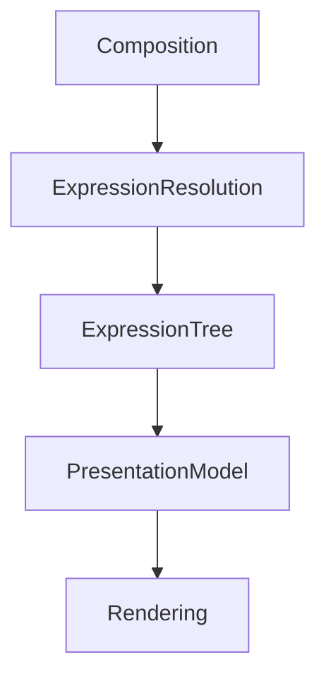

<!--
File: docs/design/system/mds-006-composition-engine/04-expression-resolution.md
Document: MDS-006
Chapter: 04
Title: Expression Resolution
Status: Draft
Version: 0.2
-->

# Expression Resolution

---

# Purpose

The Composition Solver determines **what should be understood**.

Expression Resolution determines **how that understanding should be communicated**.

This distinction is fundamental.

The Solver never creates interface.

It produces conceptual Expressions.

Expression Resolution transforms those conceptual Expressions into a platform-independent Presentation Model.

Only after this stage do components become relevant.

---

# Definition

Within MDS, **Expression Resolution** is defined as:

> **The deterministic process through which solved concepts become reusable runtime Expressions suitable for presentation.**

Expression Resolution translates understanding into communication.

It does not translate understanding into components.

---

# Why Expressions Exist

Traditional UI frameworks often follow this process.

```text
Data

↓

Widgets

↓

Render
```

Mosaic intentionally introduces an intermediate layer.

```text
Behaviour

↓

Composition

↓

Expressions

↓

Presentation

↓

Components
```

Expressions preserve conceptual meaning while remaining independent from implementation.

---

# Expressions Are Behavioural

Expressions communicate behaviour.

Not appearance.

Examples include:

```text
Hero

Timeline

Progress

Relationships

Metadata

Actions

Queue

Search

Playback
```

Notice that none of these describe:

- buttons
- cards
- shelves
- grids

Expressions communicate concepts.

---

# One Expression

An Expression represents one conceptual responsibility.

Poor.

```text
HeroCardWithButtons
```

Several responsibilities have merged.

Preferred.

```text
Hero

↓

Actions
```

Each Expression communicates one idea.

The Presentation Model later determines how those ideas are visually combined.

---

# Inputs

Expression Resolution consumes:

```text
Composition

↓

Hierarchy

↓

Priority

↓

Grouping

↓

Behaviour
```

The Runtime World is no longer consulted directly.

The Composition has already solved understanding.

Expression Resolution simply communicates it.

---

# Outputs

Expression Resolution produces:

```text
Presentation Model

↓

Expression Tree

↓

Presentation Metadata

↓

Interaction Model

↓

Material Intent
```

These outputs remain completely independent from rendering technologies.

---

# Expression Tree

Future implementations may internally represent Expressions as a tree.

Conceptually.

```text
Hero

├── Progress

├── Actions

├── Metadata

└── Relationships
```

This tree represents conceptual communication.

Not interface structure.

A renderer may later choose:

- tiles,
- lists,
- overlays,
- voice output.

The Expression Tree remains identical.

---

# Expression Identity

Expressions possess stable identities.

Example.

```text
Timeline
```

The Timeline may appear as:

- horizontal shelf,
- vertical list,
- compact mobile view,
- television timeline,
- spoken voice summary.

It remains:

```
Timeline
```

Identity survives implementation.

---

# Behaviour Preservation

Expressions inherit behavioural meaning.

Example.

```
Playback

↓

Progress

↓

Timeline
```

Every implementation should preserve this relationship.

The renderer should never reinterpret behavioural ordering.

---

# Composition Awareness

Expression Resolution respects Composition.

Example.

Hero.

↓

Resolved first.

Supporting.

↓

Resolved second.

Peripheral.

↓

Resolved last.

Expression order reflects behavioural hierarchy.

Not rendering convenience.

---

# Material Intent

Expression Resolution also produces Material Intent.

Examples.

```text
Hero

↓

Hero Material
```

```text
Overlay

↓

Overlay Material
```

```text
Navigation

↓

Surface Material
```

The Material System later resolves these into physical behaviour.

Expression Resolution communicates intention.

Not rendering.

---

# Typography Intent

Expressions also communicate editorial intent.

Examples.

```text
Hero

↓

Heading
```

```text
Metadata

↓

Supporting
```

```text
Diagnostics

↓

Caption
```

Typography therefore becomes another consequence of Expression Resolution.

---

# Motion Intent

Expressions also inherit Motion behaviour.

Examples.

Hero.

↓

Hero Motion.

Overlay.

↓

Overlay Motion.

Timeline.

↓

Supporting Motion.

Motion therefore follows Expressions naturally.

Components never invent movement independently.

---

# Adaptive Expressions

Expressions remain adaptive.

Example.

Desktop.

```text
Timeline

↓

Expanded Expression
```

Phone.

```text
Timeline

↓

Compact Expression
```

Voice.

```text
Timeline

↓

Spoken Expression
```

The conceptual identity remains unchanged.

Only presentation evolves.

---

# Expression Composition

Expressions may contain other Expressions.

Example.

```text
Hero

├── Artwork

├── Heading

├── Progress

├── Actions

└── Metadata
```

Each child remains independently meaningful.

Future implementations may reorganise them without changing behavioural understanding.

---

# Runtime Updates

Expressions should update incrementally.

Example.

Progress changes.

↓

Progress Expression updates.

The Hero remains stable.

Incremental updates preserve continuity while reducing runtime work.

---

# Deterministic Resolution

Given identical Composition.

↓

Expression Resolution should always produce identical Expression Trees.

Determinism enables:

- caching,
- replay,
- testing,
- cross-platform consistency.

---

# Modules

Modules contribute:

- information,
- relationships,
- behaviours.

Modules never contribute Expressions.

The Composition Engine determines which Expressions exist.

Every module therefore inherits the same conceptual language.

---

# Good Examples

## Playback

Composition.

↓

Hero.

↓

Progress.

↓

Timeline.

↓

Presentation.

The user immediately understands current playback.

---

## Reading

Book.

↓

Chapter.

↓

Bookmarks.

↓

Reading Progress.

Editorial understanding naturally emerges.

---

## Music

Album.

↓

Current Track.

↓

Playback Queue.

↓

Recommendations.

Expressions communicate listening behaviour.

---

# Anti-patterns

## Component Resolution

Generating widgets directly from Composition.

---

## Platform Expressions

Different platforms inventing different conceptual Expressions.

---

## Module Expressions

Modules defining custom interface structures.

---

## Layout Thinking

Expression identity depending upon grid position.

---

# Expression Resolution Model



Expressions bridge understanding and presentation.

They intentionally remain independent from rendering.

---

# Relationship To Future Chapters

The next chapter defines **Runtime Hierarchy**.

Expression Resolution explains:

> **What should be communicated.**

Runtime Hierarchy explains:

> **How those Expressions are prioritised continuously as behaviour evolves.**

Together they establish the runtime language through which the user's World becomes visible.

---

# Summary

Expression Resolution transforms solved understanding into reusable runtime communication.

It separates:

- behaviour
- understanding
- presentation

allowing every Mosaic client to present one consistent World regardless of rendering technology.

Expressions are therefore one of the most important architectural abstractions within the entire Mosaic platform.

---

# Review Status

**Status**

Draft

**Next File**

`05-runtime-hierarchy.md`
